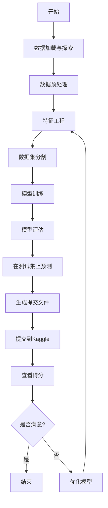

---
draw:
title: Kaggle
date created: 2024-10-13
date modified: 2025-03-20
---

整体而言，Kaggle Notebook 的设计本意就是方便复现，大部分高评分 Notebook 都是可以直接运行的。



## 基本定位

#最佳实践  
Kaggle给机器学习新手和顶尖选手带来的好处是最大的，反倒对中间选手没什么太大的帮助。

新手小白只需要参加一次与自己工作领域相同的比赛，就可以马上摘掉小白的标签。因为在参赛过程中，你会完整地了解并掌握基于机器学习、深度学习的整个任务的工作流程。包括：

1. 什么是EDA，以及如何进行充分的EDA
2. 针对不同类型的数据，如何进行预处理
3. 如何选择模型，如何训练模型，训练过程中有哪些提升结果的tricks
4. 如何高效调参
5. 如何划分验证集，如何进行模型融合
6. 如何进行数据后处理，以进一步提升最终结果

我当年就是从一枚小白，在参加了一次完整的Kaggle比赛后瞬间成长。最开始大神公开的代码，每一行都需要百度什么意思，然后就一行一行的写上注释。到最后可以针对不同的比赛任务有自己的想法，并熟练地进行训练调参等一系列操作，最终得到了第一枚银牌。

过了小白的阶段，我自认为Kaggle对个人能力的提升所带来的帮助就不是很大了。因为该会的你都已经会了，剩下的就是炼丹，模型融合。本质上就是调参技巧和硬件设备大比拼了。因为数据预处理和后处理基本上大家都差不多，你也不会想出其他多牛逼的提点tricks了，真能想到的话就可以发论文了。至于说kaggle在找工作时候可以作为能力证明，这个其实不是很明显，因为kaggle组队带打越来越多，kaggle含金量越来越低了。

对于大神来说，如果可以保证自己至少拿银牌并且有大概率拿金牌。那么一方面，参加kaggle不失为一份兼职，可以组队带打并收取一定的费用，如果能力超强还可以拿到比赛的奖金。另一方面，如果真能在几次比赛中得个前三，那确实可以在应聘国内外大厂的时候拿出来炫耀一下，还是很加分的。

以下是专门为初学者制作的一份 Kaggle 平台使用速查表（Cheatsheet）：

|**功能类别**|**操作**|**说明**|
|---|---|---|
|**数据集**|查找数据集|在顶部导航栏点击「Datasets」，输入关键字搜索|
||下载数据集|进入数据集页面后，点击右侧「Download」按钮|
||创建数据集|点击「Datasets」→「New Dataset」，上传数据文件并添加描述|
|**Notebook**|创建Notebook|点击「Code」→「New Notebook」，选择语言（Python、R等）|
||运行Notebook|Notebook界面点击「Run」或使用快捷键（Shift+Enter）|
||添加代码/文本单元格|使用界面顶部的「+ Code」或「+ Markdown」按钮|
||保存Notebook|Notebook界面右上角点击「Save Version」|
||发布Notebook|点击「Save Version」，勾选「Public」进行发布|
|**竞赛**|加入竞赛|点击顶部导航栏「Competitions」，选择竞赛并点击「Join Competition」|
||提交结果|在竞赛页面选择「Submit Predictions」，上传结果文件|
||查看排行榜|在竞赛页面点击「Leaderboard」|
|**讨论区**|提问交流|点击顶部「Discussion」，创建问题或浏览现有帖子|
||回复帖子|在讨论区帖子下方的回复框输入内容并提交|
|**快捷键**|运行代码单元格|`Shift + Enter`|
||添加单元格|`a` (上方插入)、`b` (下方插入)|
||删除单元格|双击左侧单元格编号后按两次`d`键 (`d`+`d`)|
||代码自动补全|按下`Tab`键|
||查看函数说明|在函数名后面加`?`并运行|
|**常用命令（Python）**|查看文件列表|`!ls`|
||安装库|`!pip install package-name`|
||读取CSV文件|`pd.read_csv('file.csv')`|
||检查数据前5行|`df.head()`|
|**提交格式**|CSV 文件要求|通常需包含ID列和预测结果列，明确参赛页面上的格式|
||示例提交代码|`df.to_csv('submission.csv', index=False)`|
|**资源**|官方文档|[Kaggle官方文档](https://www.kaggle.com/docs)|
||入门教程|[Kaggle Learn入门教程](https://www.kaggle.com/learn)|

希望以上内容能帮助你更快地熟悉和掌握 Kaggle 平台的使用！

___

[[baseline]]

装依赖  


看起来你已经成功上传了baseline文件到Kaggle，出现了"No Data Sources Found"提示，这是因为代码需要比赛数据才能运行。接下来的步骤是：

1. **添加数据源**：
   - 点击右侧的"Add Input"按钮
   - 在搜索框中输入比赛名称"equity-post-HCT-survival-predictions"
   - 点击"Competition Datasets"标签
   - 选择该比赛的数据集

2. **连接到网络**（如需要）：
   - 确保在"Settings"中开启了"Internet"选项，因为代码可能需要下载一些库

3. **运行代码**：
   - 你可以点击顶部的"Run All"按钮运行所有单元格
   - 或者使用单个单元格旁边的播放按钮逐个运行

4. **监控输出**：
   - 代码运行时会显示进度和结果
   - 训练模型可能需要一些时间，特别是在跑10折交叉验证时

5. **生成提交文件**：
   - 代码运行完成后，会在输出目录生成"submission.csv"文件
   - 可以在左侧文件浏览器中找到它

6. **提交结果**：
   - 点击"Submit"或在比赛页面上提交生成的文件

如果"No Data Sources Found"问题持续存在，你可能需要：

- 手动添加比赛数据文件
- 检查代码中的数据路径是否正确
- 确保已经加入了该比赛

这样，你就能使用这个baseline来参与Kaggle比赛并获得你的第一个提交结果了。

```Java

#!/usr/bin/env python
# coding: utf-8

# In[ ]:


"""
To evaluate the equitable prediction of transplant survival outcomes,
we use the concordance index (C-index) between a series of event
times and a predicted score across each race group.
 
It represents the global assessment of the model discrimination power:
this is the model’s ability to correctly provide a reliable ranking
of the survival times based on the individual risk scores.
 
The concordance index is a value between 0 and 1 where:
 
0.5 is the expected result from random predictions,
1.0 is perfect concordance (with no censoring, otherwise <1.0),
0.0 is perfect anti-concordance (with no censoring, otherwise >0.0)

"""

import pandas as pd
import pandas.api.types
import numpy as np
from lifelines.utils import concordance_index

class ParticipantVisibleError(Exception):
    pass


def score(solution: pd.DataFrame, submission: pd.DataFrame, row_id_column_name: str) -> float:
    """
    >>> import pandas as pd
    >>> row_id_column_name = "id"
    >>> y_pred = {'prediction': {0: 1.0, 1: 0.0, 2: 1.0}}
    >>> y_pred = pd.DataFrame(y_pred)
    >>> y_pred.insert(0, row_id_column_name, range(len(y_pred)))
    >>> y_true = { 'efs': {0: 1.0, 1: 0.0, 2: 0.0}, 'efs_time': {0: 25.1234,1: 250.1234,2: 2500.1234}, 'race_group': {0: 'race_group_1', 1: 'race_group_1', 2: 'race_group_1'}}
    >>> y_true = pd.DataFrame(y_true)
    >>> y_true.insert(0, row_id_column_name, range(len(y_true)))
    >>> score(y_true.copy(), y_pred.copy(), row_id_column_name)
    0.75
    """
    
    del solution[row_id_column_name]
    del submission[row_id_column_name]
    
    event_label = 'efs'
    interval_label = 'efs_time'
    prediction_label = 'prediction'
    for col in submission.columns:
        if not pandas.api.types.is_numeric_dtype(submission[col]):
            raise ParticipantVisibleError(f'Submission column {col} must be a number')
    # Merging solution and submission dfs on ID
    merged_df = pd.concat([solution, submission], axis=1)
    merged_df.reset_index(inplace=True)
    merged_df_race_dict = dict(merged_df.groupby(['race_group']).groups)
    metric_list = []
    for race in merged_df_race_dict.keys():
        # Retrieving values from y_test based on index
        indices = sorted(merged_df_race_dict[race])
        merged_df_race = merged_df.iloc[indices]
        # Calculate the concordance index
        c_index_race = concordance_index(
                        merged_df_race[interval_label],
                        -merged_df_race[prediction_label],
                        merged_df_race[event_label])
        metric_list.append(c_index_race)
    return float(np.mean(metric_list)-np.sqrt(np.var(metric_list)))
```
