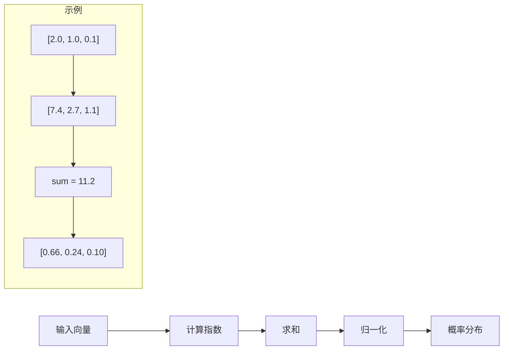

---
draw:
tags: []
title: softmax
date created: 2025-01-24
date modified: 2025-01-24
---

## 目的

- 输出总和为1（归一化）
- 输出范围在[0,1]之间
- 保持相对大小关系
- 放大差异（exp函数的性质）

## 为什么叫"soft"max

- 传统max只选最大值（硬选择）
- softmax给每个选项一个概率（软选择）
- 最大值获得最大概率，但其他值也有概率
