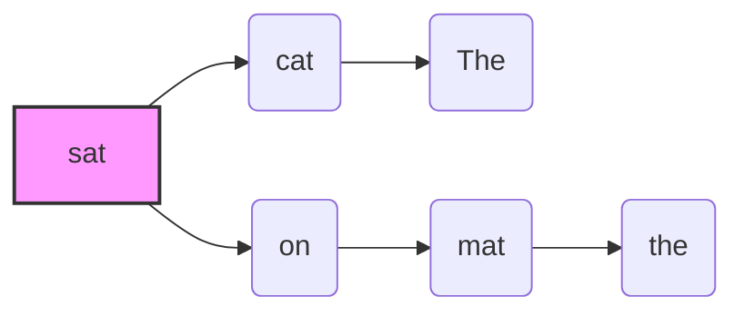

---
draw:
tags: []
title: 语法分析、依存句法分析
date created: 2025-01-24
date modified: 2025-01-24
---

好的！为了让你更直观地理解 **依存句法分析 (Dependency Parsing)** 是什么，以及它在 Neural Transition-Based Dependency Parsing 中扮演的角色，我们来看一个具体的例子。

**例子句子：** "The cat sat on the mat." (猫坐在垫子上。)

**依存句法分析的目标：** 就是要分析出这句话中，每个词 **依赖** 于哪个词，以及它们之间是什么 **依存关系**。

**分析结果 (依存树)：**

**关系解释 (用大白话描述):**

- **sat --> cat("cat")**: 表示 "sat" (坐) 支配 "cat" (猫)，箭头方向从支配词 "sat" 指向依存词 "cat"。 ("cat") 是在节点中显示的文本，这里用的是词本身。
- **cat --> The("The")**: 表示 "cat" (猫) 支配 "The" (The)。
- **sat --> on("on")**: 表示 "sat" (坐) 支配 "on" (在...上)。
- **on --> mat("mat")**: 表示 "on" (在...上) 支配 "mat" (垫子)。
- **mat --> the("the")**: 表示 "mat" (垫子) 支配 "the" (the)。
- **"cat" (猫) -> "sat" (坐)**
    
    - 关系：**主语 (subject)**
        
    - 解释：谁在坐？是 "猫" 在坐。"猫" 是 "坐" 这个动作的执行者，所以 "cat" 依赖于 "sat"。
        
- **"The" -> "cat" (猫)**
    
    - 关系：**限定词/冠词 (determiner)**
        
    - 解释："The" 用来限定 "cat"，说明是 "这只" 猫，而不是 "那只" 或其他猫。所以 "The" 依赖于 "cat"。
        
- **"on" (在...上) -> "sat" (坐)**
    
    - 关系：**介词 (preposition)**
        
    - 解释：在哪里坐？在 "垫子上"。"on" 引导的介词短语 "on the mat" 用来修饰 "坐" 这个动作的地点。所以 "on" 依赖于 "sat"。
        
- **"mat" (垫子) -> "on" (在...上)**
    
    - 关系：**介词宾语 (object of preposition)**
        
    - 解释：在 "什么" 上？在 "垫子上"。"mat" 是介词 "on" 的宾语，表示介词作用的对象。所以 "mat" 依赖于 "on"。
        
- **"the" -> "mat" (垫子)**
    
    - 关系：**限定词/冠词 (determiner)**
        
    - 解释：和 "The" -> "cat" 类似，"the" 限定了 "mat"，说明是 "这个" 垫子。所以 "the" 依赖于 "mat"。
        

**总结:**

依存句法分析就是找出句子中词语之间的 **依存关系**，用 **箭头** 表示 **从属关系的方向**，用 **词语** 表示 **核心词** 和 **从属词**。分析的结果可以画成 **依存树**，清晰地展示句子的结构。

**在 Neural Transition-Based Dependency Parsing 中：**

我们训练神经网络的目的，就是让它学会 **自动** 分析出这种依存关系。 在 Transition-Based 的方法中，我们通过一步步的 **转移操作** (SHIFT, LEFT-ARC, RIGHT-ARC) 来逐步构建这个依存树，而神经网络的作用就是 **预测每一步应该执行哪个转移操作**，最终完成整个句子的依存分析。

希望这个例子能让你更明白 "依存句法分析" 是在做什么了！它其实就是分析句子中词语之间的 **语法关系**，并用一种结构化的方式 (依存树) 来表示出来。
