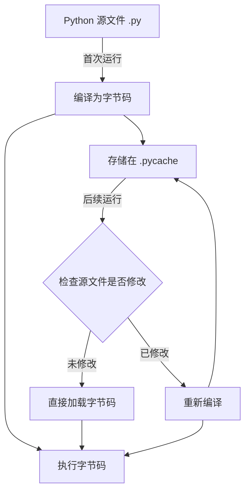

---
draw:
tags: []
title: pycache
date created: 2024-10-13
date modified: 2024-12-27
---

.pycache 文件夹是 [Python](Python.md) 的一个重要优化机制，用于存储字节码缓存文件。让我详细解释一下它的作用和工作原理：

.pycache 文件夹的主要作用和特点：

1. 性能优化：
   - 当 Python 脚本首次运行时，解释器会将源代码编译成字节码。
   - 这些编译后的字节码被保存在.pycache 文件夹中，文件扩展名为.pyc。
   - 在后续运行时，如果源文件没有被修改，Python 可以直接加载字节码，避免重新编译，从而加快程序的启动时间。

2. 自动管理：
   - Python 解释器会自动创建和管理.pycache 文件夹。
   - 你通常不需要手动干预这个过程。

3. 版本兼容：
   - .pyc 文件名中包含 Python 解释器的版本信息，确保不同版本的 Python 不会混用字节码文件。

4. 源文件变更检测：
   - Python 会检查.pyc 文件的时间戳与对应的.py 文件。
   - 如果.py 文件被修改，Python 会重新编译并更新.pyc 文件。

5. 清理：
   - 你可以安全地删除.pycache 文件夹，Python 会在需要时重新创建它。
   - 这在某些情况下（如排除缓存引起的问题）可能会有用。

6. 发布考虑：
   - 在发布 Python 应用时，通常不需要包含.pycache 文件夹。
   - 可以在.gitignore 文件中添加 **pycache** 来避免将其包含在版本控制中。

7. 环境变量控制：
   - 可以通过设置 PYTHONDONTWRITEBYTECODE 环境变量为非空值来阻止 Python 写入.pyc 文件。

8. Python 3.8+的新特性：
   - 从 Python 3.8 开始，引入了 PEP 552，实现了更安全和高效的字节码缓存机制。

.pycache 是 Python 运行时优化的重要部分，通常不需要直接操作它。它的存在有助于提高 Python 程序的运行效率，特别是在大型项目中。

你对 .pycache 的工作机制或者如何在特定情况下管理它还有其他问题吗？
