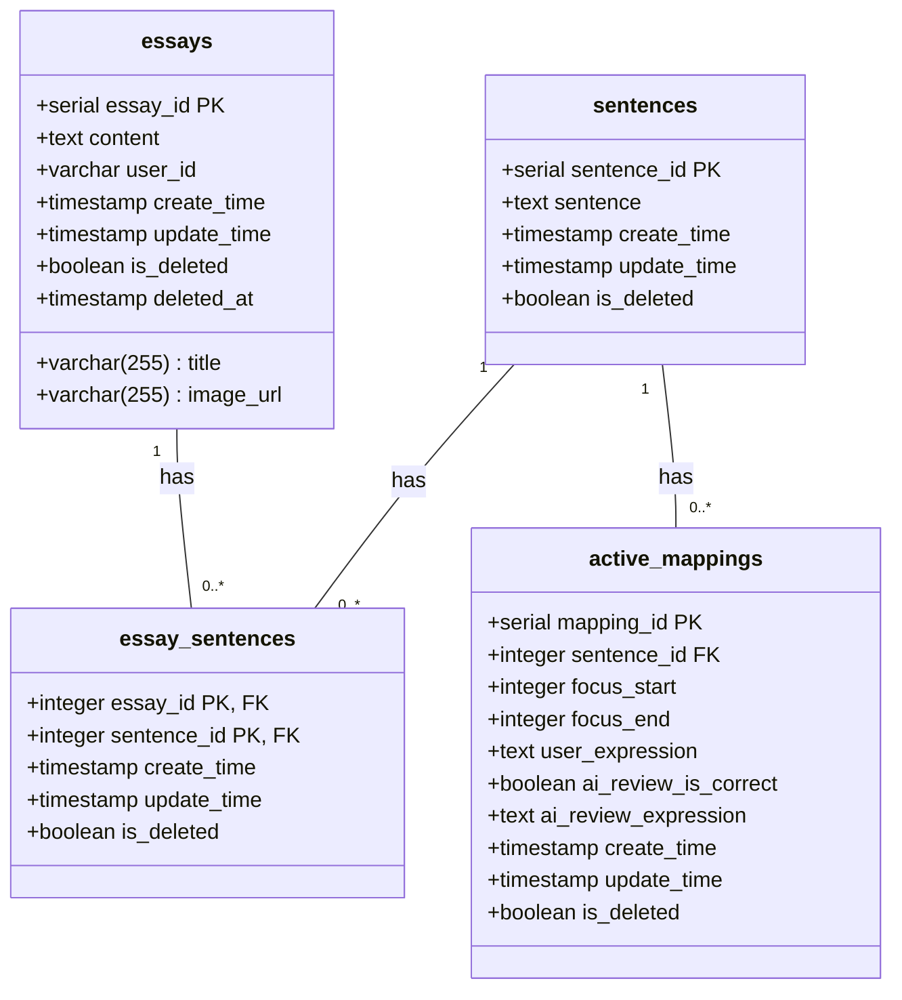
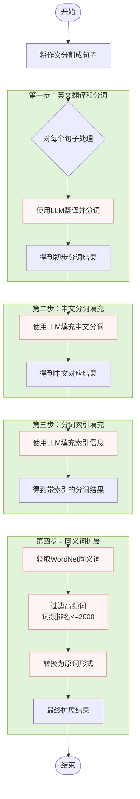

---
draw:
tags: []
title: viva 后端
date created: 2024-10-07
date modified: 2024-11-12
---



## 新建文章

文章 - 分句 - 分词

## 文章 detail

文章 id，查出 content 展示

## 进入学习模式

返回有序的句子 id，然后发起第一个 id 的学习卡片的请求

## 学习卡片

一张卡片内是该句子下的 mappingsVo

## 核心处理流程



## VO

是的，你的理解是正确的。在 Python 中，特别是在使用 FastAPI 和 Pydantic 的上下文中，`EssaySchema` 确实相当于 Java 后端中的 VO（View Object）或 DTO（Data Transfer Object）。

让我们来比较一下：

1. 用途：
   - Java VO/DTO：用于在不同层之间传输数据，通常是从后端到前端。
   - Python `EssaySchema`：同样用于数据传输，特别是在 API 响应中。

2. 数据验证：
   - Java VO/DTO：通常使用像 Bean Validation 这样的注解来进行验证。
   - Python `EssaySchema`：使用 Pydantic 的字段类型和验证器来确保数据的正确性。

3. 序列化：
   - Java VO/DTO：通常使用 Jackson 或 Gson 等库进行 JSON 序列化。
   - Python `EssaySchema`：Pydantic 模型可以直接序列化为 JSON。

4. 文档生成：
   - Java：通常需要额外的工具如 Swagger 来生成 API 文档。
   - Python：FastAPI 可以根据 Pydantic 模型自动生成 OpenAPI（Swagger）文档。

这里是一个简化的对比：

Java (Spring Boot) 版本：

```java
public class EssayVO {
    private int essayId;
    private String userId;
    private String title;
    private String content;
    private LocalDateTime createTime;
    private LocalDateTime updateTime;
    private boolean isDeleted;

    // getters, setters, constructors
}
```

Python (FastAPI/Pydantic) 版本：

```python
from pydantic import BaseModel
from datetime import datetime

class EssaySchema(BaseModel):
    essay_id: int
    user_id: str
    title: str
    content: str
    create_time: datetime
    update_time: datetime
    is_deleted: bool

    class Config:
        from_attributes = True
```

主要区别：

1. Python 版本更简洁，不需要显式的 getters 和 setters。
2. Python 版本的类型注解直接用于验证和文档生成。
3. `from_attributes = True` 允许直接从 ORM 模型创建 schema 实例。

总的来说，`EssaySchema` 在 Python/FastAPI 中的角色确实与 Java 后端中的 VO 非常相似，都用于数据传输和 API 响应的结构定义。
