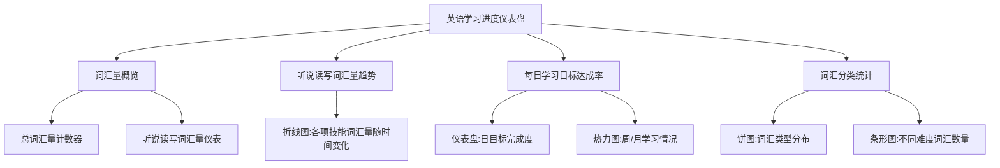

---
draw:
tags: []
title: 英语学习可视化$
date created: 2024-08-17
date modified: 2024-12-27
---

```mermaid
graph TD
    A[英语学习进度仪表盘] --> B[词汇量概览]
    A --> C[听说读写词汇量趋势]
    A --> D[每日学习目标达成率]
    A --> E[词汇分类统计]

    B --> B1[总词汇量计数器]
    B --> B2[听说读写词汇量仪表]

    C --> C1[折线图:各项技能词汇量随时间变化]

    D --> D1[仪表盘:日目标完成度]
    D --> D2[热力图:周/月学习情况]

    E --> E1[饼图:词汇类型分布]
    E --> E2[条形图:不同难度词汇数量]
```
