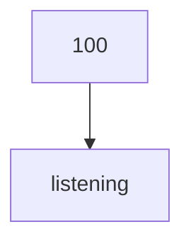

---
draw:
tags: []
title: 如何成为兼职托福老师
date created: 2024-07-02
date modified: 2024-11-12
---

## [第一性原理](第一性原理.md)

教哪个科目？
胜任标准：小项达到 28 分及以上  
难度排名：口语>听力>写作>阅读  
我选择听力，难度比口语低，且对自己本身英语能力来说，收益最大

> 现在课程基本集中一周2次，减少了1对1，一次收费，班课挣得更多，对身体消耗也小。
> 🌸正常上课  
这是我的主业，也是独立英语老师安身立命的根本，半年来从一开始抓瞎天天备课上课忙要死，现在课程基本集中一周2次，减少了1对1，一次收费，班课挣得更多，对身体消耗也小。
🌺开个英语app sell账号资源  
这个算次业，顺带的事，平时整理的教材、课程、比如分级绘本、桥梁书，启蒙规划资源、儿歌动画视频等等，上传到app里，满足很多家长的需求，帐号也很受欢迎，毕竟里面很多资源的。
💐接广  
这个是针对有做小红书啊等自媒体账号的，我的号不在小红书，平时坚持日更两年多了，累计有一两万粉，每月接两三次广，一次1000-2000不等，其他老师注意‼不能接跟自己有竞争关系的，纯纯搬石头砸自己的脚哈  
🎋英语课程分销  
也是顺带的事，不囤货，只转卖，有很多老师应该都会做这块，拿佣💰就行，有的老师更厉害，不只做英语课程，还会有学习用品硬件之类的。
🌳做打卡营  
这个我是寒假接触到才知道很火🔥，前期需要先准备内容，整体规划，跑通一次后期基本就是复制前期模式了，比如我入坑就是寒假21天阅读营，把每阶段内容整理好，任务规划到每一天，然后提供每日同步监督指导，后来我都用app工具更快些，客单价更高些，还能把家长们留下来慢慢转化为班课的。
挣钱真的不是靠时间熬的，靠的是抓住机会，很多时候没办法全准备好，机会不等人的，都是遇到了立马开始做，边走边学，路子通了，钱也就来了。
