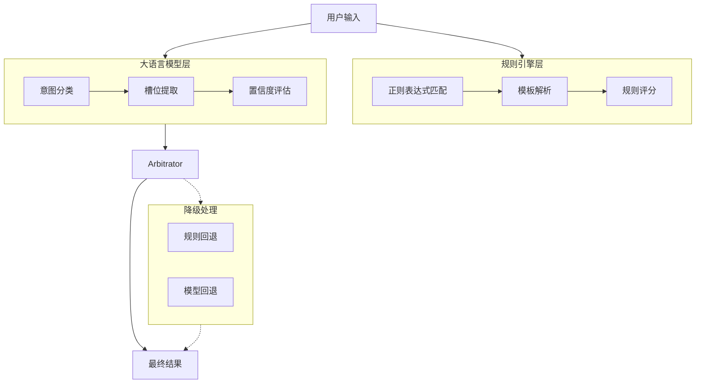
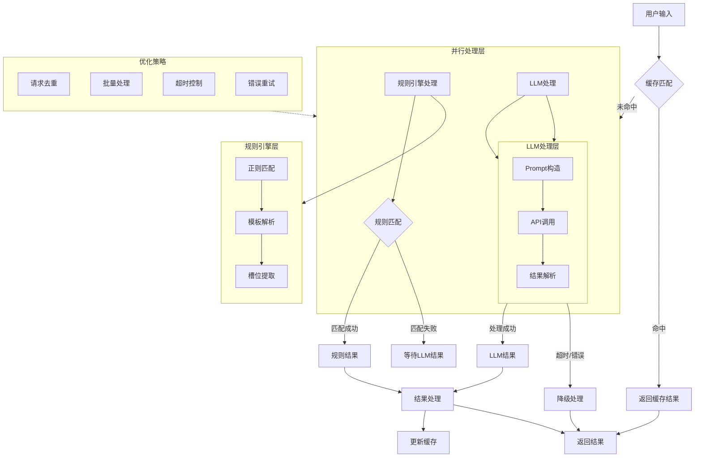

---
draw:
tags: []
title: 意图识别
date created: 2024-11-09
date modified: 2024-11-12
---
- 从项目视角拆解题目，开发独立 IM 系统，打造友好的 AI 交互方式。
- 整合项目群聊与文档信息，通过知识库问答、语义搜索、催办待办、项目进度总结等方式，全方位挖掘项目生命周期中的各种信息价值。
- 追踪社区最新实践，使用 OpenAI、Anthropic、Cerebras 等原生 API 的新特性
- Agent 智能交互解决日常工作中的繁琐操作
- 开发过程从 UI设计、前端、后端、PPT 制作，50% 以上由 AI 助力完成。


## 一、交互


1. 输入框输入@Agent 之后的信息触发后端意图识别接口
2. 提取出来的意图显示在图中卡片上，之后槽位信息可以加到卡片上，进一步优化
3. 用了前端 Debounce (防抖)，用户停止输入 800ms 后才调用 API，800ms 可以调整

## 二、整体架构（降级处理还待优化）



## 三、实现细节（缓存、错误重试还未实现）



## 四、场景分析

### 1. 语义搜索

### 2. 总结内容 or 形成结论

槽位里最关键的是起止时间


我可以帮你将这些消息按主题和事件进行分类。我会分析消息内容、时间连续性以及参与者之间的对话来进行分组。让我们把它分成几个主要的话题群:


1. 需求开发初期讨论与工时评估 (9月24-25日)
- 主要参与者:徐赟哲、崔宇、赵赵力等
- 主要内容:讨论工时评估、接口定义、技术方案等

1. 项目联调与问题修复 (10月8-11日)
- 主要参与者:赵赵力、乔路、董威宁、王颖yw等
- 内容:
    - 接口联调
    - bug修复
    - 配置调整
    - 环境问题处理

1. 项目发布与上线 (10月18日)
- 主要参与者:王颖yw、赵赵力、董威宁、刘丽慧等
- 内容:
    - 发布步骤确认
    - 配置检查与修改
    - 各模块依次发布
    - 发布验证

1. 线上问题跟进与优化 (10月21-29日)
- 主要参与者:刘丽慧、赵赵力、蔡创基等
- 内容:
    - 曝光率监控
    - 埋点问题
    - 用户反馈问题处理
    - 性能优化


这种分类可以帮助我们更好地理解整个项目的进展过程,以及在不同阶段遇到的主要问题。每个子群都有其相对独立但又相互关联的主题。你觉得这样的分类方式合理吗？如果需要,我可以针对某个子群做更详细的分析。

### 3. 进入发布模式

`QA 触发整个群进入发布模式`

```Java
"【FD-286154】 项目发布中
发布类型：prod
开始时间：2024-10-18 14:49:17
appcode：f_athena_order..."

"@徐赟哲  【即将发布周知】【FD-285952订单详情页二次售卖改版】 将于（2024-10-22）发布上线..."

"【发布delay】【FD-286155 订单详情页二次售卖改版】 未按计划发布时间（2024-10-11）发布..."
```

1. 测试验证相关:

```Java
"发布拦截了 快速点下哈"

"好的，刚才那个问题他们看下，应该不是本次改动的"

"我这边验证好了哈"
```

2. 配置管理相关:

```Java
"@王颖yw 审核一下配置，加了一下新的模块"

"这个标签是根据什么维度的"

"谨慎操作qconfig"
```

3. 问题排查相关:

```Java
"[obj type="image" value="https://qtalk.qunarzz.com/pp_qtalk_file_0003/f714c57c1cce3f27031df0935d477707.jpg" width=1236 height=628]@蔡创基 看下异常？"

"CompensateSecondSaleService_getCompensateInfo_param_error_Count]近期有值,但未添加报警..."

"qmall有npe我先回滚了"
```

### 4. 生成项目报告

1. 对于已完成的项目，提取项目过程流水，生成项目过程报告 `响应式生成` or `意图识别`
    1. 项目概览：项目名称、项目时长、参与团队、参与人、提出问题数、解决问题数、有效沟通次数
    2. 项目流水：人、时间、动作、结果
    3. 过程问题：问题描述、提出人、解决人、解决状态、解决时长
    4. 项目关键结论：项目群中的关键结论

### 5. 生成每周回顾

基于文档的 commit 的 diff 信息

### 6. 生成待办、催办

过去的群只有两个级别的信息 艾特我的 和不艾特我的 现在我们要借助ai做成三个  
分个人维度和多人维度甚至群维度

1. 主动 push 别人，`意图识别，强提醒的功能，如果做成响应式，可能会泛滥，所以需要人为触发并点击确认`
2. 主动查看自己，`响应式`or`意图识别` 每个人可以触发找出可能和自己相关的事情

```Java
- "@all 今天开发人员大家各自子啊群里面报一下自己的进度"
- "目前卡在支付前校验，待支付中心联调"
- "售前主流程/交易/辅营 售前阻塞在支付前校验，待支付中心联调,目前售前剩余授权回调验证 还得1pd调通"

"董威宁 邀请您参加腾讯会议
会议主题：董威宁的快速会议..."

"@乔路 能给我清个缓存不"

"@王颖yw 审批的时候也注意下哈"
```

1. 技术支持相关:

```Java
"@赵赵力 检查一下配置吧"

"@伊海迪 可以关注下这个问题"

"@国内交易热线 热线帮忙看下这个接口..."
```

2. 环境配置与问题排查

```Java
- "环境没搞通" "还没听人说 环境搞好了"
- "org.apache.dubbo.rpc.RpcException: No provider available..."
- "软路由 能不能进服务页，现在没法进 case没法覆盖到"
- "[obj type="url" value="http://portal.corp.qunar.com/servicePortal/apptask/console.html?id=9302554"] trade_core 重启下"
```

3. 联调与测试协调

```Java
- "@蔡宜身 现在进度如何呀，今天提测有风险吗？晚上能showcase吗？"
- "现在目前是各个环节都有卡点，先是北京-上海营销不出，现在是航班都没了"
- "@黄启孟 帮看下支付完成页的几个问题..."
```

4. 技术方案讨论

```Java
- "@赵述佳 这个cashierJumpUrl构建的时候 有判断payToken为空的时候不返这个url吗？"
- "@蔡宜身 轮询接口 报了参数异常"
- "batchSeq为什么是yyw格式的啊，不是20格式的啊，合单情况下又传的是什么呢"
```

5. 任务分配与协作

```Java
- "@李皓雪 皓雪姐看一下你那边的排期"
- "@all 任命陈民华担任项目技术负责人，请知晓！"
- "@黄启孟 @郝泽楠 @李皓雪 @谭鹏yy @何钢 @肖杨 @刁洪亮 来对一下排期吧"
```

6. 文档与知识共享

```Java
- "[obj type="url" value="https://wiki.corp.qunar.com/pages/viewpage.action?pageId=658756458"]"
- "按照这个更新checklist吧"
- "@赵述佳 技术方案的wiki在哪有"
```

## 五、一句话多个意图（待实现）

一句话有多个意图怎么办呢？将 suggestion 卡片做成跑马图，或者干脆不实现多意图？


## 六、避免幻觉

**Best-of-N verficiation**: Run Claude through the same prompt multiple times and compare the outputs. Inconsistencies across outputs could indicate hallucinations.  
并发调用多次，比较结果
