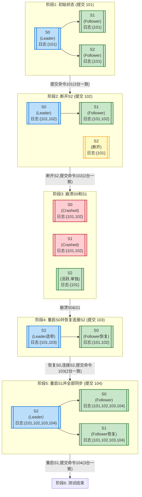

## 运行

在 Lab2 中，你的 Raft 实现代码主要位于 `6.824/src/raft/` 目录下。与 Lab1 不同，这里不需要像之前运行 MapReduce 一样先编译插件和手动启动进程；相反，你的测试是通过运行 `go test` 命令来自动执行的。

**主要命令**（在 `6.824/src/raft` 目录下执行）：

1. 进入 Raft 源码目录：

    ```bash
    cd ~/6.824/src/raft
    ```

2. 运行所有测试（包括 2A, 2B, 2C, 2D 全部）：

    ```bash
    go test -race
    ```

3. 单独测试某个部分（例如只测试2A部分）：

    ```bash
    go test -run 2A -race
    ```

    类似地：

    ```bash
    go test -run 2B -race
    go test -run 2C -race
    go test -run 2D -race
    ```

## 核心功能实现

1. **Leader 选举**:

```go
// 开始选举
func (rf *Raft) StartElection() {
    request := rf.genRequestVoteRequest()
    grantedVotes := 1  // 自己给自己投票
    rf.votedFor = rf.me
    
    // 向其他节点发送投票请求
    for peer := range rf.peers {
        if peer == rf.me {
            continue
        }
        go func(peer int) {
            response := new(RequestVoteResponse)
            if rf.sendRequestVote(peer, request, response) {
                rf.mu.Lock()
                defer rf.mu.Unlock()
                
                // 如果获得投票
                if response.VoteGranted {
                    grantedVotes += 1
                    // 获得多数票就成为 Leader
                    if grantedVotes > len(rf.peers)/2 {
                        rf.ChangeState(StateLeader)
                        rf.BroadcastHeartbeat(true)
                    }
                }
            }
        }(peer)
    }
}
```

2. **日志复制**:

```go
// Leader 广播日志条目
func (rf *Raft) BroadcastHeartbeat(isHeartBeat bool) {
    for peer := range rf.peers {
        if peer == rf.me {
            continue
        }
        if isHeartBeat {
            go rf.replicateOneRound(peer)
        } else {
            rf.replicatorCond[peer].Signal()
        }
    }
}

// 复制日志到某个 Follower
func (rf *Raft) replicateOneRound(peer int) {
    // ...
    request := rf.genAppendEntriesRequest(prevLogIndex)
    response := new(AppendEntriesResponse)
    if rf.sendAppendEntries(peer, request, response) {
        rf.mu.Lock()
        rf.handleAppendEntriesResponse(peer, request, response)
        rf.mu.Unlock()
    }
}
```

3. **提交日志**:

```go
// Leader 推进 commitIndex
func (rf *Raft) advanceCommitIndexForLeader() {
    // 统计有多少节点复制了日志
    n := len(rf.matchIndex)
    srt := make([]int, n)
    copy(srt, rf.matchIndex)
    insertionSort(srt)
    
    // 取得多数节点都复制的最大索引
    newCommitIndex := srt[n-(n/2+1)]
    if newCommitIndex > rf.commitIndex {
        // 只提交当前任期的日志
        if rf.matchLog(rf.currentTerm, newCommitIndex) {
            rf.commitIndex = newCommitIndex
            rf.applyCond.Signal()
        }
    }
}
```

4. **应用日志**:

```go
// 应用已提交的日志到状态机
func (rf *Raft) applier() {
    for rf.killed() == false {
        rf.mu.Lock()
        // 等待新的提交
        for rf.lastApplied >= rf.commitIndex {
            rf.applyCond.Wait()
        }
        
        // 获取需要应用的日志
        entries := make([]Entry, commitIndex-lastApplied)
        copy(entries, rf.logs[lastApplied+1-firstIndex:commitIndex+1-firstIndex])
        rf.mu.Unlock()
        
        // 应用日志到状态机
        for _, entry := range entries {
            rf.applyCh <- ApplyMsg{
                CommandValid: true,
                Command:     entry.Command,
                CommandIndex: entry.Index,
            }
        }
        
        rf.lastApplied = commitIndex
    }
}
```

5. **心跳机制**:

```go
func (rf *Raft) ticker() {
    for rf.killed() == false {
        select {
        case <-rf.electionTimer.C:
            // 超时未收到心跳，开始选举
            rf.mu.Lock()
            rf.ChangeState(StateCandidate)
            rf.currentTerm += 1
            rf.StartElection()
            rf.mu.Unlock()
            
        case <-rf.heartbeatTimer.C:
            // Leader 定期发送心跳
            rf.mu.Lock()
            if rf.state == StateLeader {
                rf.BroadcastHeartbeat(true)
            }
            rf.mu.Unlock()
        }
    }
}
```

这些代码实现了 Raft 的核心机制：

- Leader 选举通过投票实现
- 日志复制通过 AppendEntries RPC 实现
- 通过多数确认来提交日志
- 心跳机制维护 Leader 地位
- 持久化关键状态确保崩溃恢复

每个部分都通过精心的并发控制和状态管理来保证正确性。

## 测试

下面是一个针对 `raft_test.go` 中测试用例的说明表格。表格中列出了各测试方法的名称、主要测试目标和关键关注点。

|            | 测试名称                            | 测试内容                        | 重点关注点                                       |
| ---------- | ------------------------------- | --------------------------- | ------------------------------------------- |
| 领导选举       | TestInitialElection2A           | 测试初始节点选举                    | 检查初始条件下是否能在一段合理时间内选出领导者，以及 term 是否正确增长      |
|            | TestReElection2A                | 测试在网络故障后重新选举                | 当领导者断开后能否正确选出新领导者；旧领导者重连后系统的稳定性             |
|            | TestManyElections2A             | 测试多次随机断连和重新连接场景下的多轮选举       | 在反复断开、重连部分节点的环境中是否始终能维持或选出正确的领导者            |
| 基本一致性和日志复制 | TestBasicAgree2B                | 基本达成一致性测试                   | 测试在一个健康集群中对简单命令是否能正确提交日志条目                  |
|            | TestRPCBytes2B                  | 测试 RPC 字节数量                 | 确保同一命令不重复向各节点发送过多的 RPC；检查实现的高效性             |
|            | TestFailAgree2B                 | 测试在一个 follower 断开时的日志一致性    | 即使有 follower 掉线，领导者和剩余的 follower 也能对新日志达成一致 |
|            | TestFailNoAgree2B               | 测试过半 follower 断开后无法达成一致     | 若大多数 follower 不在线，则无法提交新日志条目                |
|            | TestConcurrentStarts2B          | 并发调用 Start() 的一致性测试         | 同一任期内，对多条并发提交的命令能否全部正确提交                    |
|            | TestRejoin2B                    | 测试领导者分区后再加入的场景              | 一个长期断开的领导者重新加入集群后，系统仍然能够保证一致性并选出合理的领导者      |
|            | TestBackup2B                    | 测试领导者对日志不一致的 follower 的快速回退 | 在 follower 日志落后且存在不一致的情况下，领导者是否能快速进行日志回退并同步 |
|            | TestCount2B                     | 测试 RPC 调用次数是否合理             | 检查正常操作下 RPC 调用数量不应过高或过低，以保证性能和正确性           |
| 持久化和恢复     | TestPersist12C                  | 基本持久化测试                     | 节点重启后能否正确恢复状态，从而保证系统安全性                     |
|            | TestPersist22C                  | 更复杂的持久化测试                   | 多次断开、重启和重新连接场景下，确保日志和状态机的一致性和持久性            |
|            | TestPersist32C                  | 测试分区的领导者和 follower 宕机后恢复    | 在有节点崩溃和网络分区的复杂场景下，重启后的节点能否正确恢复状态并加入新的任期     |
|            | TestFigure82C                   | 模拟 Figure 8 场景              | 随机节点崩溃、恢复、分区下，对日志提交和领导者选举的稳定性进行长时间大规模测试     |
|            | TestUnreliableAgree2C           | 在不可靠网络中达成一致性                | 测试在网络不可靠、丢包条件下，系统仍能提交大多数日志                  |
|            | TestFigure8Unreliable2C         | Figure 8 场景下的不可靠网络测试        | 结合随机崩溃、分区和不可靠网络的极端情况，确保系统的最终一致性和可用性         |
|            | TestReliableChurn2C             | 有限可靠性的节点频繁变化场景              | 不断重启、断线、重连节点，检查系统在大范围混乱中的表现                 |
|            | TestUnreliableChurn2C           | 不可靠网络下节点频繁变化场景              | 与上一个测试类似，但加入网络不可靠因素，进一步测试稳定性                |
| 快照         | TestSnapshotBasic2D             | 基本快照功能测试                    | 当日志不断增长时，领导者和 follower 是否能正确生成和安装快照以压缩日志    |
|            | TestSnapshotInstall2D           | 测试在断开连接条件下的快照安装             | follower 掉线后重新连接是否能通过接收快照快速追上最新日志           |
|            | TestSnapshotInstallUnreliable2D | 不可靠网络 + 断开连接下的快照安装          | 在不可靠网络和 follower 掉线下，检查快照同步的健壮性             |
|            | TestSnapshotInstallCrash2D      | 崩溃后重启下的快照安装测试               | 在节点崩溃并重启后，通过快照安装快速恢复一致性日志状态                 |
|            | TestSnapshotInstallUnCrash2D    | 不可靠网络 + 崩溃恢复下的快照安装          | 最复杂场景下，测试通过快照恢复日志一致性的能力                     |

这些测试全面覆盖了Raft算法的核心功能，包括领导选举、日志复制、持久化、恢复、快照等，并在各种网络条件（可靠、不可靠）和故障情况（节点崩溃、网络分区）下进行测试，以确保算法的正确性和鲁棒性。

## 游戏的全局设置器 make_config

下面是对该函数 `make_config` 的目的

- 创建多个 Raft 节点实例
- 控制节点间的通信（可以模拟网络分区、延迟等）
- 启动和停止节点
- 检查节点的状态（如谁是领导者，当前的任期等）
- 模拟客户端请求
- 验证一致性和正确性

**函数参数与关键变量**：

| 参数/变量        | 类型           | 含义                                                                          |
| ------------ | ------------ | --------------------------------------------------------------------------- |
| `t`          | `*testing.T` | Go 的测试框架中用于表示当前测试用例的对象。`make_config` 使用它来在测试过程中输出错误信息或终止测试。|
| `n`          | `int`        | 要创建的 Raft 节点个数，即集群中服务器的数量。|
| `unreliable` | `bool`       | 是否使用不可靠网络。当 `true` 时，模拟丢包、网络延迟、不按序到达的消息，从而测试 Raft 在不可靠通信环境下的表现。|
| `snapshot`   | `bool`       | 是否启用快照测试场景。如果为 `true`，则使用 `applierSnap` 来处理日志和快照，否则使用 `applier` 只对日志进行正常应用。|  

**关于网络可靠/不可靠的实现**：
在 `make_config` 函数中使用了 `cfg.net = labrpc.MakeNetwork()` 来创建一个模拟的网络对象。`labrpc.Network` 提供了对消息发送、接收的钩子，可通过配置指定如下特性：
- **可靠网络（unreliable = false）**：
    网络不会有意丢包或乱序，消息基本按照发送顺序和预期路线到达对端。
- **不可靠网络（unreliable = true）**：
    当将网络设置为不可靠后，这个 `labrpc.Network` 实例可能会丢弃某些 RPC 消息、对消息进行延迟、或是对消息重新排序。这就模拟了真实网络中的各种异常情况，使得 Raft 在面对丢包、乱序的环境下仍需要保持正确性与一致性。通过 `cfg.setunreliable(unreliable)` 来开启或关闭这种不确定性。
    
**关于 `snapshot` 参数的本质与形象解释**：
`setunreliable(true)` 会让网络按一定概率丢包、延迟消息；`setunreliable(false)` 则保证消息不丢不乱，从而达到控制网络可靠性的目的。
- **不使用快照时（snapshot=false）**：每次你从商店带回的新衣服（日志条目）都往衣柜里塞，衣柜越来越满（日志越来越长）。
- **使用快照时（snapshot=true）**：当衣柜塞满时，你会把一些旧衣服整理打包起来（生成快照），清空衣柜一部分空间，让衣柜保持较小的负载。随后的新衣服（日志条目）就不会因为衣柜满了而无处安置。


**总结**：
通过 `make_config` 函数，可以快速搭建一个包含 n 个 Raft 节点的测试环境，包括网络模拟、持久化存储初始化、日志处理逻辑设置以及节点连接状态的默认配置。这为后续测试用例（如选举、日志复制、持久化、网络分区和快照安装等）提供了基础的运行环境。

## 代码流程-TestInitialElection2A

TestInitialElection2A的主要思路是验证Raft集群在初始选举时的基本功能。

1. 初始设置:

```go
servers := 3
cfg := make_config(t, servers, false, false)
```

- 创建3个Raft服务器的集群
- false, false 参数表示网络是可靠的(不丢包),且不使用快照功能

1. 第一个检查点 - 选举出领导者:

```go
cfg.checkOneLeader()
```

- 这个函数会循环检查10次,每次等待450-550ms
- 检查是否有且仅有一个服务器认为自己是leader
- 如果发现多个leader或没有leader会失败

1. 第二个检查点 - term一致性检查:

```go
time.Sleep(50 * time.Millisecond)
term1 := cfg.checkTerms()
if term1 < 1 {
    t.Fatalf("term is %v, but should be at least 1", term1)
}
```

- 等待50ms让follower同步选举结果
- 检查所有服务器的term是否一致
- term必须至少为1(因为经过了一次选举)

1. 第三个检查点 - 稳定性检查:

```go
time.Sleep(2 * RaftElectionTimeout)
term2 := cfg.checkTerms()
```

- 等待2个选举超时时间
- 再次检查term
- 如果term改变了(意味着发生了新的选举),会打印警告
- 这说明在没有故障的情况下,leader应该保持稳定

1. 最后检查点:

```go
cfg.checkOneLeader()
```

- 再次确认仍然有一个leader

这个测试验证了Raft的几个基本特性:

1. 能够选出唯一的leader
2. 所有节点就term达成一致
3. 在无故障情况下保持稳定
4. leader能持续保持领导地位

代码执行流程:

1. Make_config创建集群 -> 启动3个Raft节点
2. 节点启动后开始选举过程
3. 等待并验证选举结果
4. 等待并验证集群稳定性
5. 最后验证leader状态

这是对Raft最基本功能的测试,确保实现的Raft能够正确完成领导者选举。

## 代码流程-TestPersist32C

`TestPersist32C` 的测试代码顺序如下：

1. **初始化设置**:

   ```go
   servers := 3
   cfg := make_config(t, servers, false, false)
   defer cfg.cleanup()
   ```

   - 创建一个包含3个服务器的Raft集群。
   - `make_config` 函数初始化网络、Raft实例、持久化存储等。

2. **开始测试**:

   ```go
   cfg.begin("Test (2C): partitioned leader and one follower crash, leader restarts")
   ```

3. **提交第一个命令**:

   ```go
   cfg.one(101, 3, true)
   ```

   - 提交命令 `101`，期望所有3个服务器都能达成一致。

4. **检查当前的领导者**:

   ```go
   leader := cfg.checkOneLeader()
   ```

5. **断开一个跟随者**:

   ```go
   cfg.disconnect((leader + 2) % servers)
   ```

   - 断开与领导者不相邻的一个跟随者。

6. **提交第二个命令**:

   ```go
   cfg.one(102, 2, true)
   ```

   - 提交命令 `102`，期望剩下的2个服务器达成一致。

7. **崩溃两个服务器**:

   ```go
   cfg.crash1((leader + 0) % servers)
   cfg.crash1((leader + 1) % servers)
   ```

   - 崩溃领导者和另一个跟随者。
   
8. **重新连接并重启一个崩溃的服务器**:

   ```go
   cfg.connect((leader + 2) % servers)
   cfg.start1((leader+0)%servers, cfg.applier)
   cfg.connect((leader + 0) % servers)
   ```

   - 重新连接之前断开的跟随者。
   - 重启并连接之前崩溃的领导者。

9. **提交第三个命令**:

   ```go
   cfg.one(103, 2, true)
   ```

   - 提交命令 `103`，期望2个服务器达成一致。

10. **重启并连接另一个崩溃的服务器**:

    ```go
    cfg.start1((leader+1)%servers, cfg.applier)
    cfg.connect((leader + 1) % servers)
    ```

11. **提交第四个命令**:

    ```go
    cfg.one(104, servers, true)
    ```

    - 提交命令 `104`，期望所有3个服务器都能达成一致。
    

12. **结束测试**:

    ```go
    cfg.end()
    ```

这个测试的目的是验证在领导者和一个跟随者崩溃后，系统能否正确恢复并继续达成一致。通过模拟网络分区和崩溃，测试Raft的持久化和恢复能力。

使用了不同的颜色来表示节点状态：

- 蓝色：领导者节点 leader
- 绿色：正常工作的节点 worker
- 红色：崩溃的节点
- 黄色：网络隔离的节点 脑裂



**为什么阶段4中 S0 拥有 {101,102} 而 S2 是 {101,103}？**  
- 当 S0 重启时，它是从持久化存储中恢复日志（S0 在崩溃前已经将 {101,102} 持久化）。此时 S2 虽然在线，但缺少 {102}。在重新连上 S0 后，Raft 必须重新选举领导者并保证日志一致。
- 由于测试代码 `cfg.one(103, 2, true)` 要求在这个场景下达成两个节点对于 `103` 的一致提交，那么不管最终是谁成为领导者（可能是 S2 也可能是 S0，在真实实现里通常是日志更"新"的节点成为领导者，但这里我们重点不纠结领导者身份转换的细节），领导者都会尝试让另一个存活节点复制最新的日志项 `103`。
- 在此过程中，领导者发现双方的日志不一致（S0 有 {102}，S2 没有）。Raft 协议会通过 AppendEntries RPC 尝试匹配日志索引和任期。如果发现不匹配，领导者会回退并尝试找到一致的前缀，然后通过发送缺失的日志项来使跟随者日志追上来。
- **102 已经在之前达成过多数派提交，它是不可逆的**。无论现在的领导者是谁，它都必须最终包含所有已提交的日志条目（包括 102）。
- 因此，领导者在尝试写入 `103` 时，会先确保所有参与的节点对于之前已经提交的条目达成一致。也就是说，最终 S2 将通过日志复制机制获得 {102}，然后才会正确接受 {103}。

这个过程可能会在内部进行多次 AppendEntries RPC 往返，直到 S2 更新日志变为 {101,102,103}。同时，S0 作为重启后加入集群的节点，已经有 {101,102}，现在再加上 {103}，两者同步达成了一致。

## 代码流程-TestSnapshotInstall2D
