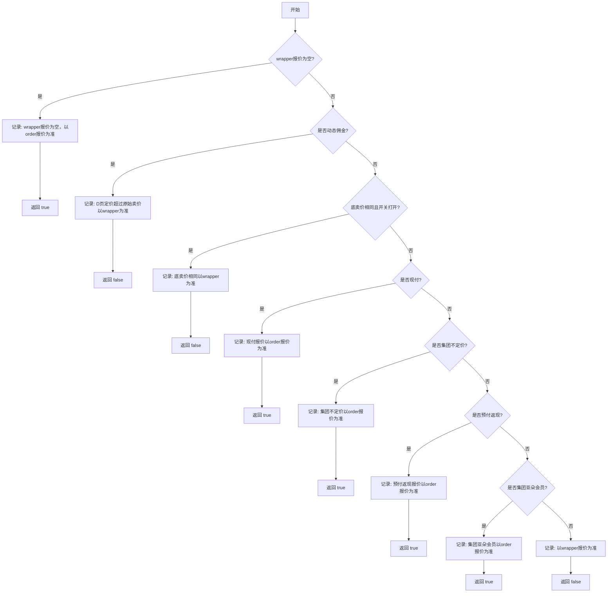

简而言之，其名字即来自于 `R{eliable|plicated|dundant} And Fault-Tolerant`，也来自于这是一艘可以帮助你逃离 Paxos 小岛的救生筏（Raft）。

<!-- more -->

## 参考资料

[Lab2 raft](1%20一切皆项目/搁置中/Q2：做CS的经典lab%201/MIT6.824/Lab2%20raft.md)

[6.824 Lab 2: Raft (mit.edu)](http://nil.csail.mit.edu/6.824/2022/labs/lab-raft.html)

[一文搞懂Raft算法 - 割肉机 - 博客园 (cnblogs.com)](https://www.cnblogs.com/williamjie/p/11137140.html)

[使用 “隐喻” 的方式帮你建立对 Raft 的直觉 | 木鸟杂记 (qtmuniao.com)](https://www.qtmuniao.com/2023/11/15/raft-explain/)

## 核心思想

- 选举班长:
    - 班级需要选出一个班长来领导大家。
    - 每个学生都可以竞选班长,获得多数票的人当选。
    - 班长任期有限,到期后需要重新选举。
- 日志复制:
    - 班长负责记录班级的重要决定(日志)。
    - 班长会把这些决定告诉其他同学,确保大家都知道。
    - 只有多数同学都记录了某个决定,这个决定才算正式生效。
- 安全性:
    - 如果班长缺席了,新班长上任后会先了解之前的决定,不会随意更改。
    - 所有正式生效的决定都会被保留下来,不会丢失。
- 一致性:
    - 通过以上机制,确保所有同学对班级的重要决定达成一致。
    - 即使有同学暂时离开或者新同学加入,最终都能同步到最新信息。

1. raft 共识算法的目的是实现不同节点有着相同的状态机流转
2. 状态机流转表现在相同的历史日志上
3. leader 意味着所有人的日志应该以它为准，只有 leader 有资格接收写命令，当 leader 确认一个日志条目被多数节点复制后，才意味着该条目被成功 commit。

```go
type Entry struct { 
	Index int 
	Term int 
	Command interface{} 
} 
```

所以所谓的共识算法，就是保证 entry 的 commit 顺序都相同

## 分工线程

1. 队长可以专注于接收新的游戏指令
2. Replicator是队长的特派员队伍，每个Replicator负责与一个特定的队员通信
3. Applier 负责是把大家同意的内容真正地写在各自的小本本上

## 节点

```go
type Raft struct {  
    mu        sync.RWMutex        // Lock to protect shared access to this peer's state  
    peers     []*labrpc.ClientEnd // 这是班级里所有同学的联系方式列表。  
    persister *Persister          //  Alice 的"日记本",用来永久记录重要信息,即使遇到意外(比如电脑重启)也不会丢失。  
    me        int                 // Alice 在班级里的学号  
    dead      int32               // 标记 Alice 是否还在"参与班级事务"。  
  
    applyCh        chan ApplyMsg //用来向"班级公告栏"(也就是状态机)发布已确认的决定。  
    applyCond      *sync.Cond    // 这些是 Alice 用来协调不同任务的"闹钟"。  
    replicatorCond []*sync.Cond  // 这些是 Alice 用来协调不同任务的"闹钟"。  
    state          NodeState     //表示 Alice 当前的角色(普通同学、候选人或班长)。  
  
    currentTerm int     // 当前的"学期"编号。  
    votedFor    int     // 在这个学期,Alice 投票给了谁(如果投过的话)。  
    logs        []Entry // Alice 的笔记本,记录了所有的班级决定。  
  
    commitIndex int   //Alice 确定全班大多数人都记下的最新笔记的页码。  
    lastApplied int   // Alice 最后一次在"班级公告栏"上贴出的笔记的页码。  
    nextIndex   []int //对于每个同学,Alice 准备发给他们的下一页笔记的页码。  
    matchIndex  []int //对于每个同学,Alice 确定他们已经记下的最新笔记的页码。  
  
    electionTimer  *time.Timer // "选举超时" 的责任闹钟,如果太久没收到班长的消息,就会响起。  
    heartbeatTimer *time.Timer // 如果 Alice 是班长,这个"心跳"闹钟会定期提醒她给其他同学发消息。  
}
```

electionTimer"责任闹钟"

- 主动性：
    - 在Raft算法中，electionTimer就像是每个同学都有的一个"责任闹钟"。
    - 它不是被动等待别人来组织班级，而是主动关注班级的状况。
- 自我管理：
    - 这个机制确保了即使当前的班长（Leader）出了问题（比如请假或转学），班级也不会陷入无人管理的混乱状态。
    - 每个同学都有潜力成为新的班长，保证了班级管理的连续性。
- 分布式特性：
    - 这种机制很好地体现了分布式系统的特点 - 没有单点故障。
    - 不依赖于固定的"权威"，而是通过群体的自组织来维持秩序。
- 平衡与竞争：
    - 但这也不意味着同学们会急于"篡位"。定时器的随机性（通常是150-300ms）确保了不会所有人同时站出来，避免了混乱。
    - 这就像是大家都在关注，但又不会争先恐后，保持了一种平衡。
- 容错性：
    - 这个机制也提供了很好的容错性。即使有些同学可能暂时"走神"（节点故障），只要还有超过半数的同学在认真听讲（正常工作的节点），班级就能继续正常运转。
- 民主过程：
    - 当有同学站出来要当班长时，还需要获得多数同学的同意（投票过程）。这确保了新班长的合法性和群体的认可。
    


持久化：currentTerm, voteFor 和 logs 这三个变量一旦发生变化就一定要在被其他协程感知到之前（释放锁之前，发送 rpc 之前）持久化，这样才能保证原子性。

锁操作：防止多个 [Goroutine](Goroutine.md) 同时改变关键状态（如 currentTerm, votedFor 和 logs）

## 选举与投票

想象我们有一个5人的班级:Alice, Bob, Charlie, David 和 Eva。

1. 初始状态: 所有人都是普通同学(Follower状态)。
2. 选举触发: 假设Alice的"选举定时器"先到期了。她决定竞选班长。
3. 请求投票:
    - Alice将自己的"任期号"增加到1。
    - 她给其他所有同学发送"投票请求"。
4. 投票过程:
    - Bob和Charlie收到请求后,发现这是他们见过的最新任期,所以同意投票给Alice。
    - David的网络延迟,暂时没收到请求。
    - Eva可能刚刚重启,也没来得及回应。
5. 统计选票:
    - Alice收到了自己、Bob和Charlie的3票,超过了半数(5/2 = 2.5)。
    - Alice宣布自己成为新班长(Leader)。
6. 巩固领导地位:
    - Alice立即向所有同学发送"心跳"消息,表明自己是班长。
    - 收到心跳的同学会重置他们的选举定时器,防止新的选举发生。（其实并不是这样实现的）
		- 这里强调，只有当节点给另一个节点投票（grant vote）时，才应该重置这个计时器。
		- 这与一些可能的直觉相反，因为你可能会认为收到心跳时也应该重置计时器。
			- 防止"活锁"（Livelock）:
			    - 如果每次收到心跳就重置计时器，在网络不稳定的情况下，可能会出现这样的情况：一个节点发送部分心跳成功，但不足以维持领导地位，却足以阻止其他节点发起新的选举。
			    - 这可能导致系统长时间处于没有有效领导者的状态，影响系统的可用性。
			- 加快选举过程:
			    - 只在投票时重置计时器可以让系统在失去领导者后更快地进入新的选举阶段。
			    - 如果每次心跳都重置，可能会延迟发现领导者已经离线的时间。
			- 增加选举的公平性:
			    - 这种机制给了其他节点更公平的机会来发起选举，而不是总是偏向于网络连接较好的节点。
7. 处理迟到的响应:
    - 如果David后来投票给Alice,这票会被接受但不会改变结果。
    - 如果Eva稍后尝试发起新的选举(因为她可能错过了整个过程),由于她的任期号不会高于Alice,所以不会成功。
8. 持续领导:
    - Alice会定期发送心跳来维持自己的领导地位。
    - 只要她能继续与多数同学保持联系,她就能继续担任班长。

这个例子展示了Raft选举的关键特点:

- 选举是由超时触发的
- 候选人寻求多数票
- 最先获得多数票的候选人获胜
- 通过心跳消息维持领导地位

通过这种机制,Raft确保在任何给定时刻,班级(集群)中最多只有一个公认的班长(Leader),从而保证了决策的一致性。

```go
type RequestVoteRequest struct {  
    Term         int // 表示 "我想在第几学期竞选班长"  
    CandidateId  int // 明确告诉大家 "我是谁，我在竞选班长"  
    LastLogIndex int // 相当于说 "我的笔记本最后一页是第几页"，表明自己了解班级事务的程度  
    LastLogTerm  int // 表示 "我笔记本最后一页是哪个学期的内容"，进一步证明自己的资格  
}  
  
type RequestVoteResponse struct {  
    Term        int  // 目的：告诉竞选者 "我当前认为我们在哪个学期"  
    VoteGranted bool // 目的：表示 "我是否同意你当班长" true: "我投你一票" false: "抱歉，这次我不投你"  
}

rf.votedFor = rf.me    // 投给自己
rf.votedFor = request.CandidateId   // 投给拉票的RequestVote RPC
rf.votedFor = -1       // 初始或者重置状态，标识未投票
rf.persist()          // 每次改变 votedFor 的值后,都需要持久化状态，保存到硬盘中，避免崩溃重启后丢失状态 

response.VoteGranted = true  // 表示投票
response.VoteGranted = false // 表示拒绝投票

`term`： Lamport 逻辑时钟
```

## 日志同步

```go

type Entry struct {
	Index   int     // 这是笔记本的第50页
	Term    int     // 这条规定是在第4学期做出的
	Command interface{} // 具体内容是"每周五放学后打扫教室"
}


type AppendEntriesRequest struct {  
    Term         int     //表示当前的"班级学期"。帮助同学们判断这个通知是否来自最新的班长。  
    LeaderId     int     //明确告诉大家是谁发的通知。如果有同学不知道谁是当前班长，可以直接认出来。  
    PrevLogIndex int     //相当于说"我要告诉你的新信息是接在第几页笔记之后的"。  
    PrevLogTerm  int     //确保大家的笔记本上这一页是在同一个"学期"写的。  
    LeaderCommit int     //告诉大家"到第几页的内容已经确定不会变了"。  
    Entries      []Entry //新的笔记内容。可能包含多条新记录，也可能为空（表示这是一个心跳消息）。  
}  
  
  
type AppendEntriesResponse struct {  
    Term          int  //告诉 Alice(leader) 自己当前所知的"班级学期"。如果这个值比 Alice 发来的更大,说明可能有更新的班长产生了。  
    Success       bool //告诉 Alice 是否成功接受并记录了她发来的新内容。 true: "好的,我已经记下来了" false: "抱歉,我没能记下来,可能我的笔记有些问题"  
    ConflictIndex int  //如果记录失败,告诉 Alice "从第几页开始,我的笔记可能和你的不一样"  
    ConflictTerm  int  //如果记录失败,告诉 Alice "在冲突的那一页,我记录的是哪个学期的内容"  
}

/**  
    这个方法可以理解为"检查对方的笔记是否比自己的更新"。  
    参数:  
    term: 对方笔记最后一页的学期  
    index: 对方笔记的总页数  
*/  
func (rf *Raft) isLogUpToDate(term, index int) bool {  
    lastLog := rf.getLastLog()  
    return term > lastLog.Term ||  
       (term == lastLog.Term && index >= lastLog.Index)  
}  
  
/**  
    这个方法可以理解为"检查对方提到的某页笔记是否与自己的一致"。  
    参数:  
    term: 要检查的那页笔记的学期  
    index: 要检查的是第几页笔记  
*/  
func (rf *Raft) matchLog(term, index int) bool { // bob说第50页是3年级上学期写的  
    // 首先Alice检查自己有没有写到第50页 && 如果有,就看看自己第50页是不是真的写着"3年级上学期"  
    return index <= rf.getLastLog().Index && rf.logs[index-rf.getFirstLog().Index].Term == term  
}
```

1. **乐观**：一开始心跳不附带任何日志，只带一些 "暗号" 过去。假如 Follower 的通过 "暗号" 发现自己日志跟 Leader 完全一致，就直接回：一致，之后的心跳不需附加任何日志。
2. **回撤**：如果 Follower 通过 "暗号" 发现自己和 Leader 日志并不一致，也会告诉 Leader——下次得附带日志。则 Leader 就附加一些末尾的日志，如果发现还是不一致，就要继续回撤，多向前附加一些日志，同时更新 "暗号"，直到收到 Follower 肯定回复，则继续恢复不附加任何日志的心跳。

`entry`：驱动生长出一个新的边。仅有 leader 可以生成 entry。Raft 中，将每一个事件都称为一个 entry，每一个 entry 都有一个表明它在 log 中位置的 index




```Java

```
