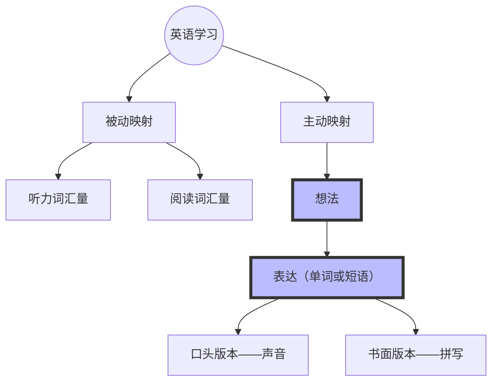
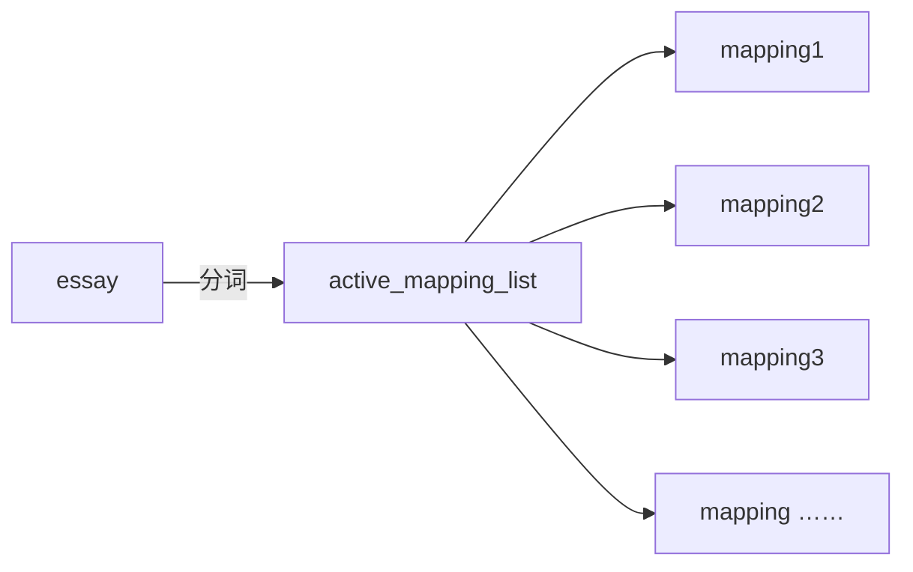
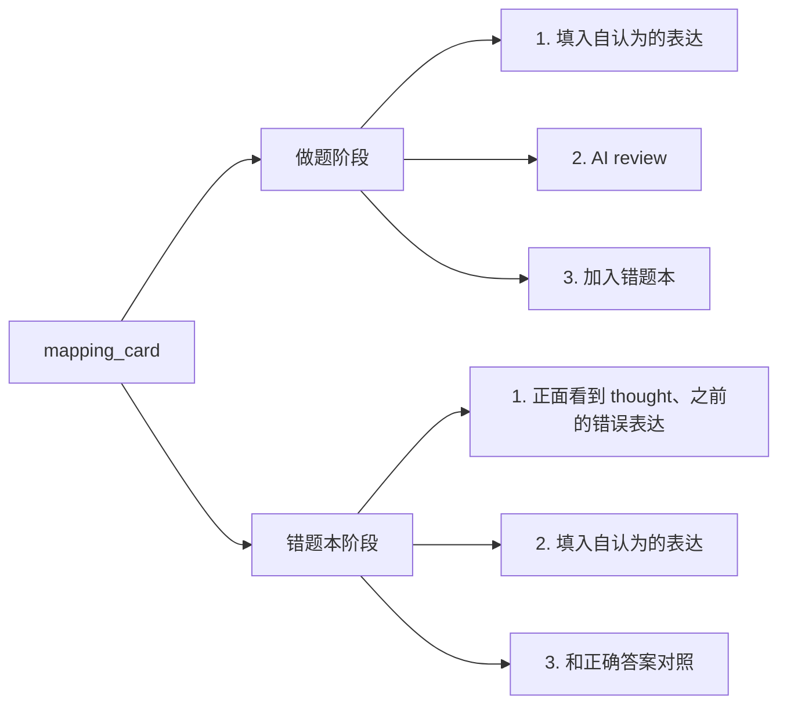
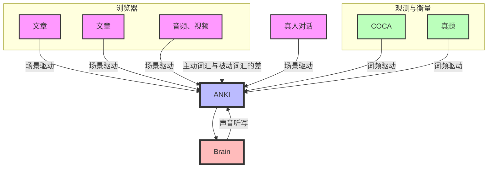

帮我做一个 kaggle 风格的网站，功能是用户上传中文文章后，会分词，然后用户输入自己认为的英文翻译，网站会帮忙检查对错，并生成闪卡用于间隔复习。

Help me build a Kaggle-style website, with the function of users uploading Chinese articles, which will be segmented, and then users inputting their own English translations, and the website will help check the correctness and generate flashcards for spaced repetition review.

**我想做的是英语世界的溯源系统**  
还是软件开发中数字化+智能化的方式  
网站本身首先是一个传感器，将过去白白流逝掉的英语使用信息数字化保存  
其次是一个算法平台，从数据中挖掘规律，找到学习中最痒的那个点，反馈用户

**通过两三年的努力，终于能把问题和需求定清楚，这样占了我之前那个想法，后代产品的核心竞争力就在于他能够提出需求，相比之下实现需求反而变得简单**

最终的目的是在英语这个一切有解，一切能具体到生活的，理想的，学习试验田上，实现学习过程的数字化，找到学习中最痒的那个点，实现有效积累，快速进步，降低总的时间成本。

- 抖音、小红书能利用算法挖掘自媒体内容中的优点、卖点，同时激发新的内容创作。我们为什么不能数字化我们和世界的交互过程，并利用算法挖掘和作用呢？
- 好的产品，应该帮助用户回归本真，回到第一性原理最能发挥的动作中，并让其低成本重复  
 英语相比其他学科的知识图谱来说已经是一个结构最简单的图结构了

## 主要思想

对英语的掌握，本质是脑中四种映射的数量。

|      |                |                                                                                     |
| ---- | -------------- | ----------------------------------------------------------------------------------- |
| 主动映射 | active_mapping | 我想『打』死你 -> beat 给我一『打』鸡蛋 -> dosen                                                |
| 想法   | thought        | 是主动映射的 key，由 sentence 和 句子中的聚焦位置 focus_word 共同组成，这样就能精确定位出一个想法，比如：我想『打』死你，给我一『打』鸡蛋。|
| 表达   | expression     | 是主动映射的 value的 object，包括『口头版本』written_expression『书面版本』oral_expression                |
|      |                |                                                                                     |

## 写作部分，通过 essay 增加 mapping 数量

|        |                 |                                          |
| ------ | --------------- | ---------------------------------------- |
| 文章     | essay           | 是用户输入，是念头的集合                             |
| 用户的表达  | user_expression |                                          |
| AI 的建议 | ai_review       | 包括 is_correct 和 ai_expression            |
| 映射卡片   | mapping_card    | 包括 thought，user_expression，ai_expression |

### 做题

|     | 流程                                          |     |
| --- | ------------------------------------------- | --- |
|     | 上传 essay                                    |     |
|     | 中文分词，获得 active_mapping_list，返回 mapping_card |     |
|     | 用户在 sentence_card 中填写 mapping_card          |     |
|     | ai 检查 mapping_card                          |     |
|     | 用户添加需要间隔复习的 mapping_card                    |     |

### 错题本

---

[口语课复盘 demo](口语课复盘%20demo.md)

[Streamlit](Streamlit.md)

## 过去的痛点

1. 自己无法控制复习强度，要么记不牢，要么记忆负担过大，
	1. 通过自定义间隔复习的参数可以解决
2. 出现的同义词无法纵览、辨析、比较记忆
	1. 通过自己 select 数据可以解决
3. 无法与口语课的数据联动
4. 本质是因为数据不在我们自己的手里

### 功能

#### 利用 Anki 实现间隔复习

- 卡片正面
	- 该单词用 ChatGPT 生成的中文例句
- 卡片背面
	1. 单词的拼写
	2. 单词的发音
		- 用 11labs 生成的自己的声音模型

#### 一键同步到 excel

excel 与 anki 的公用主键应该是单词的拼写  
将 excel 作为同义词、例句用法、聚类整理的地方  
同时将 anki 记忆数据定期 attach 到 excel

- anki connect 取出单词数据
- 将关心的字段增量更新到 excel 表格

#### 一键聚类

- telegram 中 /cluster 触发
- 复习的时候对于脑中无法正确定位的同义词打 flag1
- Anki-Connect 找到 flag1 的单词
- GPT 做聚类分析

### 一键生成 instruction

将外教课的 url 传给 bot，返回 instruction 的 txt 文件  
可以用 txt 文件让 chatgpt 生成复习 json

### Vault 内近义词检索

#### 一键同步口语课数据

- 上传口语课视频
- 得到复盘内容的同时
- 将本次口语课自己的单词使用情况累计到词库数据上

### 需要的工具

#### 从墨墨导出数据

- app 端加入收藏
- 网页端云词库复制出来

#### Anki 的原理和使用

#### Python

- Telegram Bot 开发
- elevenlabs、openai 的接口调用
- Anki connect 实现 Anki 数据的可编程

