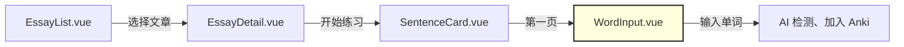
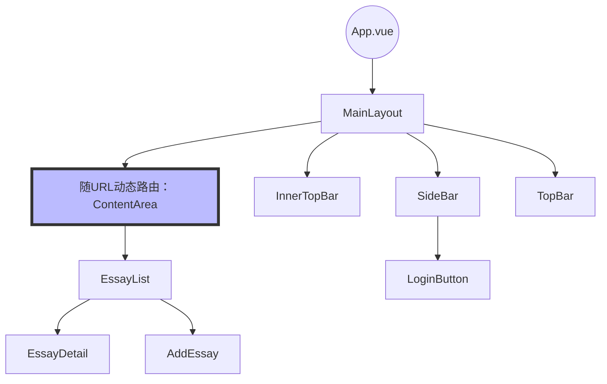

## 工程结构

```Java
.
├── main.js  # Vue 应用的入口文件
├── App.vue

// 路由配置
├── router
│   └── index.js

// 页面布局模板 定义整体布局框架
// 多个页面对应一个布局，是 view 的抽象类
├── layouts
│   ├── AuthLayout.vue  # 主布局
│   └── MainLayout.vue  # 认证页面布局

// 页面视图、与路由对应， 页面级组件，处理业务逻辑
// 每个路由对应一个页面
└── views
    ├── Home.vue
    └── essay
        ├── EssayDetailModal.vue
        ├── EssayList.vue
        ├── MappingGridCard.vue
        └── SentenceCard.vue
        
// 被 views 和 layouts 复用的 UI 组件
// 通过 props 接收数据，通过 emit 发送事件
// 提供具体功能的、较小的组件,通常不与路由直接关联,
// 例如按钮、表单输入、卡片
├── components
│   ├── ActiveVocabulary.vue
│   ├── AddEssay.vue
│   ├── AddEssayModal.vue
│   ├── EssayInput.vue
│   ├── InnerTopBar.vue
│   ├── Portal.vue
│   └── layout
│       ├── ContentArea.vue
│       ├── LoginButton.vue
│       ├── SideBar.vue
│       ├── Toast.vue
│       └── TopBar.vue
├── components.d.ts

// 插件配置
├── plugins
│   ├── element-plus.js
│   └── googleAuth.js

// API 服务
├── services
│   └── api.js

// 状态管理
├── stores
│   ├── index.js
│   └── user.js
```

## 渲染

```Java
App.vue
  └─ <router-view>
      └─ MainLayout.vue
          └─ <router-view>
              └─ EssayList.vue
                  └─ ContentArea
                      └─ 文章列表内容
```

## 路由

```js
  {
	// 对应 layouts 中的布局
    path: '/',
    component: () => import('@/layouts/MainLayout.vue'),
    children: [
      // 每个 child 对应 views 中的一个页面
      {
        path: '',
        name: 'essay-list',
        component: () => import('@/views/essay/EssayList.vue'),
        meta: { 
          layout: 'main',
          requiresAuth: false 
        }
      },
    ]
  },
  ```

- 需要将所有页面内容移到 views 目录下
- 使用 ContentArea 作为页面内容的包装器
- 可以在路由配置中添加 meta 信息来控制权限等
- 可以使用路由守卫来处理权限验证

## 登录

```json
{"web":{"client_id":"","project_id":"linen-option-420316","auth_uri":"https://accounts.google.com/o/oauth2/auth","token_uri":"https://oauth2.googleapis.com/token","auth_provider_x509_cert_url":"https://www.googleapis.com/oauth2/v1/certs","client_secret":"、","redirect_uris":["http://localhost:5173"],"javascript_origins":["http://localhost:5173"]}}
```

```js
// 添加请求拦截器来设置 JWT token，以后所有的请求都带了能表示用户身份的 token
api.interceptors.request.use((config) => {
  const token = localStorage.getItem('jwt_token');
  if (token) {
    config.headers['Authorization'] = `Bearer ${token}`;
  }
  return config;
}, (error) => {
  return Promise.reject(error);
});
```

### mock 数据

```shell
json-server --watch db.json --port 8000
```

### 模态框的使用

模态框（Modal）是一种常见的用户界面元素，在网页设计和应用程序开发中广泛使用。从 AddEssay 组件转变为 AddEssayModal 组件，这是一种模态框（Modal）设计模式。这种设计模式有以下几个特点和优势：

- 分离关注点：将添加文章的功能从主界面分离出来，成为一个独立的模态框组件，使得代码结构更清晰，更易于维护。
- 模态框是一个出现在当前页面之上的内容框，通常用于显示重要信息、获取用户输入或确认操作。它的主要特点包括：
	1. 覆盖性：模态框会覆盖在主要内容之上，通常会有一个半透明的背景遮罩。
	2. 焦点转移：当模态框打开时，用户的注意力会被引导到模态框内容上。

### 状态管理

- 用户状态（UserStore）是全局状态，只需要在应用的入口点（通常是 App.vue）初始化一次就够了。
- 在 App.vue 中初始化后，所有子组件都可以访问到已经初始化的状态。

## Vue 和 JavaScript 方法使用频率统计（表格版）

### Vue 相关方法

| 方法          | 使用次数 |             |
| ----------- | ---- | ----------- |
| ref         | 18   |             |
| computed    | 2    |             |
| onMounted   | 2    |             |
| provide     | 2    |             |
| inject      | 1    |             |
| reactive    | 1    |             |
| watch       | 1    |             |
| defineProps | 1    |             |
| defineEmits | 1    |             |
| emit        |      | 本质是发射一个事件出去 |

### JavaScript 数组方法

| 方法 | 使用次数 |
|------|----------|
| map | 3 |
| forEach | 2 |
| filter | 1 |

### JavaScript 对象方法

| 方法 | 使用次数 |
|------|----------|
| Object.keys | 1 |

### DOM 操作方法

| 方法 | 使用次数 |
|------|----------|
| addEventListener | 1 |
| removeEventListener | 1 |
| appendChild | 1 |

### 其他常用 JavaScript 方法

| 方法 | 使用次数 |
|------|----------|
| setTimeout | 2 |
| console.log | 多次 (用于调试) |
| console.error | 多次 (用于错误处理) |

### Vue Router 相关方法

| 方法 | 使用次数 |
|------|----------|
| useRouter | 2 |
| push (router.push) | 2 |

### Axios 相关方法

| 方法 | 使用次数 |
|------|----------|
| post | 5 |
| get | 3 |
| create | 1 |
| interceptors.request.use | 1 |

### Pinia 相关方法

| 方法 | 使用次数 |
|------|----------|
| defineStore | 1 |

### 其他注意到的模式

- 大量使用了 ES6+ 的箭头函数语法
- 使用了解构赋值
- 使用了模板字符串
- 使用了 async/await 进行异步操作
