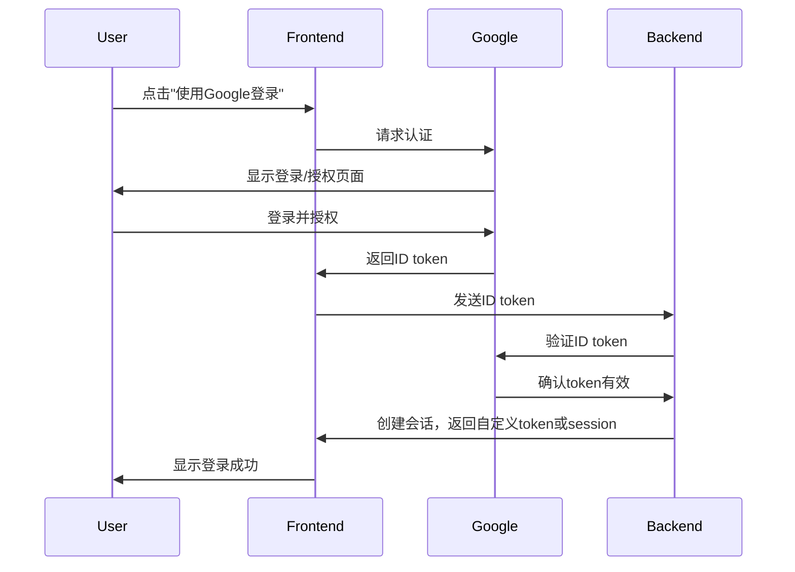

OAuth 2.0 是一个开放标准的授权协议，允许用户授权第三方应用访问他们在某个服务提供商上的受保护资源，而无需将自己的凭证直接提供给第三方应用。

这种登录交互方式属于 OAuth 2.0 和 OpenID Connect (OIDC) 技术的应用，特别是 " 使用 Google 登录 " 这种情况。让我为您详细解释一下：

1. OAuth 2.0：这是一个授权框架，允许第三方应用获取对用户资源的有限访问权，而无需知道用户的凭据。
2. OpenID Connect (OIDC)：这是建立在 OAuth 2.0 之上的身份层，增加了身份验证功能。它允许客户端应用基于授权服务器执行的身份验证来验证最终用户的身份。

在您描述的流程中，我们可以看到典型的 OAuth 2.0 + OIDC 流程，具体是 " 授权码流程 "（Authorization Code Flow）:
