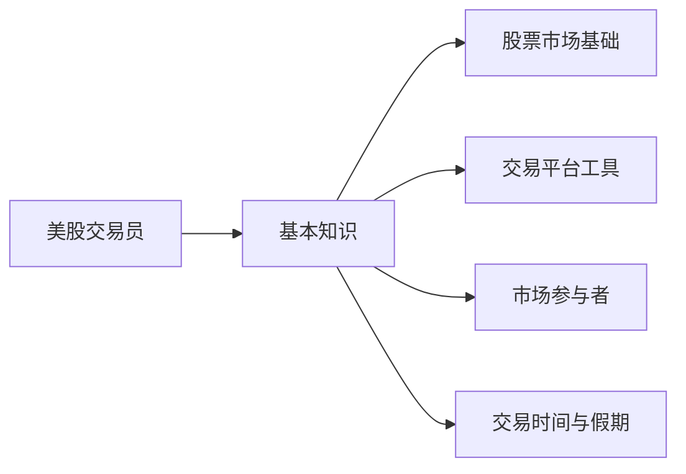

美股最难第一是不能卖，第二是什么时候卖。我总结下我的期权止盈系统：1. 设置止盈点，要么基于价格要么基于事件，前提是要理解深刻 2. 关键日期要reserve时间来思考操作 3. 动态评价风险。止盈点要调整 4. 三个月内的期权盈利100%，不管发生什么开始每日动态止盈 5. 严格控制仓位，尤其是短期的风险较高的事件

美股的大科技股，十个点以内浮亏当没看见就行。

apple 是美股永远的英伟达

## 股票市场基础

[股票](股票.md)  
正股、[期权](期权.md)  
[日内交易](日内交易.md)  
[交易单](交易单.md) [左侧](左侧.md) [股息](股息.md)

## 交易平台工具

- 交易所
    - NYSE（纽约证券交易所）
    - NASDAQ（纳斯达克）
    - 其他区域交易所
- [券商](券商.md)
- 专业交易软件
    - Bloomberg Terminal：提供实时市场数据和新闻
    - Thomson Reuters Eikon：类似Bloomberg的专业平台
- 图表和分析工具
    - [TradingView](TradingView.md)：提供图表和社交交易功能，技术分析的软件。里面有你能知道的所有技术分析指标。这个软件我每天用，很多时间都是花在这里了。每天做做charting，培养感觉。
    - Finviz。股票筛选和可视化工具，选好的公司，你如何想要了解更多，去 Finviz。可以查看这个公司的各项经营数据，交易量等指标。也能看到过去几天有异常交易量的ticker
- 市场数据提供商
    - Market Data API：如Alpha Vantage, IEX Cloud
- 算法交易平台
    - 量化交易平台：如QuantConnect, Quantopian
- 风险管理工具
    - 投资组合分析软件
    - 风险评估模型
- 新闻和研究平台
    - 财经新闻网站：如CNBC, Bloomberg，每天刷刷当日新闻，把自己放在这个匆忙的金融世界里。看多听多了，评论员的讨论慢慢就听懂了。
    - 研究报告平台：如Morningstar, S&P Capital IQ
    - Trade ideas。一个帮你选公司的系统。如何选，你可以根据你想要的标准去设置适合你的系统。
    - Benzinga Pro。可以查看公司的最新的新闻，最新最新，按照秒算。也可以看到大盘的最新新闻。基本就是美联储关键人物一说话，新闻基本可以同步出来。主打就是一个及时。
    - marketwatch。大环境是很重要的，每一个个体经济活动在这个大环境里表演。这个网站梳理出了重要经济活动时间表：1）重大经济活动，2）发布经济指标，3）美联储重要会议等等。
- 社交交易平台
    - StockTwits：股票相关的社交媒体平台
    - Seeking Alpha：投资者社区和分析平台

## 市场参与者

1. 个人投资者
    - 散户：通过经纪商账户进行[交易](交易.md)的个人
    - 日内交易者：频繁进行短期交易的个人
2. 机构投资者
    - 共同基金：代表众多投资者进行专业管理的投资组合
    - 养老基金：为退休人员管理的长期投资基金
    - 对冲基金：采用更激进策略的私募投资基金
    - 保险公司：将保费收入投资于股票市场
3. 投资银行
    - 为公司提供上市、融资等服务
    - 进行自营交易
4. 做市商
    - 为特定股票提供流动性，报价买卖
5. 高频交易公司
    - 使用算法进行极速交易
6. 公司本身
    - 通过股票回购或发行新股参与市场
7. 政府和监管机构
    - SEC（证券交易委员会）：主要监管机构
    - FINRA（金融业监管局）：自律组织
    

## 交易时间

美国的股市是周一到周五的交易时间

闭市时段对于东八区的中国人来说，就变成了：[夜盘](夜盘.md)、[粉单](粉单.md)、  
盘中交易通常更安全、更有流动性,而盘前交易可能为快速反应市场变化提供机会,但风险也更高

## [信息](信息.md)

勃勃的美股投资日记：https://boist.org/  
抖音KZG  
[长期更：入美股快 5 年了，复盘这些年的失与得 - V2EX](https://www.v2ex.com/t/941650)  
[格雷厄姆](格雷厄姆.md)

## 经验

1. 快速投入金钱，获取自己的注意力
2. 刚接触可以通过小额短线快速熟悉常用操作
3. 基本面不错的股票意外暴跌
4. 加入社区获得新鲜的信息、良好的氛围
5. 一段时间后转为长线价值投资，只作为其他方面收入的一个小杠杆（10%）

## Stock

| 代码                    | 描述                                             | 策略           |
| --------------------- | ---------------------------------------------- | ------------ |
| XLF                   | 专注于金融业的 ETF。反映美国金融 sector 整体表现，包括银行、保险、券商等     |              |
| XLV                   | 专注于医疗保健业的 ETF。包括制药、医疗设备、生物科技等，防御性较强            |              |
| FAS(金融类ETF)、LLY(礼来公司) |                                                |              |
| COST                  | Costco 公司。会员制仓储式零售商，以低价和高质量著称                  |              |
| HD                    | Home Depot。北美最大家居装修零售商，受房地产市场影响大               |              |
| MCD                   | 麦当劳。全球最大的快餐连锁企业，抗通胀能力强                         |              |
| DKNG                  | DraftKings。在线体育博彩和日常幻想体育平台，增长潜力大但风险高           |              |
| AMD                   | Advanced Micro Devices。半导体公司，CPU 和 GPU 主要生产商之一 |              |
| DIS                   | 迪士尼。娱乐帝国，包括主题公园、电影制作和流媒体服务                     |              |
| BAC                   | 美国银行。美国领先的商业银行之一，对利率变化敏感                       |              |
| ASTS                  | 太空移动通信公司。技术具有颠覆性，但风险和不确定性很高                    |              |
|                       |                                                |              |
| GameStop（GME）| 电子游戏零售商。因散户热炒成为知名 [Meme](Meme.md)                   |              |
|                       |                                                |              |
| ENPH                  | 太阳能微型逆变器制造商。可再生能源领域的领先企业                       | 目前是低点，可以长期持有 |
| ALB                   | 全球最大的锂生产商之一。电动车电池原材料供应商，长期看好                   |              |
| OXY                   | 西方石油公司，抄巴菲特的底                                  |              |
|                       |                                                |              |
| NVDA                  | 英伟达，NVDL 是两倍做多                                 |              |
| AAPL                  | 苹果，AAPU 是两倍做多                                  |              |
| GOOGL                 | Alphabet 公司 A 类股。搜索引擎巨头，广告收入为主，涉及 AI、云计算等      |              |
| META                  | Facebook 母公司。社交媒体巨头，正大力投资元宇宙技术                 |              |
|                       |                                                |              |
| QQQ                   | 追踪纳斯达克 100 指数的 ETF。科技股比重大，波动较大                 |              |
| [罗素指数](罗素指数.md)              | 小型股、各行各业、基准指标。广泛代表美国股市，适合多元化投资                 |              |
|                       |                                                |              |
| PDD                   | 中国电商平台。以低价和社交电商模式快速增长                          |              |
| LKNCY                 | 瑞幸咖啡。中国连锁咖啡品牌，曾因财务造假退市后重新上市                    |              |
| TCOM                  | 携程                                             |              |
|                       |                                                |              |
| VIX                   | 恐慌指数，衡量市场预期波动性。市场恐慌时上升，平静时下降                   | 做日内交易就好      |
| UVXY                  | 做多 VIX 期货的杠杆 ETF。波动剧烈，长期持有有严重损耗                | 尽量不要隔夜       |
| SVIX、SVXY             | 做空波动率的 ETF。长期看来可能表现较好，但短期风险很大                  |              |
|                       |                                                |              |
| AVGO                  | 博通 半导体设备                                       |              |
| ARM                   | NVIDIA的Grace GPU已基于ARM架构开发                     |              |
| MU                    | 美光科技，内存条在三星、海力士之后                              |              |
|                       |                                                |              |
| GRAB                  | 东南亚领先的超级应用平台，提供打车、外卖和金融服务。|              |
| AITX                  | 开发用于安保和客户服务的AI驱动机器人解决方案。|              |
| VVOS                  | 开发创新的口腔设备来治疗睡眠呼吸暂停。|              |
| LUNR                  | 月球探索和太空技术公司。专注于开发月球着陆器和其他太空探索技术。|              |
| WBUY                  | 电子商务平台，主要面向中国市场。提供多种商品和服务，类似于亚马逊的商业模式。|              |
| OMEX                  | 海洋探索和深海资源开发公司。专注于海底考古和矿产资源勘探。|              |

---
