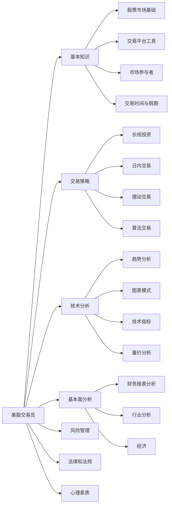
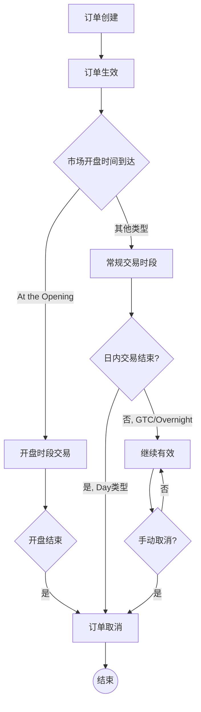

[基本面](基本面.md)、[消息面](消息面.md)  
[大盘](大盘.md)、[技术指标](技术指标.md)  
[仓位](仓位.md)、[交易单](交易单.md)  
[Buy the rumor, sell the news](Buy%20the%20rumor,%20sell%20the%20news.md)

操作的成功与否不重要，重要的是有思路，并能通过复盘优化思路  

炒股的人试过了各种指标和方法，突然有一天开悟了，开始稳定盈利。他们悟到什么了呢？- 不二哥的回答 - 知乎  
https://www.zhihu.com/question/30793521/answer/295872063  


- **大学阶段：纪律与心态的管理**
    
    - 在此层面，"纪律"成了把胜率、赔率、资金管理有效结合的关键。
    - 作者提出了"胜败""对错""盈亏"三概念：
        - **胜败**是对市场趋势是否符合预期的判断；
        - **对错**是自己是否按计划执行（有无违背交易系统和仓位管理）；
        - **盈亏**则是最终的资金结果。
    - 真正的"稳定盈利"往往源于：执行前定好计划与仓位、设置严格止损、管住情绪，反复践行并不断改进。
    - 同时也深入探讨了如何改掉人性的弱点（频繁交易、抄底摸顶、重仓赌徒心理等），并指出"行为习惯和心态调整"是长期反思与实践的成果。
- **大师阶段：信念**
    
    - 真正站在金字塔顶端的交易者，不仅具备概率+纪律的执行力，还拥有强大而灵活的"信念"与哲学思维。
    - 一方面坚守核心原则（生存第一、赚大赔小），另一方面在极少数确定性极高的机会里也敢"all in"（如索罗斯对冲英镑）。
    - 作者引用量子力学"观测者意识会影响粒子状态"的比喻，强调"人之所信，往往决定结果"。由此衍生出对"意识/信念创造现实"的阐述。
    - 这种信念并非"盲目冒进"，而是"上善若水"的中庸之道：既能百折不挠又能灵活变通。

## 复盘

作为美股投资者，撰写交易复盘是提升交易能力、优化策略和培养纪律性的重要工具。以下是一份系统化的复盘框架，结合美股市场特点，帮助你高效总结交易经验：

---

### **一、复盘核心目标**

1. **客观记录**：避免情绪化，用数据还原交易过程。
2. **策略验证**：检验交易系统是否符合市场环境。
3. **行为修正**：识别重复性错误（如追涨杀跌、过度交易）。
4. **心理建设**：强化纪律性，减少冲动操作。

---

### **二、美股交易复盘模板（逐笔分析）**

#### **1. 交易基础信息**

- **日期/时间**：记录交易执行时间（美东时间ET），注意盘前/盘后交易。
- **标的**：股票代码、公司名称、所属板块（如科技、消费、能源）。
- **方向**：做多/做空、仓位大小（占总资金比例）。
- **持仓周期**：日内交易（Day Trade）、波段（Swing Trade）或长线。

#### **2. 交易逻辑与策略**

- **入场理由**（需具体化）：
  - 技术面：突破关键阻力位（如$200均线）、MACD金叉、超卖RSI等。
  - 基本面：财报超预期（EPS、营收增长）、行业趋势（如AI、新能源政策）。
  - 消息面：美联储利率决议、个股新闻（如特斯拉新产品发布）。
- **预期目标**：预设止盈位（如20%涨幅）、止损位（如-8%）、持有时间。

#### **3. 交易执行细节**

- **入场点**：实际成交价与计划价差（是否滑点？）。
- **出场点**：是否按计划执行？提前止盈/止损的原因。
- **风险管理**：单笔风险是否控制在总资金1-2%？杠杆使用情况。

#### **4. 市场环境分析**

- **大盘走势**：标普500（SPX）、纳斯达克（NDX）当日波动率（VIX指数）。
- **板块轮动**：资金流向（如防御板块 vs 成长股）。
- **关键事件**：经济数据（非农、CPI）、个股期权到期日（Options Expiration）。

#### **5. 交易结果评估**

- **盈亏统计**：绝对金额、收益率、与基准（如SPY）对比。
- **绩效归因**：
  - 正确决策：如精准捕捉到英伟达财报后跳空缺口。
  - 错误决策：如忽视美联储加息预期导致科技股回调。

#### **6. 行为与心理反思**

- **纪律性**：是否遵守交易计划？有无受FOMO（错失恐惧）影响？
- **情绪管理**：持仓期间焦虑程度（可量化评分1-10分）。
- **认知偏差**：确认偏误（只关注利好信息）、锚定效应（执着于成本价）。

#### **7. 改进计划**

- **策略优化**：调整技术指标参数（如将RSI超买阈值从70改为75）。
- **知识补充**：需学习期权对冲策略或量化回测工具（如Python backtrader）。
- **行为约束**：设置交易冷却期（如单日亏损3%后暂停交易）。

---

### **三、美股复盘进阶技巧**

1. **多周期验证**：
   - 日线趋势与1小时图信号是否共振？
   - 例如：苹果（AAPL）在周线支撑位+15分钟图放量突破时入场。

2. **资金流分析**：
   - 使用L2数据观察机构订单流（如纳斯达克TotalView）。
   - 追踪ARKK等明星基金持仓变动。

3. **相关性检验**：
   - 个股与行业ETF的相关性（如AMD与SOXX半导体ETF）。
   - 美元指数（DXY）与出口型公司（如波音BA）的联动。

4. **批量统计分析**（适用于高频交易者）：
   - 月度胜率、盈亏比、夏普比率。
   - 不同时间段表现（如开盘30分钟 vs 尾盘波动）。

---

### **四、工具推荐**

- **交易日志软件**：Tradervue、Edgewonk（自动生成统计数据）
- **图表平台**：TradingView（标记关键决策点）
- **情绪指标**：CNN Fear & Greed Index（记录当日市场情绪）

---

### **五、范例片段**

> **交易日期**：2023-10-05（美东时间14:30入场）  
> **标的**：META @ $310（通信服务板块）  
> **逻辑**：  
> - 技术面：日线回踩50日均线+小时图形成看涨吞没形态  
> - 基本面：Reels广告收入增速超预期（Q3财报前瞻）
> **结果**：持仓2天，止盈于$335（+8%），跑赢纳指同期+1.2%  
> **反思**：未考虑美债收益率飙升对成长股估值压力，下次需结合宏观面过滤信号。

---

**关键提醒**：  
美股复盘需特别关注**盘前盘后流动性**、**财报发布时间**（通常盘前/盘后公布）、**期权链隐含波动率变化**。建议每周做一次策略级复盘，每月做一次账户全面体检。

---

可以选择市价单（Market Order）或限价单（Limit Order）。市价单会按当前市场价格立即成交，而限价单则是在达到您设定的价格时成交。

限价单是一种常见的股票交易订单类型。在富途平台上填写限价单时，它的含义是：

1. 设定价格：你需要指定一个具体的买入价格。这个价格通常低于或等于当前市场价格。
2. 执行条件：只有当市场价格达到或低于你设定的价格时，订单才会被执行。
3. 价格保护：限价单可以保护你不会以高于你预期的价格买入股票或 ETF（如纳斯达克指数 ETF）。
4. 不保证成交：如果市场价格没有达到你设定的价格，订单可能不会被执行。
5. 有效期：通常你可以设置订单的有效期，比如当日有效或者直到取消为止。

限价单的优点是可以让你更好地控制买入价格，避免因市场波动而 overpay。但缺点是如果市场价格没有达到你设定的价格，你可能会错过买入机会。

如果你想了解更多关于限价单的细节或其他订单类型，我可以为你进一步解释。

## 策略

**1. 山顶型（High Beta，短期见顶的高波动形态）**

```Java
            /\  
           /  \    <-- 股价短期可能已经冲顶
          /    \  
         /      \  
        /        \
       /          \
      /            \
```

- 这个时候你认为股价已在**山顶**或接近顶部，短期要下跌，
    - **策略：** 直接卖出正股，落袋为安；
    - 如果只卖CC，当股价快速下跌时，收一点权利金就有点"捡了芝麻丢了西瓜"的感觉。

---

**2. 平缓上涨型（相对低 Beta，缓慢上行的形态）**

```Java
		    __ ___ ___ __
           /
          /               <-- 价格平缓上涨或震荡上行
         /                可能没有明显见顶迹象
        /
       /
```

- 这个时候股价处于**平稳或缓慢上行**趋势，没有短期见顶的大概率判断，
    - **策略：** 可以在持有正股的同时，**卖出 Covered Call** (CC)，稳健收取权利金，增强收益；
    - 股价如果继续慢涨，赚股价上行+期权费；
    - 如果下跌，期权费也可以部分对冲损失。

---

Beta 是什么意思？

- **Beta**（贝塔）：衡量个股（或组合）相对于整体市场的**波动程度**。
- Beta = 1 表示跟大盘波动幅度相近；Beta > 1 表示比大盘更"活跃"，波动更大；Beta < 1 表示比大盘波动小，整体偏稳健。
- **高 Beta** 的股票，往往一旦出现短期见顶或下跌趋势，调整幅度可能更大；
- **低 Beta** 的股票，相对波动没那么剧烈，更适合做一些稳定的策略，比如持续地卖 Covered Call 赚权利金。

---

**小结**

- 如果你判断股价**短期见顶**，而且是**高 Beta** 并有可能出现急跌，那么直接卖出正股更合适，避免回吐过多利润；
- 如果股价**趋势平缓**、波动不大、暂时看不到显著的顶部或大跌风险，则在持股的同时，持续卖出 Covered Call（收权利金）是一个增强收益的稳健方式。

## Order

```Java
## Buy

	                    limit  <--M
------------------------------------  到价买入      

M-->  stop            
------------------------------------  反弹买入

	  limit  <--M    stop	 <--M
------------------------------------  杀跌，StopLimit，到Stop点的时候，触发Limit


## Sell

		  M-->	        limit
------------------------------------  到价卖出，UVXY 那次应该用止损错误用了止盈导致立即成交

	  stop	     <--M
------------------------------------  回落卖出，FFIE 那次，可以设置止损单

	  stop--M	-->   stop--M
------------------------------------  动态止盈，回落卖出，Trail
```

|                 |        |                                                          |                                  |
| --------------- | ------ | -------------------------------------------------------- | -------------------------------- |
| Stop            | 止损     |                                                          |                                  |
| Limit           | 限价     |                                                          |                                  |
| Trail10         | 追踪止损   | 动态 Stop，跟踪距离为 10 元，涨到 100 相当于 Stop 90，涨到 120 相当于 Stop110 | TCOM 那次，可以用这种方式，追一段时间涨幅又避免大幅度的回调 |
| Stop Limit      | 止损限价单  | when stop 被触发，then set limit                             | 拼多多跌 20%的时候，触发 Limit，如果再跌 10%就买  |
|                 |        |                                                          |                                  |
|                 |        |                                                          |                                  |
| Market          | 市价     |                                                          |                                  |
| Market on Close | 收盘市价单  |                                                          | UVXY 绝不隔夜，那么就适合闭市时候的市价单兜底        |
| Limit on Close  | 收盘限价单  |                                                          |                                  |
|                 |        |                                                          |                                  |
| Profit Taker    | 兜底止盈选项 |                                                          |                                  |
| Stop Loss       | 兜底止损选项 |                                                          |                                  |

1. Market（市价单）：以当前市场价格立即执行的订单。
2. Limit（限价单）：以指定价格或更好价格执行的订单。
3. MidPrice（中间价格单）：以买卖价中间价格执行的订单。
4. Stop（止损单）：当价格达到指定水平时触发的市价单。
5. Stop Limit（止损限价单）：当价格达到指定水平时触发的限价单。
6. Trail（追踪止损单）：根据市场价格变动自动调整触发价的止损单。
7. Trail Limit（追踪限价单）：触发后成为限价单的追踪止损单。
8. Market on Close（收盘市价单）：在交易日结束时以收盘价执行的市价单。
9. Limit on Close（收盘限价单）：在交易日结束时以限定价格或更好价格执行的订单。

## 常规时间

1. Day（日内有效）:
    - 这是最常用的选项，适合大多数日间交易者。
    - 订单仅在当天交易时段内有效，如果未成交，会在收市时自动取消。
    - 优点：避免了隔夜持仓的风险，适合短期交易策略。
    - 建议：如果您希望在当天完成交易，并且不想让订单在隔夜市场中暴露，选择此项。
2. Good till Cancel（GTC，有效至取消）:
    - 订单会一直有效，直到被成交或您主动取消。
    - 优点：不需要每天重新下单，适合长期投资者或等待特定价格的投资者。
    - 注意：要记得追踪和管理未成交的 GTC 订单。
3. At the Opening（开盘时段有效）:
    - 订单仅在开盘时段内有效。
    - 适合想要在开盘时立即执行交易的投资者。
    - 优点：可以利用开盘时的流动性和价格发现过程。

## 夜盘时间

1. Overnight（隔夜有效）:
    - 允许订单在正常交易时间之外执行。
    - 适合想要参与盘后交易或预市交易的投资者。
    - 注意：隔夜市场流动性可能较低，价格波动可能较大。



建议：

- 如果您是日内交易者或短期投资者，选择 "Day" 是最安全和常用的选项。
- 如果您有特定的价格目标，并且愿意等待较长时间，可以考虑 "Good till Cancel"。
- 如果您想在开盘时抓住可能的价格机会，选择 "At the Opening"。
- 除非您有特殊的交易需求或策略，通常不建议选择 "Overnight"，因为隔夜市场风险较高。

最终选择应该基于您的交易策略、风险承受能力和对市场的预期。如果不确定，"Day" 选项通常是最安全和灵活的选择。

```Java
|域名(server_name)|服务|上游(upstream) 隐藏后端节点|转发改写(location)|服务类型|菜单|
|---|---|---|---|---|---|
|travelco.greya.corp.qunar.com|simulation-docker|\|k8s__h-travelco__simulation-docker<br><br>- 10.68.36.99:8080:1\||\|**始终**\||OpenResty||
|l-travelco.h.qunar.com|
```


## 经验

1. 今天的一个经验是非盘中确实波动比较慢 不适合做t  
实验之后发现fomc day这种日内大事件大iv 日内theta decay接近无  但是一但iv crash还横盘就能赚很多 两点前基本上就浮动几刀 根本吃不到theta 两点后到盘尾暴涨到一百盈利一手 要吃theta decay还是iv低的日子有的吃

| caozuo |                                                                            |
| ------ | -------------------------------------------------------------------------- |
|        | 限价单中的止盈逻辑和止损逻辑                                                             |
|        | excess 流动性不足导致的清仓                                                          |
|        | UVXY 等带损耗的工具不能过夜                                                           |
|        | 瑞幸这种一般的股票大涨之后不能跟，瑞幸看七个点进去，没有继续涨就应该赶紧出掉，这是个低级错误                         |
|        | ------------ 其实没有这些失误，正常已经百十的收益了，所以不要怀疑自己的判断，丰富信息和操作步骤的知识即可 -------------- |
|        |                                                                            |

## 卖

在美股或港股券商账户（包括长桥证券）里，**卖出股票后获得的资金并不会立刻变成"可提取"或"可兑换"的现金余额**。通常有一个"T+结算周期"（美股常见为 T+2，港股则多为 T+2 或 T+1 视具体股票而定）：

1. **T+2（或 T+1）是什么意思？**
    
    - "T"指的是交易当日（Trade Date），后面的数字表示需要再过多少个工作日资金才会正式结算并"到账"。
    - 例如：如果美股是 T+2，那么你在周一卖出股票，对应资金要到周三收盘或周四（视券商处理流程）才会正式在你的证券账户内成为"可用资金"。

**日结单（Daily Statement）**通常只是对当天或最近一个交易日内的账户交易、持仓、费用等信息的汇总和确认，等于是告诉你"今天有什么交易或变动，预计结算多少资金"。但并不代表这些资金已经在你的账户中成为**可提现/可兑换**的"可用余额"。

收到日结单：只代表当天交易已确认、记录产生了相应账务明细。
资金真正入账：需要等清算周期（T+1或T+2等）走完，并且券商完成内部资金划转后，你在账户上才能看到相应的可用余额。
