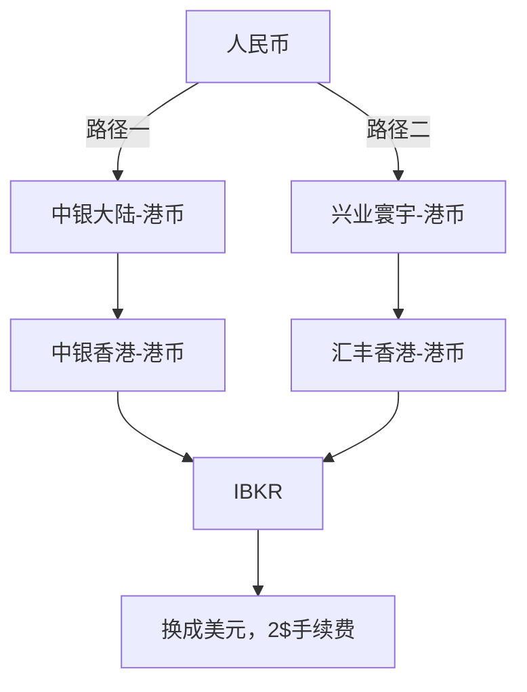

## 线上

> [!最佳实践]
> 1. 最好一次性把 5w 额度打满用完，中银大陆一个月汇款7次会被限制，从失败汇款那里算一个自然月解封
> 2. ibkr 里的美元汇率是更好的，但是有 2 刀手续费，Ib 兑换还是比较划算的，就是市场价买入美元，加上 2USD 费用。
 > 3. 寰宇汇美元去汇丰，中转行有可能收手续费，看运气；但汇港币能保证无损

## 人肉

还有一种方法是每次带 2w rmb 或 5000 美元现金出去存入中银香港 atm 机，这个可以不限 5w 额度，有兴趣 可以看看流程文档 [一、汇丰ONE和中银香港开户](https://docs.qq.com/doc/DTWVlZ09ISFRHenVN)  

## 参考信息

### 兴业寰宇人生借记卡权益

- 购汇结汇交易费率 5 折优惠，购汇结汇交易费率"指购汇/结汇价格与中间价格的差值，中间价格指（结汇价格+购汇价格）/2。
- 跨境外汇汇款前 30 笔手续费、电讯费全免.
- 境外银联 ATM 取现每月前 3 笔手续费全免，免收寰宇人生借记卡客户每月前 3 笔境外"银联"标识 ATM 取现手续费，实际收费情况请以 ATM 提示信息为准。
- 开具存款证明/外币携带证免手续费。
