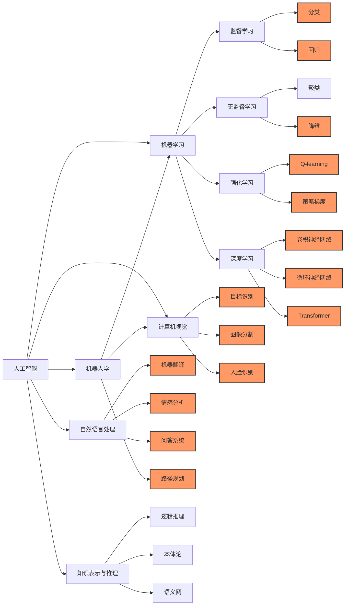

[[莱布尼茨]]提出了**"人类思想的字母表"（Alphabet of Human Thought）** 和**"普遍语言"（Universal Language）**的构想。他认为人类的所有思想都可以像文字由字母组合而成一样，由一些基本的、简单的概念符号组合而成。

具体来说：

1. **人类思想的字母表**  
    莱布尼茨认为，所有复杂的思想都能被还原为一组基本元素或"原子思想"，类似字母表中的字母。这些元素清晰、简单，能够通过一定规则进行组合，从而表达复杂的含义。
    例如，他设想人类思想有一个有限的基本元素集合（如基本的概念或范畴），通过不同组合，可以精确地表达世间一切知识。
    
2. **普遍语言**  
    莱布尼茨希望基于上述"思想的字母表"，创建一种"普遍语言"，即通用于所有领域和文化的通用符号系统。这种语言不仅可以精确地表达思想，还能消除歧义，帮助人们更好地沟通与思考。他甚至设想通过逻辑计算来解决分歧，认为如果出现争论，人们只需像计算数学问题那样用这种普遍语言去推演，就可以迅速得出正确的结论。
    

莱布尼茨的愿景十分超前，也为后来计算机科学、符号逻辑、人工智能的诞生提供了深刻的哲学启发。他的这些思想直接或间接地启发了现代逻辑和符号语言的发展。

  
1943 年，麦卡洛克和皮茨发表 "M-P 神经元模型 "，用数理逻辑解释并模拟人脑的计算单元，并提出[神经网络](神经网络.md)这一概念。

1956 年，" 人工智能 " 一词首先在达特茅斯会议上被提出。

1957 年，罗森布拉特提出**感知机**模型，并在两年后成功制造能够识别英文字母的硬件感知机 Mark-1.  
1969 年，明斯基发表《感知机》，书中指出的感知机缺陷沉重打击了感知机乃至神经网络的研究。

1983 年，辛顿发明玻尔兹曼机。

1986 年，辛顿发明误差[反向传播算法](反向传播算法.md)。

1989 年，杨立昆 (Yann LeCun) 发明 " 卷积神经网络 "([CNN](CNN.md))。

2006 年，辛顿提出深度信念网络，开启[深度学习](2%20第二大脑/1%20知识/CS/人工智能/深度学习.md)时代。

2012 年，辛顿和他的两个学生设计 AlexNet 在 ImageNet（李飞飞发起的）大赛中以绝对优势获得冠军，深度学习被业界所重视。

2015 年，Google 收购的 DeepMind 公司推出 AlphaGo，2016 年战胜李世石，2017 年战胜柯洁。OpenAI 成立。

2016 年，Hugging Face 成立。

2017 年，Google 发表 [Transformer](Transformer.md) 模型论文。

2018 年，OpenAI 基于 Transformer 架构发布了 GPT-1。Hugging Face 发布 Transformers 项目。

2019 年，OpenAI 发布 GPT-2。

2020 年，OpenAI 发布 GPT-3。Hugging Face 推出 Hugging Face Hub。

2022 年，OpenAI 发布 ChatGPT

图中高亮的模块都用到了[梯度下降算法](梯度下降算法.md)

[人工智能@](人工智能@.md)  
[机器学习ML](机器学习ML.md)  
[神经网络](神经网络.md)  
[深度学习](2%20第二大脑/1%20知识/CS/人工智能/深度学习.md)  
[LLM大模型](LLM大模型.md)  
[RNN](RNN.md)  
[CNN](CNN.md)  
[GAN](GAN.md)

CNN 先统治了计算机视觉，[Transformer](Transformer.md)颠覆了之前被[RNN](RNN.md)统治的[NLP](NLP.md)，然后是语音，图像，视频的多模态领域

## 学习路线

数学基础 线性代数：矩阵运算、特征值和特征向量、奇异值分解*等。概率和统计：概率论基础、贝叶斯理论*、描述统计、推断统计等。微积分：导数、积分、偏导数、梯度、泰勒展开+等。优化方法：凸优化、梯度下降法*、牛顿法、随机梯度下降法*等。

编程基础 Python：Python是AI领域最常用的编程语言。要学会基础语法、数据结构等。这个编程语言没有别的，只有 Python。数据处理：学会使用NumPy*、Pandas等库进行数据预处理。这个会极大影响你的效率，所以要熟练掌握。

机器学习基础 下面这些主要是一些基础性的公式、简单的评估方法与模型的原理性的东西。如果要学习，最好是亲手写个代码。监督学习：线性回归、逻辑回归、支持向量机、决策树、随机森林、K近邻、朴素贝叶斯等。无监督学习：聚类*、降维、密度估计等。模型评估：交叉验证、偏差和方差、过拟合＋和欠拟合、性能指标（准确率、召回率、F1分数等）。

深度学习基础 尽管你不喜欢，但是这些基础性的原理还是要必须学会的。神经网络+基础：前馈神经网络*、反向传播算法、激活函数等。卷积神经网络（CNN）+：用于图像识别、对象检测等任务。循环神经网络（RNN）*：用于序列数据，如自然语言处理、时间序列分析等。Transformer：LLM*、及一切可能。常见框架：TensorFlow、PyTorch*、[[Keras]]的基础知识。

熟悉编程框架 这个是快速实现你想法的基础了。如果你不能熟练的使用某一个 AI 的编程框架，那你怎么来验证你的想法是不是对的，是不是有用的，是不是真的能超过人类呢？因为我pytorch+用的多，所以如何熟练用这个编程框架，我就以它为例吧。了解PyTorch的基础结构和概念 张量*（Tensor）：理解PyTorch中的基础数据结构张量，它类似于NumPy的数组。自动微分+（Autograd）：理解PyTorch的自动微分机制，如何利用它来自动计算梯度。神经网络（nn。Module）：学习如何使用PyTorch的nn。Module来定义神经网络。这个玩意是所有自定义模型的基础 学习构建基本的神经网络模型+ 要用 pytorch 能熟练的完成下面模型的编写工作。前馈神经网络：学习如何构建和训练基本的前馈神经网络。你要会写输入、输出、隐藏层还有激活函数什么的。卷积神经网络：用于图像识别等计算机视觉任务。像LetNet、VGGNet*。循环神经网络：适用于序列数据如文本、时间序列等。像LSTM*、GRU 类的网络。Transformer：LLM及一切任务，都能用它。BERT 与 GPT 是必练的模型。我的收藏可 bookmark 2024-09-22模型的训练与验证 损失函数+：理解不同任务的损失函数，如交叉熵损失*、均方误差损失等。这个怎么用pytorch 搞到你的模型里是个非常非常重要的工作。优化器：掌握常见的优化器如SGD*、Adam等，并了解它们的工作原理。跟损失函数同样重要。模型验证和测试：学会如何在验证集上验证模型性能，并在测试集上进行测试。干活嘛，总要有标准，这个就是标准。你做的对不对，好不对，全看它了。模型的保存和加载 学习如何保存和加载模型：包括模型结构和模型参数。Ctrl+S 你说重要不？

- 学习与复现现有的经典项目
    - 研究GitHub开源项目
    - 学习使用预训练模型和工具库
    
- 确定自己的发展方向
    - 自然语言处理(NLP)
    - 计算机视觉(CV)
    - 推荐系统
    - 语音处理
    - 大语言模型(LLM)
    
- 自主学习
    - 项目实践:个人项目、参与开源项目、竞赛参与- 参与Kaggle竞赛
    - 论文阅读:选择高质量论文、定期阅读、深入理解和实践
    - 交流:参与线上社区、线下Meetup、研讨会和会议
