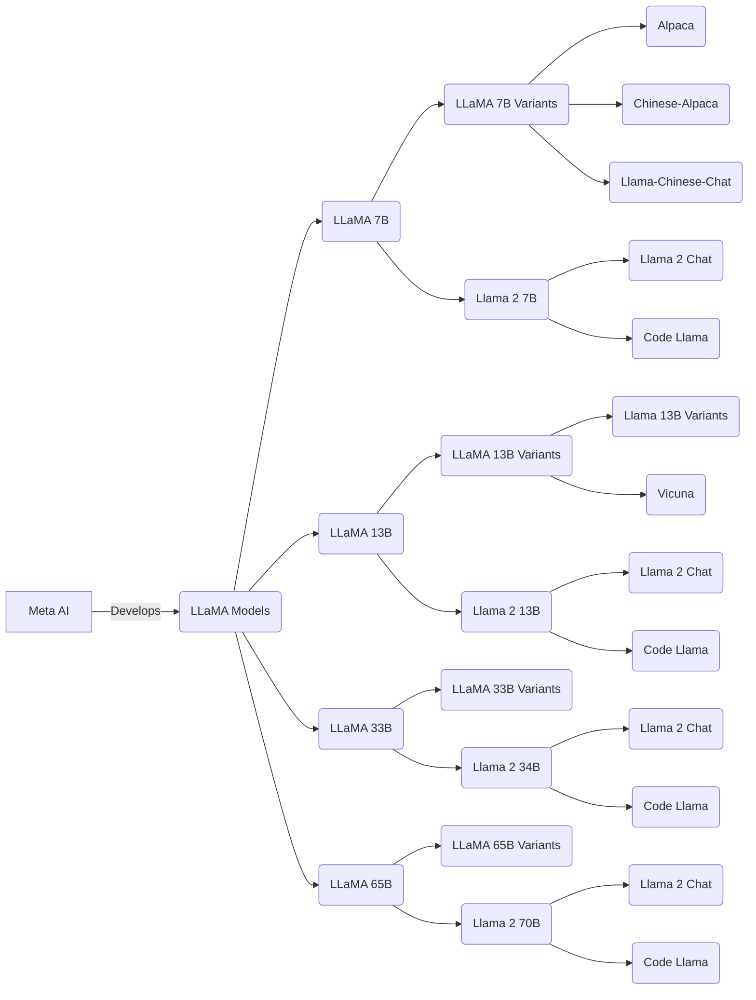

```mermaid
graph LR
    A[Meta AI] -->|Develops| B(LLaMA Models)
    
    B --> C(LLaMA 7B)
    B --> D(LLaMA 13B)
    B --> E(LLaMA 33B)
    B --> F(LLaMA 65B)

    C --> G(LLaMA 7B Variants)
    C --> H(Llama 2 7B)
    
    D --> I(LLaMA 13B Variants)
    D --> J(Llama 2 13B)

    E --> K(LLaMA 33B Variants)
    E --> L(Llama 2 34B)

    F --> M(LLaMA 65B Variants)
    F --> N(Llama 2 70B)

    G --> O(Alpaca)
    G --> P(Chinese-Alpaca)
    G --> Q(Llama-Chinese-Chat)

    H --> R(Llama 2 Chat)
    H --> S(Code Llama)

    I --> T(Llama 13B Variants)
    I --> U(Vicuna)

    J --> V(Llama 2 Chat)
    J --> W(Code Llama)

    L --> X(Llama 2 Chat)
    L --> Y(Code Llama)

    N --> Z(Llama 2 Chat)
    N --> AA(Code Llama)
```
