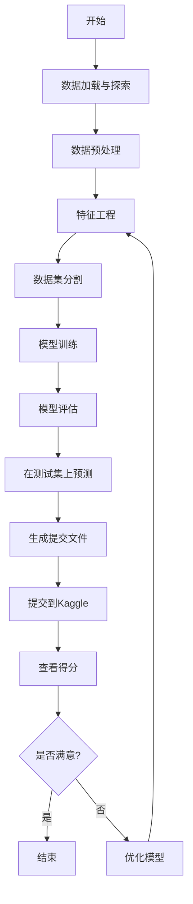

整体而言，Kaggle Notebook 的设计本意就是方便复现，大部分高评分 Notebook 都是可以直接运行的。



## 基本定位

#最佳实践  
Kaggle给机器学习新手和顶尖选手带来的好处是最大的，反倒对中间选手没什么太大的帮助。

新手小白只需要参加一次与自己工作领域相同的比赛，就可以马上摘掉小白的标签。因为在参赛过程中，你会完整地了解并掌握基于机器学习、深度学习的整个任务的工作流程。包括：

1. 什么是EDA，以及如何进行充分的EDA
2. 针对不同类型的数据，如何进行预处理
3. 如何选择模型，如何训练模型，训练过程中有哪些提升结果的tricks
4. 如何高效调参
5. 如何划分验证集，如何进行模型融合
6. 如何进行数据后处理，以进一步提升最终结果

我当年就是从一枚小白，在参加了一次完整的Kaggle比赛后瞬间成长。最开始大神公开的代码，每一行都需要百度什么意思，然后就一行一行的写上注释。到最后可以针对不同的比赛任务有自己的想法，并熟练地进行训练调参等一系列操作，最终得到了第一枚银牌。

过了小白的阶段，我自认为Kaggle对个人能力的提升所带来的帮助就不是很大了。因为该会的你都已经会了，剩下的就是炼丹，模型融合。本质上就是调参技巧和硬件设备大比拼了。因为数据预处理和后处理基本上大家都差不多，你也不会想出其他多牛逼的提点tricks了，真能想到的话就可以发论文了。至于说kaggle在找工作时候可以作为能力证明，这个其实不是很明显，因为kaggle组队带打越来越多，kaggle含金量越来越低了。

对于大神来说，如果可以保证自己至少拿银牌并且有大概率拿金牌。那么一方面，参加kaggle不失为一份兼职，可以组队带打并收取一定的费用，如果能力超强还可以拿到比赛的奖金。另一方面，如果真能在几次比赛中得个前三，那确实可以在应聘国内外大厂的时候拿出来炫耀一下，还是很加分的。

以下是专门为初学者制作的一份 Kaggle 平台使用速查表（Cheatsheet）：

|**功能类别**|**操作**|**说明**|
|---|---|---|
|**数据集**|查找数据集|在顶部导航栏点击「Datasets」，输入关键字搜索|
||下载数据集|进入数据集页面后，点击右侧「Download」按钮|
||创建数据集|点击「Datasets」→「New Dataset」，上传数据文件并添加描述|
|**Notebook**|创建Notebook|点击「Code」→「New Notebook」，选择语言（Python、R等）|
||运行Notebook|Notebook界面点击「Run」或使用快捷键（Shift+Enter）|
||添加代码/文本单元格|使用界面顶部的「+ Code」或「+ Markdown」按钮|
||保存Notebook|Notebook界面右上角点击「Save Version」|
||发布Notebook|点击「Save Version」，勾选「Public」进行发布|
|**竞赛**|加入竞赛|点击顶部导航栏「Competitions」，选择竞赛并点击「Join Competition」|
||提交结果|在竞赛页面选择「Submit Predictions」，上传结果文件|
||查看排行榜|在竞赛页面点击「Leaderboard」|
|**讨论区**|提问交流|点击顶部「Discussion」，创建问题或浏览现有帖子|
||回复帖子|在讨论区帖子下方的回复框输入内容并提交|
|**快捷键**|运行代码单元格|`Shift + Enter`|
||添加单元格|`a` (上方插入)、`b` (下方插入)|
||删除单元格|双击左侧单元格编号后按两次`d`键 (`d`+`d`)|
||代码自动补全|按下`Tab`键|
||查看函数说明|在函数名后面加`?`并运行|
|**常用命令（Python）**|查看文件列表|`!ls`|
||安装库|`!pip install package-name`|
||读取CSV文件|`pd.read_csv('file.csv')`|
||检查数据前5行|`df.head()`|
|**提交格式**|CSV 文件要求|通常需包含ID列和预测结果列，明确参赛页面上的格式|
||示例提交代码|`df.to_csv('submission.csv', index=False)`|
|**资源**|官方文档|[Kaggle官方文档](https://www.kaggle.com/docs)|
||入门教程|[Kaggle Learn入门教程](https://www.kaggle.com/learn)|

希望以上内容能帮助你更快地熟悉和掌握 Kaggle 平台的使用！

___

[[baseline]]

装依赖  


看起来你已经成功上传了baseline文件到Kaggle，出现了"No Data Sources Found"提示，这是因为代码需要比赛数据才能运行。接下来的步骤是：

1. **添加数据源**：
   - 点击右侧的"Add Input"按钮
   - 在搜索框中输入比赛名称"equity-post-HCT-survival-predictions"
   - 点击"Competition Datasets"标签
   - 选择该比赛的数据集

2. **连接到网络**（如需要）：
   - 确保在"Settings"中开启了"Internet"选项，因为代码可能需要下载一些库

3. **运行代码**：
   - 你可以点击顶部的"Run All"按钮运行所有单元格
   - 或者使用单个单元格旁边的播放按钮逐个运行

4. **监控输出**：
   - 代码运行时会显示进度和结果
   - 训练模型可能需要一些时间，特别是在跑10折交叉验证时

5. **生成提交文件**：
   - 代码运行完成后，会在输出目录生成"submission.csv"文件
   - 可以在左侧文件浏览器中找到它

6. **提交结果**：
   - 点击"Submit"或在比赛页面上提交生成的文件

如果"No Data Sources Found"问题持续存在，你可能需要：

- 手动添加比赛数据文件
- 检查代码中的数据路径是否正确
- 确保已经加入了该比赛

这样，你就能使用这个baseline来参与Kaggle比赛并获得你的第一个提交结果了。

```Java

#!/usr/bin/env python
# coding: utf-8

# In[ ]:


"""
To evaluate the equitable prediction of transplant survival outcomes,
we use the concordance index (C-index) between a series of event
times and a predicted score across each race group.
 
It represents the global assessment of the model discrimination power:
this is the model’s ability to correctly provide a reliable ranking
of the survival times based on the individual risk scores.
 
The concordance index is a value between 0 and 1 where:
 
0.5 is the expected result from random predictions,
1.0 is perfect concordance (with no censoring, otherwise <1.0),
0.0 is perfect anti-concordance (with no censoring, otherwise >0.0)

"""

import pandas as pd
import pandas.api.types
import numpy as np
from lifelines.utils import concordance_index

class ParticipantVisibleError(Exception):
    pass


def score(solution: pd.DataFrame, submission: pd.DataFrame, row_id_column_name: str) -> float:
    """
    >>> import pandas as pd
    >>> row_id_column_name = "id"
    >>> y_pred = {'prediction': {0: 1.0, 1: 0.0, 2: 1.0}}
    >>> y_pred = pd.DataFrame(y_pred)
    >>> y_pred.insert(0, row_id_column_name, range(len(y_pred)))
    >>> y_true = { 'efs': {0: 1.0, 1: 0.0, 2: 0.0}, 'efs_time': {0: 25.1234,1: 250.1234,2: 2500.1234}, 'race_group': {0: 'race_group_1', 1: 'race_group_1', 2: 'race_group_1'}}
    >>> y_true = pd.DataFrame(y_true)
    >>> y_true.insert(0, row_id_column_name, range(len(y_true)))
    >>> score(y_true.copy(), y_pred.copy(), row_id_column_name)
    0.75
    """
    
    del solution[row_id_column_name]
    del submission[row_id_column_name]
    
    event_label = 'efs'
    interval_label = 'efs_time'
    prediction_label = 'prediction'
    for col in submission.columns:
        if not pandas.api.types.is_numeric_dtype(submission[col]):
            raise ParticipantVisibleError(f'Submission column {col} must be a number')
    # Merging solution and submission dfs on ID
    merged_df = pd.concat([solution, submission], axis=1)
    merged_df.reset_index(inplace=True)
    merged_df_race_dict = dict(merged_df.groupby(['race_group']).groups)
    metric_list = []
    for race in merged_df_race_dict.keys():
        # Retrieving values from y_test based on index
        indices = sorted(merged_df_race_dict[race])
        merged_df_race = merged_df.iloc[indices]
        # Calculate the concordance index
        c_index_race = concordance_index(
                        merged_df_race[interval_label],
                        -merged_df_race[prediction_label],
                        merged_df_race[event_label])
        metric_list.append(c_index_race)
    return float(np.mean(metric_list)-np.sqrt(np.var(metric_list)))
```

这篇回答深入探讨了**Kaggle与实际工作的差异和联系**，可以总结为以下几个要点：

## 一、对 Kaggle 的偏见和反驳

作者反驳了一些常见的偏见：

- **偏见1：Kaggle 问题与实际问题差异大**  
    事实上，Kaggle 的问题种类繁多，本质上和现实工作场景一样，不同任务之间差异本来就很大。
（例如 CV、NLP、生物医疗、金融量化，都是截然不同的领域。）
    
- **偏见2：Kaggle 模型难以落地、ensemble 过拟合、靠抱大腿刷排名**  
    反驳理由：
    
    - Kaggle 是商业平台，如果模型毫无实际价值，平台早就无法维持。
        
    - 一些企业反复举办比赛，且长期与选手合作，说明模型实际有用。
        
    - 不能以少部分刷牌子的人否定整体，很多顶级方案能上顶刊论文。
        
- **偏见3：模型重于数据，轻视 Kaggle 的数据驱动方法**  
    事实上，数据的重要性被严重低估，现实工作中数据敏感度至关重要。
    

---

## 二、Kaggle 与科班培养出的特质的对比

作者强调 Kaggle 和科班各有培养侧重：

### （一）Kaggle 培养的优势特质

1. **数据敏感度**  
    每个比赛数据各异，都要从零探索（EDA）。
    
2. **快速学习新领域的能力**  
    由于每个比赛可能涉及不同的领域，需要快速入门并上手。
    
3. **Pipeline 构建能力与大局观**  
    需要从数据清理到特征、模型搭建、模型融合完整的流程，培养整体观念。
    
4. **高效执行、抗压能力强**  
    每场比赛有 deadline，能培养快速推进的执行力。
    
5. **结果导向的创新能力和接受新想法的开放性**  
    在 Kaggle，只要能赢就是好想法。无需过于拘泥于理论支持和模型结构是否优雅。
    
6. **对验证集（public）与真实未知集（private）的差距警惕性**  
    提高了对过拟合和泛化能力的关注，在实际场景（如量化金融）尤其重要。
    

---

### （二）Kaggle 出身的选手（尤其非科班出身）可能存在的缺点

1. **对源码理解不足**  
    更倾向于“拼乐高”，忽视对底层代码逻辑的深入理解，限制了更高层次的发挥。
    
2. **代码规范性差**  
    因快速迭代导致代码不够整洁、优雅，可维护性低。
    
3. **前沿科研反应滞后**  
    Kaggle 社区通常对最新论文成果的吸收较慢，且更多是实用主义，缺少学术敏锐性。
    
4. **对计算机底层性能优化能力不足**  
    在实际工作中数据存储、分布式计算优化非常重要，但 Kaggle 主要集中在应用层（特征工程、模型调参），对底层优化技术缺乏锻炼。
    

---

## 三、结论与建议

作者认为 Kaggle 是**很好的自学深度学习的平台**，能够培养很多实际工作需要的能力：

- 数据敏感度
    
- 快速入门新领域
    
- pipeline 大局观
    
- 强执行力和创新能力
    
- 对泛化的谨慎态度
    

但也提醒大家**意识到 Kaggle 的局限性**，应弥补不足：

- 提升源码理解和编写能力
    
- 提高代码规范性和工程可维护性
    
- 更及时关注科研前沿
    
- 加强底层性能优化能力
    

只有做到这些，才能更好地与科班出身的人才形成互补，在职场中获得更广阔的发展空间。

---

## 四、实际工业界工作场景补充（第二位答主的观点）

后面第二个回答（腾讯优图实验室员工）补充了工业界真实工作的差异：

- 工业应用场景下，性能并不是唯一考虑因素（如移动端部署约束，需回归传统轻量级模型）
    
- 很多精妙复杂的模型工业界不一定采纳，实际工程化的模型往往更简单稳健
    
- 大量时间花费在工程化（C++模型部署、权重转换、优化）而非理论上
    
- **编程能力和工程能力往往比比赛成绩更重要**
    

---

## 总结

两位答主的观点结合起来就是：

- Kaggle 有其非常积极的作用，但也有明显局限。
    
- 工业实际工作更强调编程与工程能力，比赛能力只是锦上添花。
    
- 对 Kaggle 出身者来说，意识到短板并有意识地提升，才是获得长远发展和竞争力的关键。
    

这是非常客观、清晰、并且具备指导性的观点。

___

谢邀。

人在 Kaggle，刚下赛场，圈内人，利益相关。

看到题主问新手打 Kaggle 需要啥基础，特别是瞄准了经典的 [Titanic](https://zhida.zhihu.com/search?content_id=723958624&content_type=Answer&match_order=1&q=Titanic&zhida_source=entity) 生存预测，这个问题下面想必又会堆满了各种“你需要精通[线性代数](https://zhida.zhihu.com/search?content_id=723958624&content_type=Answer&match_order=1&q=%E7%BA%BF%E6%80%A7%E4%BB%A3%E6%95%B0&zhida_source=entity)、[微积分](https://zhida.zhihu.com/search?content_id=723958624&content_type=Answer&match_order=1&q=%E5%BE%AE%E7%A7%AF%E5%88%86&zhida_source=entity)、[概率论](https://zhida.zhihu.com/search?content_id=723958624&content_type=Answer&match_order=1&q=%E6%A6%82%E7%8E%87%E8%AE%BA&zhida_source=entity)、[统计学](https://zhida.zhihu.com/search?content_id=723958624&content_type=Answer&match_order=1&q=%E7%BB%9F%E8%AE%A1%E5%AD%A6&zhida_source=entity)、机器学习理论……”以及“Python/[R 语言](https://zhida.zhihu.com/search?content_id=723958624&content_type=Answer&match_order=1&q=R+%E8%AF%AD%E8%A8%80&zhida_source=entity)必须掌握到能手写 XXX 算法”的劝退清单。

**但我想说，那些可能都是“正确的废话”。**

咱们换个思路，来点实在的，甚至有点“反常识”的。

**一、基础？关键在于“动手”的基础，而非“理论完美”的基础**

**你不需要成为数学/统计学大师才开始。**

- **传统观念** 没有扎实的数理基础，搞机器学习/数据科学就是空中楼阁。
- **我的看法：** 对于 Titanic 这种入门级项目，你需要的数学知识，可能比你想象的要少得多。初高中级别的**基本统计概念**（均值、中位数、众数、方差、标准差）+ 对**概率**有基本直觉 + 理解**坐标系**（能看懂图表）就足够让你起步了。线性代斯、微积分？重要，但不是 _现在_ 卡住你的门槛。它们在你深入理解模型原理、进行更复杂优化时会变得关键，但 **做 Titanic，更重要的是理解数据、处理数据和调用模型的能力**。先跑起来，遇到不懂的数学原理，再去针对性地补，效率高得多。**“用到再学” (Just-in-time Learning) 在这里比“学完再用” (Just-in-case Learning) 更实际。**

- **你需要的基础是：**

1. **基本的数据分析思维：** 知道拿到数据要看什么（缺失值、异常值、数据分布），怎么看（描述性统计、可视化），如何提出假设并验证。这比背一堆公式重要。
2. **对机器学习核心流程的理解：** 知道什么是特征（Features）、标签（Labels/Target），明白训练集（Train Set）和测试集（Test Set）的区别，了解模型训练（Fit）、预测（Predict）和评估（Evaluation）这几个基本步骤。Titanic 主要涉及**分类问题**，知道这个就够了。
3. **工具使用能力 > 理论背诵能力：** 知道用什么工具（后面语言部分会详说）来完成数据加载、清洗、探索、建模、评估。

**二、语言掌握程度？“够用”即可，精通是进阶后的事**

- **你不需要精通 Python/R 的所有语法细节和高级特性。**  
    

- **传统观念：** 语言是基础，必须掌握牢固，面向对象、装饰器、异步编程……都要懂。
- **我的看法：** 对于 Kaggle 新手，尤其是 Titanic，语言只是**工具**。你需要掌握的不是语言本身有多精妙，而是**如何用这门语言去调用解决数据问题的库**。
- **语言程度要求：**

1. **基本语法：** 变量、数据类型（数字、字符串、列表、字典）、条件语句（if/else）、循环（for/while）、函数定义和调用。这是底线。
2. **核心库的熟练使用（以 Python 为例）：**

- **Pandas:** 这是**重中之重**！你需要熟练使用 Pandas 进行数据读取（`pd.read_csv`）、数据查看（`.head()`, `.info()`, `.describe()`）、数据清洗（处理缺失值 `.fillna()`, `.dropna()`）、数据选择和过滤（`loc`, `iloc`）、数据转换（类型转换 `.astype()`, 应用函数 `.apply()`）、数据合并（`merge`, `concat`）。**可以说，做 Titanic 80% 的时间可能都在和 Pandas 打交道。** 对 Pandas 的熟练度，比你对 Python 语言本身很多高级特性的掌握，对这个项目来说重要得多。
- **[NumPy](https://zhida.zhihu.com/search?content_id=723958624&content_type=Answer&match_order=1&q=NumPy&zhida_source=entity):** 通常和 Pandas 配合使用，需要了解其核心数据结构 `ndarray`，以及一些基本的数学运算和数组操作。Pandas 底层很多是基于 NumPy 的。
- **[Scikit-learn](https://zhida.zhihu.com/search?content_id=723958624&content_type=Answer&match_order=1&q=Scikit-learn&zhida_source=entity):** 这是机器学习库。你需要会：

- 数据预处理（`SimpleImputer` 填充缺失值，`StandardScaler` 或 `MinMaxScaler` 进行特征缩放，`OneHotEncoder` 或 `LabelEncoder` 处理分类变量）。
- 模型调用（导入你想用的模型，比如 `LogisticRegression`, `DecisionTreeClassifier`, `RandomForestClassifier`，然后用 `.fit()` 训练，`.predict()` 预测）。
- 模型评估（`accuracy_score`, `confusion_matrix`, `classification_report` 等）。

- **[Matplotlib](https://zhida.zhihu.com/search?content_id=723958624&content_type=Answer&match_order=1&q=Matplotlib&zhida_source=entity) / [Seaborn](https://zhida.zhihu.com/search?content_id=723958624&content_type=Answer&match_order=1&q=Seaborn&zhida_source=entity):** 用于数据可视化，帮助你理解数据（EDA - Exploratory Data Analysis）。会画基本的图（散点图、直方图、箱线图、热力图）来看数据分布、特征间关系、异常值等。

- **读懂别人的代码，比自己从零写出完美代码更重要（初期）。**  
    

- Kaggle 的一大精髓在于其开放的社区和 Notebooks。去看别人（特别是高分大佬）是怎么处理 Titanic 数据的，他们用了哪些特征工程技巧，模型是怎么选择和调优的。**初期，你的目标不是写出最优雅、最高效的代码，而是能理解、借鉴、修改别人的代码，让它在你的环境里跑起来，并理解每一步是为什么。** 模仿是最好的学习。你需要掌握的语言程度，至少要能**读懂**这些常用库的代码示例和 Kaggle 上的公开 Notebook。

**三、如何针对 Titanic 下手？**

1. **环境准备：** 安装 Anaconda (自带 Python, Jupyter Notebook, Pandas, NumPy, Scikit-learn 等常用库)。或者直接用 Kaggle 提供的在线 Notebook 环境，更方便。
2. **学习资源：**

- 找一个好的 Pandas 教程（比如官方文档的十分钟入门，或者一些评价不错的在线课程/博客）。

推荐这个资源给你：[太赞了！Pandas官方文档中文版PDF，免费开放下载！](https://link.zhihu.com/?target=https%3A//mp.weixin.qq.com/s/4rvNooiQOoR5Dkewpc6fjQ)

- 找一个 Scikit-learn 的入门教程，重点看分类模型和预处理部分。
- **直接去看 Kaggle Titanic 比赛页面下的 “Code” (以前叫 Kernels/Notebooks)。** 按点赞数排序，从最简单的 EDA + 基础模型开始看。别贪多，找一个你觉得代码风格清晰、解释详细的，跟着复现一遍。

1. **动手实践：**

- **第一步：加载数据，做探索性数据分析 (EDA)。** 用 Pandas 加载 `train.csv` 和 `test.csv`，用 `.info()`, `.describe()`, 可视化库看看数据长什么样，有哪些缺失值，不同特征和生存率（`Survived`）有什么关系。这是最重要的环节之一，能极大启发你后续的特征工程。
- **第二步：数据预处理和特征工程。** 处理缺失值（比如 Age, Cabin, Embarked），把文本类特征（Sex, Embarked）转换成模型能理解的数字，可能的话，基于现有特征创造一些新特征（比如家庭大小 `FamilySize = SibSp + Parch + 1`）。这是提升模型效果的关键。
- **第三步：选择并训练一个简单模型。** 从逻辑回归（Logistic Regression）或决策树（Decision Tree）开始，用 `train.csv` 里的特征和 `Survived` 标签进行训练 (`.fit()`)。
- **第四步：进行预测并提交。** 用训练好的模型对 `test.csv` 进行预测 (`.predict()`)，生成符合提交格式要求的 `submission.csv` 文件（通常是 `PassengerId` 和 `Survived` 两列），然后在 Kaggle 页面提交，看看你的分数。
- **第五步：迭代优化。** 根据分数和对他人的学习，回头改进你的 EDA、数据预处理、特征工程或尝试更复杂的模型（如随机森林、梯度提升树），重复步骤 3-4。

**总结一下：**

- **心态上：** 不要被“完美基础”吓倒，Kaggle 是一个**实践场**，边做边学是常态。完成比完美重要（尤其对新手）。
- **基础上：** 重视**数据分析思维**和**机器学习流程**的理解，数学理论可在实践中逐步深化。
- **语言上：** 聚焦 Python，**精通 Pandas 是关键**，熟练使用 Scikit-learn 和可视化库是核心要求。目标是**能用这些库解决问题，能读懂别人的代码**，而非语言本身的精通。
- **行动上：** 立刻开始看 Titanic 的数据和高赞 Notebook，动手实践，提交你的第一个结果，哪怕分数很低。从错误和模仿中学习，是 Kaggle 成长的最快路径。

对于像入门的新手可以推荐看看Coggle数据科学的三个板块（竞赛总结、竞赛知识、**竞赛baseline**）的系列文章，点击即可进行学习。

（看到这里了，提示大家可以收藏下帖子，以后回看的时候就不迷路了）

此外，还有一套中文版的教程，也是我当初入门kaggle的时候刷过的。详细内容都在此链接中了。

## **竞赛总结**

[竞赛总结：2020NAIC遥感影像 Y^2C团队（优胜奖队伍）](https://link.zhihu.com/?target=http%3A//mp.weixin.qq.com/s%3F__biz%3DMzIwNDA5NDYzNA%3D%3D%26mid%3D2247497690%26idx%3D1%26sn%3De700c2f80149488d3d692901a919306e%26chksm%3D96c7da1fa1b05309115a80b7030521c3f08bc0c58663866b01a5ec6a7e3e318555123cec29b5%26scene%3D21%23wechat_redirect)

[竞赛总结：CCF乘用车细分市场销量预测](https://link.zhihu.com/?target=http%3A//mp.weixin.qq.com/s%3F__biz%3DMzIwNDA5NDYzNA%3D%3D%26mid%3D2247497787%26idx%3D1%26sn%3D03e8e432030d67147dfefeff6f82f8d7%26chksm%3D96c7d5fea1b05ce87438f8e2386cbaa86964c6b1fc5409f05756ef2b184d0b327b458ade56d2%26scene%3D21%23wechat_redirect)

[竞赛总结：CCF多人种人脸识别](https://link.zhihu.com/?target=http%3A//mp.weixin.qq.com/s%3F__biz%3DMzIwNDA5NDYzNA%3D%3D%26mid%3D2247497928%26idx%3D1%26sn%3Db2b50ff22e512a0b6b5df1bc3316299a%26chksm%3D96c7d50da1b05c1b5a7c66125af51937e7a865813d031c23d8b2cdde3a46f3c61428b6e72f06%26scene%3D21%23wechat_redirect)

[竞赛总结：FaceBook ISC2021 图像相似度检索（版权检测方向）](https://link.zhihu.com/?target=http%3A//mp.weixin.qq.com/s%3F__biz%3DMzIwNDA5NDYzNA%3D%3D%26mid%3D2247498048%26idx%3D1%26sn%3Dc11b922bfe4b01f34da13d1c4d294ce2%26chksm%3D96c7d485a1b05d93709f48df6d38984ae81c1372a2b805840613497c5d2423fe4391c31bfe6d%26scene%3D21%23wechat_redirect)

[竞赛总结：CHIP2020医学命名实体识别](https://link.zhihu.com/?target=http%3A//mp.weixin.qq.com/s%3F__biz%3DMzIwNDA5NDYzNA%3D%3D%26mid%3D2247498894%26idx%3D1%26sn%3D484bdad916242c06c10f20877a21791b%26chksm%3D96c7d14ba1b0585d47b04a626f2b4722546f1f64b6d8bfb4d579aa1b814f351db3fde55f11ea%26scene%3D21%23wechat_redirect)

[竞赛总结：天池中文NLP地址要素解析](https://link.zhihu.com/?target=http%3A//mp.weixin.qq.com/s%3F__biz%3DMzIwNDA5NDYzNA%3D%3D%26mid%3D2247498876%26idx%3D1%26sn%3Dc939ae3fe073799e48664a2157583810%26chksm%3D96c7d1b9a1b058af470675a5462118d34cd309a32334a3d300184549a627dfedfca88b9a15d8%26scene%3D21%23wechat_redirect)

[竞赛总结：2022 CCF国际AIOps挑战赛](https://link.zhihu.com/?target=http%3A//mp.weixin.qq.com/s%3F__biz%3DMzIwNDA5NDYzNA%3D%3D%26mid%3D2247499668%26idx%3D1%26sn%3D906257bef9ea13fd49ee588dd735a3cb%26chksm%3D96c7d251a1b05b47955d721560c85a8367bf387e744b95f987034b903b31b85e85d5d7c85d69%26scene%3D21%23wechat_redirect)

[竞赛总结：2022微信大数据挑战赛](https://link.zhihu.com/?target=http%3A//mp.weixin.qq.com/s%3F__biz%3DMzIwNDA5NDYzNA%3D%3D%26mid%3D2247499766%26idx%3D1%26sn%3D90377d970b8d0b446a9bd0570d46eea6%26chksm%3D96c7d233a1b05b2574815d1770315da32d1487a3335f111ea508ec96268cf4d0c7b94738355e%26scene%3D21%23wechat_redirect)

[竞赛总结：搜狐文本匹配算法大赛](https://link.zhihu.com/?target=http%3A//mp.weixin.qq.com/s%3F__biz%3DMzIwNDA5NDYzNA%3D%3D%26mid%3D2247499833%26idx%3D1%26sn%3D7303764180b2af5bb5a3a213347444c6%26chksm%3D96c7edfca1b064ea9277502c7779e4ddcc47a72aa0a5981ce2ca2070dda0dcd0f13c906c7a74%26scene%3D21%23wechat_redirect)

[竞赛总结：DrivenDATA 鲸鱼检索与识别](https://link.zhihu.com/?target=http%3A//mp.weixin.qq.com/s%3F__biz%3DMzIwNDA5NDYzNA%3D%3D%26mid%3D2247499888%26idx%3D1%26sn%3D7ee2ae5e160d188346c56e0ab0bccbe4%26chksm%3D96c7edb5a1b064a360fac3e08eefb9f963ebee75f9c7083aaca7dfa0c979f4df6f02b930d43f%26scene%3D21%23wechat_redirect)

[竞赛总结：Kaggle 谷歌图像编码与检索](https://link.zhihu.com/?target=http%3A//mp.weixin.qq.com/s%3F__biz%3DMzIwNDA5NDYzNA%3D%3D%26mid%3D2247499928%26idx%3D1%26sn%3Db6dfe8e72d19004fc620962fea2a95d1%26chksm%3D96c7ed5da1b0644b4e621df293e39349731ea53be42c2c9c50ed59a2a503dd4d6061da269e74%26scene%3D21%23wechat_redirect)

[赛题总结：全球人工智能技术创新大赛](https://link.zhihu.com/?target=http%3A//mp.weixin.qq.com/s%3F__biz%3DMzIwNDA5NDYzNA%3D%3D%26mid%3D2247500363%26idx%3D1%26sn%3D700a81a9ee660cfae2d90c87a6a71da0%26chksm%3D96c7ef8ea1b066982bc693885e5f9e88452d32c90dadf7284bbff8fdb7e48e5555a1a5fd661b%26scene%3D21%23wechat_redirect)

[竞赛总结：AIOps 电信故障根因定位](https://link.zhihu.com/?target=http%3A//mp.weixin.qq.com/s%3F__biz%3DMzIwNDA5NDYzNA%3D%3D%26mid%3D2247500112%26idx%3D1%26sn%3D39461dc65acaf1b6c7199ac3ada3cce7%26chksm%3D96c7ec95a1b06583ffab591958b51f46cb9d4d206e03349a11c480b068d1ea1f6c6ac043d2a1%26scene%3D21%23wechat_redirect)

[KDD Cup2022：亚马逊商品检索比赛总结](https://link.zhihu.com/?target=http%3A//mp.weixin.qq.com/s%3F__biz%3DMzIwNDA5NDYzNA%3D%3D%26mid%3D2247499547%26idx%3D1%26sn%3D9d113df3be40b9953871dfbbdf417f94%26chksm%3D96c7d2dea1b05bc866a3338f7b3c4c834793c8f11219128d02856877dd86a68731df0a56819b%26scene%3D21%23wechat_redirect)

[KDD Cup2022 风力发电预测比赛总结](https://link.zhihu.com/?target=http%3A//mp.weixin.qq.com/s%3F__biz%3DMzIwNDA5NDYzNA%3D%3D%26mid%3D2247499502%26idx%3D1%26sn%3D5a47d80b2f2441ca2c3abe7dc4c89b92%26chksm%3D96c7d32ba1b05a3d37848edb379c62bdd6208f238fb67ff38095d389c4d79cb1cf2392f024d2%26scene%3D21%23wechat_redirect)

[天池 | 心电异常事件预测冠军解决方案](https://link.zhihu.com/?target=http%3A//mp.weixin.qq.com/s%3F__biz%3DMzIwNDA5NDYzNA%3D%3D%26mid%3D2247499788%26idx%3D1%26sn%3D1f73fdc25cf74ab8b5c92873105845ba%26chksm%3D96c7edc9a1b064df342dea3d8435555b7f42921fea1617ed16740db267153f2144902016d558%26scene%3D21%23wechat_redirect)

[Kaggle比赛总结：AMEX 金融风控比赛](https://link.zhihu.com/?target=http%3A//mp.weixin.qq.com/s%3F__biz%3DMzIwNDA5NDYzNA%3D%3D%26mid%3D2247499467%26idx%3D1%26sn%3Ddf16c9f88a2de5b32a1a56a355ecb74f%26chksm%3D96c7d30ea1b05a184d2c9e22de788d62d42f7c6f4c597b54bc46a6577269f6154b85eeff5e46%26scene%3D21%23wechat_redirect)

[一场冠军两场Top10% 我的CCF比赛总结！](https://link.zhihu.com/?target=http%3A//mp.weixin.qq.com/s%3F__biz%3DMzIwNDA5NDYzNA%3D%3D%26mid%3D2247498489%26idx%3D1%26sn%3D3f0bbf0e1b7f4bfef3ad9765e363a725%26chksm%3D96c7d73ca1b05e2a59d8ad5bde394ae8598aff1c7ae8bbc6bf118252b44e39aa51e6861a938f%26scene%3D21%23wechat_redirect)

[盘点Kaggle平台的金融量化比赛](https://link.zhihu.com/?target=http%3A//mp.weixin.qq.com/s%3F__biz%3DMzIwNDA5NDYzNA%3D%3D%26mid%3D2247497902%26idx%3D1%26sn%3D054b584347c93134eea1c736f749dadd%26chksm%3D96c7d56ba1b05c7de5048128258e859343df46fe30716060471ca53d428de61b312fcc01fa3c%26scene%3D21%23wechat_redirect)

[Kaggle Jigsaw有毒识别总结（Top 2%）](https://link.zhihu.com/?target=http%3A//mp.weixin.qq.com/s%3F__biz%3DMzIwNDA5NDYzNA%3D%3D%26mid%3D2247498200%26idx%3D1%26sn%3D7d1b9aeb1780a47f2939b55a7a736995%26chksm%3D96c7d41da1b05d0bfcc1c7819cc58552d2e0a703578f7a903f14f14e52b15c6b267ef9692cde%26scene%3D21%23wechat_redirect)

[WSDM-爱奇艺：用户留存预测经验与代码分享-TOP1](https://link.zhihu.com/?target=http%3A//mp.weixin.qq.com/s%3F__biz%3DMzIwNDA5NDYzNA%3D%3D%26mid%3D2247497981%26idx%3D1%26sn%3D0af265485b99beff1df0fa3e7438b739%26chksm%3D96c7d538a1b05c2efa739385b8d740a126cdad5620dd4522878747b9d696e2d2848fc00e371a%26scene%3D21%23wechat_redirect)

## **竞赛知识**

[Kaggle知识点：节约内存的四种方法](https://link.zhihu.com/?target=http%3A//mp.weixin.qq.com/s%3F__biz%3DMzIwNDA5NDYzNA%3D%3D%26mid%3D2247497697%26idx%3D1%26sn%3Dafb8cdbc6f62ec37ff97945554d05995%26chksm%3D96c7da24a1b053323b0a71517cb8b49b2b943182234cc82ed55fba83f2d57ba32850a49cd949%26scene%3D21%23wechat_redirect)

[Kaggle知识点：入门到进阶的10个问题](https://link.zhihu.com/?target=http%3A//mp.weixin.qq.com/s%3F__biz%3DMzIwNDA5NDYzNA%3D%3D%26mid%3D2247497880%26idx%3D1%26sn%3D6ac22c12725af8a9e0087b8b2106670c%26chksm%3D96c7d55da1b05c4bb43e24291bca617afc7fc518a0b6d2aa8207c07db73c48cfb785e0ae94b6%26scene%3D21%23wechat_redirect)

[Kaggle知识点：树模型特征Embedding](https://link.zhihu.com/?target=http%3A//mp.weixin.qq.com/s%3F__biz%3DMzIwNDA5NDYzNA%3D%3D%26mid%3D2247498029%26idx%3D1%26sn%3Dd90f09e3c5d08c9db4618b643b5142e2%26chksm%3D96c7d4e8a1b05dfeb0799dd98bc5466e61aa1992861a5b85dc275af187e2065dd0819fd26fc7%26scene%3D21%23wechat_redirect)

[Kaggle知识点：树模型无监督Embedding](https://link.zhihu.com/?target=http%3A//mp.weixin.qq.com/s%3F__biz%3DMzIwNDA5NDYzNA%3D%3D%26mid%3D2247498068%26idx%3D1%26sn%3Db4e8333258e920d61f39ae4f9b1329cf%26chksm%3D96c7d491a1b05d874bc45a01785e37b57a1149d84790020e8a0fc51ec46d9cb1091fe5293660%26scene%3D21%23wechat_redirect)

[Kaggle知识点：树模型无监督Embedding](https://link.zhihu.com/?target=http%3A//mp.weixin.qq.com/s%3F__biz%3DMzIwNDA5NDYzNA%3D%3D%26mid%3D2247498068%26idx%3D1%26sn%3Db4e8333258e920d61f39ae4f9b1329cf%26chksm%3D96c7d491a1b05d874bc45a01785e37b57a1149d84790020e8a0fc51ec46d9cb1091fe5293660%26scene%3D21%23wechat_redirect)

[Kaggle知识点：网格搜索ARIMA参数](https://link.zhihu.com/?target=http%3A//mp.weixin.qq.com/s%3F__biz%3DMzIwNDA5NDYzNA%3D%3D%26mid%3D2247498146%26idx%3D1%26sn%3D49c4655b36b08f68a3e16310cfdfbf06%26chksm%3D96c7d467a1b05d71575a59c5dd95d221b8dc520836215dbb21c523e2e768fa34aa1c4f5bbe2d%26scene%3D21%23wechat_redirect)

[Kaggle知识点：对比学习基础](https://link.zhihu.com/?target=http%3A//mp.weixin.qq.com/s%3F__biz%3DMzIwNDA5NDYzNA%3D%3D%26mid%3D2247498255%26idx%3D1%26sn%3D3b6cffd4927987675cd7e0f98863ec9d%26chksm%3D96c7d7caa1b05edca482258be298c8b49e6a40c189a04599c24d27f2eb89d85f5bacf3892ee9%26scene%3D21%23wechat_redirect)

[Kaggle知识点：数据抽样方式](https://link.zhihu.com/?target=http%3A//mp.weixin.qq.com/s%3F__biz%3DMzIwNDA5NDYzNA%3D%3D%26mid%3D2247498284%26idx%3D1%26sn%3D60486afb99cb089570dd4139937da935%26chksm%3D96c7d7e9a1b05eff5045d689b2f4e820612e68fd7519cfe5c1a01c8b6c2ad1871417755a10c0%26scene%3D21%23wechat_redirect)

[Kaggle知识点：seaborn数值分布分析](https://link.zhihu.com/?target=http%3A//mp.weixin.qq.com/s%3F__biz%3DMzIwNDA5NDYzNA%3D%3D%26mid%3D2247498519%26idx%3D1%26sn%3D4c44889f002e1ede4dde85b51ad00ffc%26chksm%3D96c7d6d2a1b05fc45a8bcba80447f9e70ee8e99f56f1c87265c51c42731a881e33ce3f524d2f%26scene%3D21%23wechat_redirect)

[Kaggle知识点：TFRecord使用教程](https://link.zhihu.com/?target=http%3A//mp.weixin.qq.com/s%3F__biz%3DMzIwNDA5NDYzNA%3D%3D%26mid%3D2247498496%26idx%3D1%26sn%3Df3891f028426255c90c8c277193e30c4%26chksm%3D96c7d6c5a1b05fd3601410826742f1ca46cd52a8bfc7e494c207f3ee589e86f77421b1114ba4%26scene%3D21%23wechat_redirect)

[Kaggle知识点：集成学习基础](https://link.zhihu.com/?target=http%3A//mp.weixin.qq.com/s%3F__biz%3DMzIwNDA5NDYzNA%3D%3D%26mid%3D2247498456%26idx%3D1%26sn%3D7c1e308d5be1a5257cecbc330e999c3e%26chksm%3D96c7d71da1b05e0b829c8901f344ebb946aab9889dc8e19e4d1a5ba11efb98b9b9195eccf473%26scene%3D21%23wechat_redirect)

[Kaggle知识点：Keras Debug指南](https://link.zhihu.com/?target=http%3A//mp.weixin.qq.com/s%3F__biz%3DMzIwNDA5NDYzNA%3D%3D%26mid%3D2247498335%26idx%3D1%26sn%3Dda3cd1b9805bb86a224a1a7449689de5%26chksm%3D96c7d79aa1b05e8cee895cf0cd60176e78a13e83f38658861750cfa2499fea8b133ef09bc64e%26scene%3D21%23wechat_redirect)

[Kaggle知识点：使用BERT完成NLP任务](https://link.zhihu.com/?target=http%3A//mp.weixin.qq.com/s%3F__biz%3DMzIwNDA5NDYzNA%3D%3D%26mid%3D2247498679%26idx%3D1%26sn%3D482b45d01c35f90b22cf98b827a82031%26chksm%3D96c7d672a1b05f6451568f9066459eb7a5eb2bfd0a1388ac1e51eeaa91026292cbd6efaf1c39%26scene%3D21%23wechat_redirect)

[Kaggle知识点：排序赛中概率加权方法](https://link.zhihu.com/?target=http%3A//mp.weixin.qq.com/s%3F__biz%3DMzIwNDA5NDYzNA%3D%3D%26mid%3D2247499187%26idx%3D1%26sn%3D9469b46dc4854603dc17bce9f67857ae%26chksm%3D96c7d076a1b059609b94b2b86be579f44c63caca69887d643ae493c375ee857a335ea2a67243%26scene%3D21%23wechat_redirect)

[Kaggle知识点：时序预测基础知识](https://link.zhihu.com/?target=http%3A//mp.weixin.qq.com/s%3F__biz%3DMzIwNDA5NDYzNA%3D%3D%26mid%3D2247499292%26idx%3D1%26sn%3D68b14f72b038c0c057f670fbcfbab97f%26chksm%3D96c7d3d9a1b05acf05c672ce1bb0c81b5fbd3a355825eff61111e7d9295f3f90756beeb00e56%26scene%3D21%23wechat_redirect) [Kaggle知识点：结构化竞赛中的深度模型](https://link.zhihu.com/?target=http%3A//mp.weixin.qq.com/s%3F__biz%3DMzIwNDA5NDYzNA%3D%3D%26mid%3D2247499283%26idx%3D1%26sn%3Dad5a0aaa523c6bbabae854ea3af97a8c%26chksm%3D96c7d3d6a1b05ac00ac19d4a38a74fbe5a6c1de123fd77d664fb81692bb4d42a8dd27efcfeb5%26scene%3D21%23wechat_redirect)

[Kaggle知识点：数值特征的缩放与编码](https://link.zhihu.com/?target=http%3A//mp.weixin.qq.com/s%3F__biz%3DMzIwNDA5NDYzNA%3D%3D%26mid%3D2247499346%26idx%3D1%26sn%3D4f4ed05c51a883e33b9355710fb84c07%26chksm%3D96c7d397a1b05a81b529711dd90fb47fdae0d6ea4bd28fc8a44cd4fb63c5273dfe1ae115cfcf%26scene%3D21%23wechat_redirect) [Kaggle知识点：FastText中英文文本分类](https://link.zhihu.com/?target=http%3A//mp.weixin.qq.com/s%3F__biz%3DMzIwNDA5NDYzNA%3D%3D%26mid%3D2247499417%26idx%3D1%26sn%3D22ad9d691eaf98d56e0a7f887230a86f%26chksm%3D96c7d35ca1b05a4af4030dde66c2302ff452e8af24eb49d1178161612227a4132d845608c0a0%26scene%3D21%23wechat_redirect) [Kaggle知识点：图像模型权重和精度统计](https://link.zhihu.com/?target=http%3A//mp.weixin.qq.com/s%3F__biz%3DMzIwNDA5NDYzNA%3D%3D%26mid%3D2247499396%26idx%3D1%26sn%3D3394ad6143670aa80ec457ec89c0a124%26chksm%3D96c7d341a1b05a5753bb00101721147cd9212499a9bf19f6e65f675c42b9a44f3e35a404d7fe%26scene%3D21%23wechat_redirect)

[Kaggle知识点：模型加权集成7种方法](https://link.zhihu.com/?target=http%3A//mp.weixin.qq.com/s%3F__biz%3DMzIwNDA5NDYzNA%3D%3D%26mid%3D2247500059%26idx%3D1%26sn%3Dcefb00a2b60d490868d5abb00844c418%26chksm%3D96c7ecdea1b065c877252265d7a00d04fd439b4047118df7e1581df74c211a781086be92fd0b%26scene%3D21%23wechat_redirect) [Kaggle知识点：列表的7种特征编码](https://link.zhihu.com/?target=http%3A//mp.weixin.qq.com/s%3F__biz%3DMzIwNDA5NDYzNA%3D%3D%26mid%3D2247500378%26idx%3D1%26sn%3D8bd73d547bc5e57af9dd9671ed6ad5f4%26chksm%3D96c7ef9fa1b0668920f0a838247df61a921010af3f0b403ea1f3b99e584eacd5226f5a0a7025%26scene%3D21%23wechat_redirect) [Kaggle知识点：交叉验证常见的6个错误](https://link.zhihu.com/?target=http%3A//mp.weixin.qq.com/s%3F__biz%3DMzIwNDA5NDYzNA%3D%3D%26mid%3D2247500099%26idx%3D1%26sn%3Dd09489c5d781785c8fc1130eec4dc315%26chksm%3D96c7ec86a1b0659091f9f3f44dc58d572f5f78d8e3d07e8ce69f4e07a4a4b6a9f59fdee9c83e%26scene%3D21%23wechat_redirect) [Kaggle知识点：Sklearn异常检测方法](https://link.zhihu.com/?target=http%3A//mp.weixin.qq.com/s%3F__biz%3DMzIwNDA5NDYzNA%3D%3D%26mid%3D2247500462%26idx%3D1%26sn%3D8201a70c9786f109798cac1196ad1149%26chksm%3D96c7ef6ba1b0667d8f646d201459cb9cc3f26cb4fee4dafe2d0fb3033ad5a42f2664a29f70bb%26scene%3D21%23wechat_redirect)

[Kaggle知识点：BERT的五种Pooling方法](https://link.zhihu.com/?target=http%3A//mp.weixin.qq.com/s%3F__biz%3DMzIwNDA5NDYzNA%3D%3D%26mid%3D2247500032%26idx%3D1%26sn%3Dec20115d5c1f2f393e599a0f719aad13%26chksm%3D96c7ecc5a1b065d3aa391da2361163c8814202f0dcea04b6f46e8923327bdcbe1e862b5ab1cd%26scene%3D21%23wechat_redirect) [Kaggle知识点：12种回归评价指标](https://link.zhihu.com/?target=http%3A//mp.weixin.qq.com/s%3F__biz%3DMzIwNDA5NDYzNA%3D%3D%26mid%3D2247500010%26idx%3D1%26sn%3D455d96b79210c8cfd5cca469038f662c%26chksm%3D96c7ed2fa1b06439617a79a2bd50e6425e6722266be4278feac4358c8ec27df61277711f8d03%26scene%3D21%23wechat_redirect)

[Kaggle知识点：四种超参数搜索方法](https://link.zhihu.com/?target=http%3A//mp.weixin.qq.com/s%3F__biz%3DMzIwNDA5NDYzNA%3D%3D%26mid%3D2247499895%26idx%3D1%26sn%3D2d4a2e24dec180769173886d2ff79fda%26chksm%3D96c7edb2a1b064a47eb5fb544b89a3454392a11b370a26462035e4a74358abfa587ad3ac4b52%26scene%3D21%23wechat_redirect) [Kaggle知识点：sklearn模型迭代训练](https://link.zhihu.com/?target=http%3A//mp.weixin.qq.com/s%3F__biz%3DMzIwNDA5NDYzNA%3D%3D%26mid%3D2247499935%26idx%3D1%26sn%3D7e680d65244fb1ff10c22fb800245a90%26chksm%3D96c7ed5aa1b0644c8890bef38dc361f89d350453997e90b1a6655bf5c196a53790f985fa4b0e%26scene%3D21%23wechat_redirect) [Kaggle知识点：Numba加速Pandas计算](https://link.zhihu.com/?target=http%3A//mp.weixin.qq.com/s%3F__biz%3DMzIwNDA5NDYzNA%3D%3D%26mid%3D2247499910%26idx%3D1%26sn%3D1fde7b1806b82cfecb3ce1dccade14bb%26chksm%3D96c7ed43a1b064557078cdde884334dcad727a874ced9777fbd4e714749fa0e3974a322c729a%26scene%3D21%23wechat_redirect)

[Kaggle知识点：自定义transformers数据集](https://link.zhihu.com/?target=http%3A//mp.weixin.qq.com/s%3F__biz%3DMzIwNDA5NDYzNA%3D%3D%26mid%3D2247499784%26idx%3D1%26sn%3D13a3ba6b9ec763967ca9c43b64a526b6%26chksm%3D96c7edcda1b064db202cf42c3c4ad60f9e22feb47a731cdc32e8b786f48cd692ba898c2c76c1%26scene%3D21%23wechat_redirect)

[Kaggle知识点：集成学习基础](https://link.zhihu.com/?target=http%3A//mp.weixin.qq.com/s%3F__biz%3DMzIwNDA5NDYzNA%3D%3D%26mid%3D2247498456%26idx%3D1%26sn%3D7c1e308d5be1a5257cecbc330e999c3e%26chksm%3D96c7d71da1b05e0b829c8901f344ebb946aab9889dc8e19e4d1a5ba11efb98b9b9195eccf473%26scene%3D21%23wechat_redirect) [Kaggle知识点：类别特征处理](https://link.zhihu.com/?target=http%3A//mp.weixin.qq.com/s%3F__biz%3DMzIwNDA5NDYzNA%3D%3D%26mid%3D2247499516%26idx%3D1%26sn%3D82c3cc20c9b4663515aa6bfc18867e4d%26chksm%3D96c7d339a1b05a2f4c6db2ba3b45b259081d10c091e5ee0107ab2cf3d804e29ed16a5c488c13%26scene%3D21%23wechat_redirect)

[Kaggle知识点：竞赛中文本相似性](https://link.zhihu.com/?target=http%3A//mp.weixin.qq.com/s%3F__biz%3DMzIwNDA5NDYzNA%3D%3D%26mid%3D2247498092%26idx%3D1%26sn%3De3d1fc7a1601537ef499fccf8c24133a%26chksm%3D96c7d4a9a1b05dbf30fbd29c7f754851046bf1efbbab4139b97a9f972b557c74bb07c6117dff%26scene%3D21%23wechat_redirect)

[Kaggle知识点：XGBoost迭代读取数据集](https://link.zhihu.com/?target=http%3A//mp.weixin.qq.com/s%3F__biz%3DMzIwNDA5NDYzNA%3D%3D%26mid%3D2247498922%26idx%3D1%26sn%3D4d2a642d4a2fad909a5f61b663ee8a5a%26chksm%3D96c7d16fa1b058793e830ea7fe7f697b3ed7d2cb0d9c3f1b16145adda532329c3a1c258ea1b3%26scene%3D21%23wechat_redirect)

[小白学NLP：基础的文本纠错方法](https://link.zhihu.com/?target=http%3A//mp.weixin.qq.com/s%3F__biz%3DMzIwNDA5NDYzNA%3D%3D%26mid%3D2247498216%26idx%3D1%26sn%3Dd85a9ef227806bf61b5634cd210526b6%26chksm%3D96c7d42da1b05d3bec1d552673fb3c7e63e88397a2abe629c3437d0fb80624c706990124bc79%26scene%3D21%23wechat_redirect)

[小白学NLP：命名实体识别介绍](https://link.zhihu.com/?target=http%3A//mp.weixin.qq.com/s%3F__biz%3DMzIwNDA5NDYzNA%3D%3D%26mid%3D2247498366%26idx%3D1%26sn%3D11ab3470d7fa04cbd6d14a93e03e2552%26chksm%3D96c7d7bba1b05eada652eb4dbad34f6cb2e1759375f63e9c08b0b11d3a7a2f4625685882409b%26scene%3D21%23wechat_redirect)

[小白学NLP：必备库 spaCy使用指南](https://link.zhihu.com/?target=http%3A//mp.weixin.qq.com/s%3F__biz%3DMzIwNDA5NDYzNA%3D%3D%26mid%3D2247498342%26idx%3D1%26sn%3D19a8d359ffc3fc786ca1924936c06034%26chksm%3D96c7d7a3a1b05eb5c4a0c7af2abf014b63007b0f3996c20ae3963b9d57f034d1cab0ef91a825%26scene%3D21%23wechat_redirect)

[小白学NLP：BERT优化方向综述](https://link.zhihu.com/?target=http%3A//mp.weixin.qq.com/s%3F__biz%3DMzIwNDA5NDYzNA%3D%3D%26mid%3D2247498455%26idx%3D1%26sn%3D1db42f1eae25545f12f2fe5bcc7b57c5%26chksm%3D96c7d712a1b05e04c0216d0286c801e369b7fab2a2cd40e37c6f6a86c7b5dbfa491f21f226f9%26scene%3D21%23wechat_redirect) [小白学聚类：聚类基础与聚类个数选择](https://link.zhihu.com/?target=http%3A//mp.weixin.qq.com/s%3F__biz%3DMzIwNDA5NDYzNA%3D%3D%26mid%3D2247498547%26idx%3D1%26sn%3D385c5c7e610bd22b7d7b48a64a1806ba%26chksm%3D96c7d6f6a1b05fe04cb2813c381c5a7fc58565134db55470fec3eb15b9e183d50657271001a4%26scene%3D21%23wechat_redirect)

[小白学NLP：意图识别基础](https://link.zhihu.com/?target=http%3A//mp.weixin.qq.com/s%3F__biz%3DMzIwNDA5NDYzNA%3D%3D%26mid%3D2247498533%26idx%3D1%26sn%3Df546440f5d59275853049279f2df57ec%26chksm%3D96c7d6e0a1b05ff64cc96c0b736803eb7e2685e31f1701551b979fa1cdcbec41aa95be84b7d2%26scene%3D21%23wechat_redirect)

[小白学NLP：BERT优化方向综述](https://link.zhihu.com/?target=http%3A//mp.weixin.qq.com/s%3F__biz%3DMzIwNDA5NDYzNA%3D%3D%26mid%3D2247498455%26idx%3D1%26sn%3D1db42f1eae25545f12f2fe5bcc7b57c5%26chksm%3D96c7d712a1b05e04c0216d0286c801e369b7fab2a2cd40e37c6f6a86c7b5dbfa491f21f226f9%26scene%3D21%23wechat_redirect) [小白学NLP：自然语言生成综述](https://link.zhihu.com/?target=http%3A//mp.weixin.qq.com/s%3F__biz%3DMzIwNDA5NDYzNA%3D%3D%26mid%3D2247498601%26idx%3D1%26sn%3Dec0bb310780cffa1adbd80247aca4792%26chksm%3D96c7d6aca1b05fba788d690ae9da8210e9341987ec803025fe4a6acb7ee6ca9652366b9ef86c%26scene%3D21%23wechat_redirect) [小白学NLP：实体关系抽取入门教程](https://link.zhihu.com/?target=http%3A//mp.weixin.qq.com/s%3F__biz%3DMzIwNDA5NDYzNA%3D%3D%26mid%3D2247498666%26idx%3D1%26sn%3D78154a497e7bb8e8d788aeb555daa0b0%26chksm%3D96c7d66fa1b05f795b5b57bf2851592a196289492ee6550236f41018912d7f46960eb0a1c451%26scene%3D21%23wechat_redirect) [小白学Pandas：竞赛必备17个表格操作](https://link.zhihu.com/?target=http%3A//mp.weixin.qq.com/s%3F__biz%3DMzIwNDA5NDYzNA%3D%3D%26mid%3D2247498656%26idx%3D1%26sn%3Df9ca48472bcea19768543beeda1b67c2%26chksm%3D96c7d665a1b05f73ad10133b83f8c9e2aea7c5340d49ca9e8621edc62e2e5480e7a748b53ab4%26scene%3D21%23wechat_redirect) [从0学习NLP：中文实体数据扩增方法](https://link.zhihu.com/?target=http%3A//mp.weixin.qq.com/s%3F__biz%3DMzIwNDA5NDYzNA%3D%3D%26mid%3D2247499020%26idx%3D1%26sn%3Db283c7b6c8792958fae25008efd41651%26chksm%3D96c7d0c9a1b059dfbcfff815eed3989a60e81ad20ae677755fd88f51ed00afc90971659e4c69%26scene%3D21%23wechat_redirect) [从0学习NLP：论文摘要文本分类](https://link.zhihu.com/?target=http%3A//mp.weixin.qq.com/s%3F__biz%3DMzIwNDA5NDYzNA%3D%3D%26mid%3D2247499095%26idx%3D1%26sn%3Dd73d953295bcf8a9fbc5fc2acc2ab9e4%26chksm%3D96c7d092a1b05984b69cf2f5715aecef4b6cb52224b472761a826c424ce461809987e8e423b0%26scene%3D21%23wechat_redirect)

[从0学CV：深度学习图像分类 模型综述](https://link.zhihu.com/?target=http%3A//mp.weixin.qq.com/s%3F__biz%3DMzIwNDA5NDYzNA%3D%3D%26mid%3D2247499166%26idx%3D1%26sn%3D0c4cf2e31efc195666a7be7241af5e00%26chksm%3D96c7d05ba1b0594dd0f0322e28d867be816d401ef27b7e464757170c99dfbe90a27de1459b9e%26scene%3D21%23wechat_redirect)

[小白学NLP：短文本自动生成技术](https://link.zhihu.com/?target=http%3A//mp.weixin.qq.com/s%3F__biz%3DMzIwNDA5NDYzNA%3D%3D%26mid%3D2247499306%26idx%3D1%26sn%3D63e265f5c6d41ef3daaf39eb280d1506%26chksm%3D96c7d3efa1b05af973ba79042830b2842ea924b232a3db79f2d80a831f60d2c3978076dc37ee%26scene%3D21%23wechat_redirect) [小白学NLP：千言中文开源数据集](https://link.zhihu.com/?target=http%3A//mp.weixin.qq.com/s%3F__biz%3DMzIwNDA5NDYzNA%3D%3D%26mid%3D2247499514%26idx%3D1%26sn%3D1d259747e2e8794e7297c6541d004b1c%26chksm%3D96c7d33fa1b05a2980f7c0825ece161eb7725b28cc46d7867196e1997293a8a6f99b64f3d973%26scene%3D21%23wechat_redirect) [小白学机器学习：树模型预剪枝和后剪枝](https://link.zhihu.com/?target=http%3A//mp.weixin.qq.com/s%3F__biz%3DMzIwNDA5NDYzNA%3D%3D%26mid%3D2247499684%26idx%3D1%26sn%3D142a81409bfdedf0bcd7c12e41ca3dc3%26chksm%3D96c7d261a1b05b77e0171f54fd9cbe0a7ffec3e45310438d335c70107653f1cf9c576befa4a6%26scene%3D21%23wechat_redirect) [小白学Pandas：竞赛必备17个表格操作](https://link.zhihu.com/?target=http%3A//mp.weixin.qq.com/s%3F__biz%3DMzIwNDA5NDYzNA%3D%3D%26mid%3D2247499670%26idx%3D1%26sn%3Dc3ea16e07b44ab88f31c85ec829b00be%26chksm%3D96c7d253a1b05b4500eab7e2bac5fa3c2384dcfd5dd49fa4ab5dbec96c4f8ad5440b3f02f231%26scene%3D21%23wechat_redirect) [小白学语音识别：音乐信号特征处理](https://link.zhihu.com/?target=http%3A//mp.weixin.qq.com/s%3F__biz%3DMzIwNDA5NDYzNA%3D%3D%26mid%3D2247499433%26idx%3D1%26sn%3D4f455a9386064bd1b6cc080207a605f5%26chksm%3D96c7d36ca1b05a7a317cf0ee505b3e70767161e2003c14a618b8025cda712862257931f57c6f%26scene%3D21%23wechat_redirect) [小白学CV：图像/视频质量评价](https://link.zhihu.com/?target=http%3A//mp.weixin.qq.com/s%3F__biz%3DMzIwNDA5NDYzNA%3D%3D%26mid%3D2247499362%26idx%3D1%26sn%3D748dd478d219af3afa37128f84987866%26chksm%3D96c7d3a7a1b05ab17df4391ec61ccbceadafdf007726423d7a243516a986e8fc504cd323cb93%26scene%3D21%23wechat_redirect)

[小白学深度学习：使用Captum可视化模型](https://link.zhihu.com/?target=http%3A//mp.weixin.qq.com/s%3F__biz%3DMzIwNDA5NDYzNA%3D%3D%26mid%3D2247499958%26idx%3D1%26sn%3Dd3dfb02d915a0d9ef55de6a4d87215e7%26chksm%3D96c7ed73a1b064658e900a44ba369317d1c28f8d38636ff2e4fa40b741f1191dcb77385ebe99%26scene%3D21%23wechat_redirect) [小白学NLP：PaddleNLP中文数据增强](https://link.zhihu.com/?target=http%3A//mp.weixin.qq.com/s%3F__biz%3DMzIwNDA5NDYzNA%3D%3D%26mid%3D2247500075%26idx%3D1%26sn%3Dfcf5458d2c81af61c48ff035a10149bf%26chksm%3D96c7eceea1b065f81fc59c05eeac4213303727fa1901a5402d69a4f45121a15e36e36bff83c8%26scene%3D21%23wechat_redirect)

[小白学推荐系统：广告监测指标介绍](https://link.zhihu.com/?target=http%3A//mp.weixin.qq.com/s%3F__biz%3DMzIwNDA5NDYzNA%3D%3D%26mid%3D2247498758%26idx%3D1%26sn%3D1f595f78cfc435cc3464870b6f21d450%26chksm%3D96c7d1c3a1b058d56d4f97f2d839758e54bcedfd4d84570fdc903ec3c36295748c5e1d179aa7%26scene%3D21%23wechat_redirect)

[小白学时间序列：时序数据预处理](https://link.zhihu.com/?target=http%3A//mp.weixin.qq.com/s%3F__biz%3DMzIwNDA5NDYzNA%3D%3D%26mid%3D2247499708%26idx%3D1%26sn%3Dd50702b2eac37957f5752ef1fa36ed71%26chksm%3D96c7d279a1b05b6fec933d42c80c5b07a591aafb90b8f68a487e826bdeb8e1594b5881126569%26scene%3D21%23wechat_redirect) [小白学NLP：TextCNN中文文本分类](https://link.zhihu.com/?target=http%3A//mp.weixin.qq.com/s%3F__biz%3DMzIwNDA5NDYzNA%3D%3D%26mid%3D2247499840%26idx%3D1%26sn%3D2f8c15363f66ef562cbd1fb924c22f10%26chksm%3D96c7ed85a1b06493fb02b2ad483de9e60a6524290bdde95b4a0ea302e33810705e33ac9f6e9d%26scene%3D21%23wechat_redirect) [小白学深度学习：7步搞定Pytorch基础](https://link.zhihu.com/?target=http%3A//mp.weixin.qq.com/s%3F__biz%3DMzIwNDA5NDYzNA%3D%3D%26mid%3D2247499983%26idx%3D1%26sn%3D9365daaa4f3bd3db7824fd3d06ac83cd%26chksm%3D96c7ed0aa1b0641cce3f816e89c485673b2663d61160fc077796b2ea942280a67086a8ee4442%26scene%3D21%23wechat_redirect)

[小白学深度学习：知识蒸馏研究综述](https://link.zhihu.com/?target=http%3A//mp.weixin.qq.com/s%3F__biz%3DMzIwNDA5NDYzNA%3D%3D%26mid%3D2247498740%26idx%3D1%26sn%3Dcffa2fcf146816413e6cb7ebfbff673d%26chksm%3D96c7d631a1b05f274408b12409401fc0eff08d800ba8a830cbd32dfe34ec25a8a349770b9211%26scene%3D21%23wechat_redirect)

[时序人必备：时间序列任务介绍](https://link.zhihu.com/?target=http%3A//mp.weixin.qq.com/s%3F__biz%3DMzIwNDA5NDYzNA%3D%3D%26mid%3D2247498234%26idx%3D1%26sn%3Dcfde7284c77340cc4deaf9c4b43ae00e%26chksm%3D96c7d43fa1b05d29ff60f04fc8fb29b0639346b25bb3daf1efdd61e0201894f32943eb126b15%26scene%3D21%23wechat_redirect)

[Kaggle时序建模案例：预测水资源可用性](https://link.zhihu.com/?target=http%3A//mp.weixin.qq.com/s%3F__biz%3DMzIwNDA5NDYzNA%3D%3D%26mid%3D2247498123%26idx%3D1%26sn%3D96e6a03377df09f0d731b4fd05b723bb%26chksm%3D96c7d44ea1b05d58b75131865b0331b85ed468eb94992a518c831dc1eb3dfcaad01f36c3ce51%26scene%3D21%23wechat_redirect)

[Kaggle American Express：优化内存方法](https://link.zhihu.com/?target=http%3A//mp.weixin.qq.com/s%3F__biz%3DMzIwNDA5NDYzNA%3D%3D%26mid%3D2247498765%26idx%3D1%26sn%3D1e7b11fb40018a31150b1db21b2c3c7e%26chksm%3D96c7d1c8a1b058def08bf0ce0957c0015bf57625bcb055732c7359401fbafbbc58f4f555906c%26scene%3D21%23wechat_redirect)

[时序教程六部曲~ Kaggle时间序列教程](https://link.zhihu.com/?target=http%3A//mp.weixin.qq.com/s%3F__biz%3DMzIwNDA5NDYzNA%3D%3D%26mid%3D2247497790%26idx%3D1%26sn%3D88d7dffdfd776994aeee537a88ab5031%26chksm%3D96c7d5fba1b05ced42c477462e74471c002f1153a8a3f18b229dd4e0ece6b3af12b969ecb256%26scene%3D21%23wechat_redirect)

[NLP进阶：文本排序中的对抗数据增强](https://link.zhihu.com/?target=http%3A//mp.weixin.qq.com/s%3F__biz%3DMzIwNDA5NDYzNA%3D%3D%26mid%3D2247498293%26idx%3D1%26sn%3Dd88b1a9c596d99fa3c4471a324a0b52d%26chksm%3D96c7d7f0a1b05ee6987d16f5f756231adfa485a430bc8f8a3b87a73f31554d2f9cc96a5d5d07%26scene%3D21%23wechat_redirect)

[时序预测竞赛之异常检测算法综述](https://link.zhihu.com/?target=http%3A//mp.weixin.qq.com/s%3F__biz%3DMzIwNDA5NDYzNA%3D%3D%26mid%3D2247498677%26idx%3D1%26sn%3D1b70678797904db2e093e2b871d7cfdd%26chksm%3D96c7d670a1b05f664f3ef7cbace4bf815d5856fd8afc55f614667ea0badbff4553ca8fdfadb4%26scene%3D21%23wechat_redirect)

[5招教你搞定Kaggle文本分类比赛](https://link.zhihu.com/?target=http%3A//mp.weixin.qq.com/s%3F__biz%3DMzIwNDA5NDYzNA%3D%3D%26mid%3D2247499976%26idx%3D1%26sn%3Dd6a7c439b9dcbb2dce84c6468d5a6c68%26chksm%3D96c7ed0da1b0641b716c6f0650930f55c4094b40e3b6a35ddddb7470a9fcf9c645fd96831fcd%26scene%3D21%23wechat_redirect)

[算法模型自动超参数优化方法](https://link.zhihu.com/?target=http%3A//mp.weixin.qq.com/s%3F__biz%3DMzIwNDA5NDYzNA%3D%3D%26mid%3D2247497715%26idx%3D1%26sn%3De060afcc4dc5167ba1d98b9203bbd6c1%26chksm%3D96c7da36a1b053207400ecab094ea48549fb76ed01854728968d963ea437a4c83bbcff18b8ab%26scene%3D21%23wechat_redirect)

[Python知识点：调试和优化代码](https://link.zhihu.com/?target=http%3A//mp.weixin.qq.com/s%3F__biz%3DMzIwNDA5NDYzNA%3D%3D%26mid%3D2247499525%26idx%3D1%26sn%3Da0d8b5b6e5f43bf66bb0523c7411c99b%26chksm%3D96c7d2c0a1b05bd63ed9c6afc57f5df543b0b8edbf9cc9df3acbde01181b454a0622b20dbf4e%26scene%3D21%23wechat_redirect) [各种机器学习算法选择思路](https://link.zhihu.com/?target=http%3A//mp.weixin.qq.com/s%3F__biz%3DMzIwNDA5NDYzNA%3D%3D%26mid%3D2247497880%26idx%3D2%26sn%3D7f9b25ea886bbf1accfda0bbf525fd43%26chksm%3D96c7d55da1b05c4b4ddcf3b1fb78f31969b5bccf1095931c1ef90d25014ae72e87ccd813e315%26scene%3D21%23wechat_redirect)

[60种特征工程操作：使用自定义聚合函数](https://link.zhihu.com/?target=http%3A//mp.weixin.qq.com/s%3F__biz%3DMzIwNDA5NDYzNA%3D%3D%26mid%3D2247499074%26idx%3D1%26sn%3Da3c0a758e7a6a8a2d30b6200fd26fe61%26chksm%3D96c7d087a1b0599136f524b0bd5e2fa2f7bd250343f0c07fc45d4de0ea7dc65b693fd8f3e615%26scene%3D21%23wechat_redirect)

## **竞赛baseline**

[从0学习CV：科大讯飞神经影像疾病预测](https://link.zhihu.com/?target=http%3A//mp.weixin.qq.com/s%3F__biz%3DMzIwNDA5NDYzNA%3D%3D%26mid%3D2247498883%26idx%3D1%26sn%3Db59250851e85b073eaa1b0f0044c976d%26chksm%3D96c7d146a1b058504d1d80861373db34e2858c2e6978cf769ddaca2843d83e445d4bdfe54335%26scene%3D21%23wechat_redirect) [从0学习NLP：科大讯飞汽车多语种挑战赛](https://link.zhihu.com/?target=http%3A//mp.weixin.qq.com/s%3F__biz%3DMzIwNDA5NDYzNA%3D%3D%26mid%3D2247498939%26idx%3D1%26sn%3D38913bad9432c9dcd31beb2015a1c26f%26chksm%3D96c7d17ea1b058689c9c4c121b821cfcacdaac424c7c43065f4089284a8a6ba6f3f63c1e9a6f%26scene%3D21%23wechat_redirect) [从0学习YOLOV5：科大讯飞X光安检检测](https://link.zhihu.com/?target=http%3A//mp.weixin.qq.com/s%3F__biz%3DMzIwNDA5NDYzNA%3D%3D%26mid%3D2247498915%26idx%3D1%26sn%3Daa0a98aa85721021e51e3b1e7070bdc2%26chksm%3D96c7d166a1b0587001d8f377bbcc2f34255ab0511b619cf67996fbaa9fbb803b59da235154c4%26scene%3D21%23wechat_redirect) [从0学习NLP：疫情微博情绪识别挑战赛](https://link.zhihu.com/?target=http%3A//mp.weixin.qq.com/s%3F__biz%3DMzIwNDA5NDYzNA%3D%3D%26mid%3D2247499011%26idx%3D1%26sn%3D93c7bf79e0f9e3f1e0120ee12dbb3c83%26chksm%3D96c7d0c6a1b059d0dd7fd660b027d6a55629086c53896af84d806f6fff31c807c01c19b78439%26scene%3D21%23wechat_redirect) [从0学习OCR：阿拉伯语和印地语识别](https://link.zhihu.com/?target=http%3A//mp.weixin.qq.com/s%3F__biz%3DMzIwNDA5NDYzNA%3D%3D%26mid%3D2247498969%26idx%3D1%26sn%3D91347e2eb5b28822819b6a256a1bfbbd%26chksm%3D96c7d11ca1b0580ab3a0f54cc497955d9e5d102f66e6032f5022d393ae200161d46ba5e05cbf%26scene%3D21%23wechat_redirect)

[从0学习NLP：论文摘要文本分类](https://link.zhihu.com/?target=http%3A//mp.weixin.qq.com/s%3F__biz%3DMzIwNDA5NDYzNA%3D%3D%26mid%3D2247499095%26idx%3D1%26sn%3Dd73d953295bcf8a9fbc5fc2acc2ab9e4%26chksm%3D96c7d092a1b05984b69cf2f5715aecef4b6cb52224b472761a826c424ce461809987e8e423b0%26scene%3D21%23wechat_redirect)

[科大讯飞：电信客户流失预测挑战赛baseline](https://link.zhihu.com/?target=http%3A//mp.weixin.qq.com/s%3F__biz%3DMzIwNDA5NDYzNA%3D%3D%26mid%3D2247498822%26idx%3D1%26sn%3Dfe32ebe5e582ca8a0796fed8bfde4c49%26chksm%3D96c7d183a1b05895dfa409fb2448e9a07c94abde407c0abeb9d26021be944da7710176a8b183%26scene%3D21%23wechat_redirect) [科大讯飞语音控制的时频图分类 baseline](https://link.zhihu.com/?target=http%3A//mp.weixin.qq.com/s%3F__biz%3DMzIwNDA5NDYzNA%3D%3D%26mid%3D2247499030%26idx%3D1%26sn%3D970b14d41d2fc5de3ed1781652114cb3%26chksm%3D96c7d0d3a1b059c5ab85595a94444619680ecc1b5dc8a805f9cdb893f5dd89a7e81189314ef0%26scene%3D21%23wechat_redirect) [科大讯飞 机动车车牌识别挑战赛baseline](https://link.zhihu.com/?target=http%3A//mp.weixin.qq.com/s%3F__biz%3DMzIwNDA5NDYzNA%3D%3D%26mid%3D2247499134%26idx%3D1%26sn%3D1329e1e55804c83ee56cabbf588234c1%26chksm%3D96c7d0bba1b059ad0d6764ed7f85a759dc3c8da740bba4961db177ad012a1efeba68c5981c2f%26scene%3D21%23wechat_redirect) [科大讯飞 国产平台动作识别 baseline](https://link.zhihu.com/?target=http%3A//mp.weixin.qq.com/s%3F__biz%3DMzIwNDA5NDYzNA%3D%3D%26mid%3D2247499443%26idx%3D1%26sn%3D5a3e31d21b68a97742248c29f279579e%26chksm%3D96c7d376a1b05a608aa94e97c9de993d4b0b8ad10d8bbef88e294cf4c42ee082dd879faa75a8%26scene%3D21%23wechat_redirect)

[科大讯飞：中文对话文本匹配baseline](https://link.zhihu.com/?target=http%3A//mp.weixin.qq.com/s%3F__biz%3DMzIwNDA5NDYzNA%3D%3D%26mid%3D2247499701%26idx%3D1%26sn%3D6fd5eedf00d49b703be2c81ba5f9f77f%26chksm%3D96c7d270a1b05b669c59f2dca2ecc1b1d2a6ed532b76194ef6bb1c08966c2870ba30d455530f%26scene%3D21%23wechat_redirect) [科大讯飞：人员聚集识别挑战赛baseline](https://link.zhihu.com/?target=http%3A//mp.weixin.qq.com/s%3F__biz%3DMzIwNDA5NDYzNA%3D%3D%26mid%3D2247499694%26idx%3D1%26sn%3D80cc00d3911700f6ab550c49737bca0b%26chksm%3D96c7d26ba1b05b7d4766837b3c43eb2856328cd457d8c7a6f995aee4d3222895f099988651db%26scene%3D21%23wechat_redirect)

[山东赛工作服属性识别：YOLOv5 baseline](https://link.zhihu.com/?target=http%3A//mp.weixin.qq.com/s%3F__biz%3DMzIwNDA5NDYzNA%3D%3D%26mid%3D2247497675%26idx%3D1%26sn%3D63684e25efa2eaf82a3b784701a9c30c%26chksm%3D96c7da0ea1b053181cb2b39b42297e2e31092275f92dde222ddd7f8605989dfa8eb308f0bb04%26scene%3D21%23wechat_redirect)

[DCIC2022 交易验证码识别：比赛思路](https://link.zhihu.com/?target=http%3A//mp.weixin.qq.com/s%3F__biz%3DMzIwNDA5NDYzNA%3D%3D%26mid%3D2247497947%26idx%3D1%26sn%3Dda961b7f38c6451d041ed35ea4b6c4a3%26chksm%3D96c7d51ea1b05c086875167769ff10e1aa88f8f8e32ff3ca0b893d308132a2f949413c7738bb%26scene%3D21%23wechat_redirect)

[DCIC海上船舶检测：PPYOLO 0.92方案](https://link.zhihu.com/?target=http%3A//mp.weixin.qq.com/s%3F__biz%3DMzIwNDA5NDYzNA%3D%3D%26mid%3D2247498060%26idx%3D1%26sn%3Df192f738f9de5d34bd97d7636aeca538%26chksm%3D96c7d489a1b05d9f0fc594aa7567d0d1a76824c738e88c8a7a59180daf880a3ab922ac6b0793%26scene%3D21%23wechat_redirect)[阿里问天引擎电商搜索：无监督baseline](https://link.zhihu.com/?target=http%3A//mp.weixin.qq.com/s%3F__biz%3DMzIwNDA5NDYzNA%3D%3D%26mid%3D2247498279%26idx%3D1%26sn%3D166df917b7c1f85d32064c00686acf15%26chksm%3D96c7d7e2a1b05ef433237427d9c4f9bb9e8bc2fe6ed71bc5cc29db3516881c31bd56305e522b%26scene%3D21%23wechat_redirect)

[AIWIN2022-发债企业违约预测：赛题baseline](https://link.zhihu.com/?target=http%3A//mp.weixin.qq.com/s%3F__biz%3DMzIwNDA5NDYzNA%3D%3D%26mid%3D2247498564%26idx%3D1%26sn%3Dd15aeb1c7969e980f0df355a3886534f%26chksm%3D96c7d681a1b05f9706ad61cbb432fe0a3a95ebcdf6927b77442f71abc5fb12c4c52d6510ff78%26scene%3D21%23wechat_redirect)

[AIWIN 中文保险小样本：赛题baseline](https://link.zhihu.com/?target=http%3A//mp.weixin.qq.com/s%3F__biz%3DMzIwNDA5NDYzNA%3D%3D%26mid%3D2247498588%26idx%3D1%26sn%3D1aeb134fe97454074a43198f384b8d86%26chksm%3D96c7d699a1b05f8fefc19341a7322e2c90ff461435f0237a20718dad56cb5d0281da1c9d7e14%26scene%3D21%23wechat_redirect)

[华为全球校园AI算法精英赛-NLP赛题！](https://link.zhihu.com/?target=http%3A//mp.weixin.qq.com/s%3F__biz%3DMzIwNDA5NDYzNA%3D%3D%26mid%3D2247499492%26idx%3D1%26sn%3D72d3b30447af16f2fa564711b230c2f4%26chksm%3D96c7d321a1b05a37a044d2c505846ef5ba8cdaeb32989d9f7c5832e9520ef9170c69287f4877%26scene%3D21%23wechat_redirect)

[ATEC数字化运营 消费券分发预测 baseline](https://link.zhihu.com/?target=http%3A//mp.weixin.qq.com/s%3F__biz%3DMzIwNDA5NDYzNA%3D%3D%26mid%3D2247500439%26idx%3D1%26sn%3Dc97c902e6c3aa4f97938e0c4a4d191fe%26chksm%3D96c7ef52a1b066442015b75629da36fec3fab268929f2177cc3e6dee31166951cd2c50eddfa9%26scene%3D21%23wechat_redirect)

[百度搜索技术创新挑战赛 赛题一 baseline](https://link.zhihu.com/?target=http%3A//mp.weixin.qq.com/s%3F__biz%3DMzIwNDA5NDYzNA%3D%3D%26mid%3D2247500040%26idx%3D1%26sn%3D0d6ec65ce36814175a1ca1adac10a92f%26chksm%3D96c7eccda1b065db0f8af61f98b6d27bcda7e2ca5070c7e5cdf1c2f264580debee0801605b3a%26scene%3D21%23wechat_redirect)

[百度搜索技术创新挑战赛：赛道一 答案检验任务 baseline](https://link.zhihu.com/?target=http%3A//mp.weixin.qq.com/s%3F__biz%3DMzIwNDA5NDYzNA%3D%3D%26mid%3D2247500427%26idx%3D1%26sn%3Dfc79b404292b0a5926f9c922f66a7289%26chksm%3D96c7ef4ea1b066588020c645cd8815cd7c7f60a25e7d999909f9f1ec662dcd0181cdac3ae8b3%26scene%3D21%23wechat_redirect)

祝你在 Kaggle 的旅程顺利！Titanic 是个很好的起点，别犹豫，Just do it!
