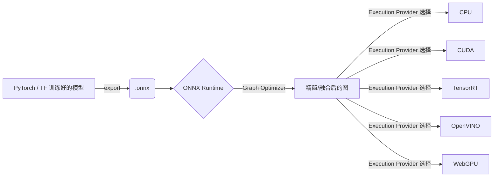

## ONNX Runtime 是什么？

**ONNX Runtime（ORT）** 是 微软主导、开源的 **跨平台机器学习模型加速引擎**。
它可以把来自 PyTorch、TensorFlow/Keras、scikit-learn 等框架导出的 ONNX 模型加载进来，自动做图优化，然后调用对应硬件的「执行提供者 (Execution Provider, EP)」以最高效的方式完成推理或训练。([onnxruntime - ONNX Runtime](https://onnxruntime.ai/docs/?utm_source=chatgpt.com))

---

### 1. 核心定位

|角色|说明|
|---|---|
|**统一格式**|只要模型转成 `.onnx` 文件，就能在 ORT 上运行；省去在不同硬件上重写推理代码的麻烦。|
|**高性能推理**|通过 **图融合、常量折叠、算子替换、量化** 等 100+ 种优化，把原始计算图变成最短执行路径。|
|**跨硬件后端**|一套 API，自动切换 **CPU、CUDA、TensorRT、DirectML、OpenVINO、ROCm、WebGPU/NPU** 等后端。([OpenVINO™ Execution Provider - Intel - ONNX Runtime](https://onnxruntime.ai/docs/execution-providers/OpenVINO-ExecutionProvider.html?utm_source=chatgpt.com),[NVIDIA - CUDA|
|**训练/微调加速**|ORT 既能推理，也能做 **Large-Model Training & LoRA 微调**，在 Azure、PyTorch Lightning 或本地多卡环境里都能直接插拔使用。([Training - ONNX Runtime](https://onnxruntime.ai/training?utm_source=chatgpt.com))|

---

### 2. 组件速览

|组件|用途|典型安装指令|
|---|---|---|
|**onnxruntime**|纯 CPU 或 OpenVINO/DirectML 等自动 fallback|`pip install onnxruntime`|
|**onnxruntime-gpu**|CUDA 12.x/11.x 加速|`pip install onnxruntime-gpu`|
|**onnxruntime-genai**|专针对 LLM/多模态的优化（KV-cache、MoE、QLoRA 等）|`pip install onnxruntime-genai` ([Releases · microsoft/onnxruntime-genai - GitHub](https://github.com/microsoft/onnxruntime-genai/releases?utm_source=chatgpt.com))|

最新稳定版 1.21.1 已于 **2025-04-18** 发布。([onnxruntime - PyPI](https://pypi.org/project/onnxruntime/?utm_source=chatgpt.com))

---

### 3. 典型工作流



1. **导出**：`torch.onnx.export(model, "model.onnx")`
    
2. **加载**：`sess = ort.InferenceSession("model.onnx", providers=["CUDAExecutionProvider"])`
    
3. **推理**：`sess.run(None, {"input": input_arr})`
    

---

### 4. 为什么用 ORT？

|场景|传统做法|用 ORT 的收益|
|---|---|---|
|**服务器推理**|手写 TensorRT / TVM / XLA|一键 graph 优化 + 多后端切换，无需重编译|
|**移动端**|MediaPipe / NNAPI 手工适配|ORT-Mobile 体积 < 1 MB，自动挑选最优算子实现 ([ONNX Runtime Mobile vs. MediaPipe: Your 2025 Guide to Building ...](https://medium.com/%40sharmapraveen91/onnx-runtime-mobile-vs-mediapipe-your-2025-guide-to-building-ai-powered-mobile-apps-7c49a222b879?utm_source=chatgpt.com))|
|**Web**|WebAssembly / WebGPU 定制|ORT-Web 同一套 JS API，浏览器即可跑 Transformer ([Web|
|**本地量化**|自己写 8-bit kernel|自带动态/静态量化、块式量化、INT4/FP16 支持|
|**LLM 推理**|模型拆分 + 手写 KV-cache|ORT-GenAI 内置 KV-cache、Group-Query-Attention、Multi-LoRA 等|

---

### 5. 与其他推理框架的差异

|对比项|ORT|TensorRT|TF-Lite|TVM|
|---|---|---|---|---|
|支持框架数量|**多**（ONNX = 公共中间表示）|主要 PyTorch/ONNX|TensorFlow 系|多，需编译|
|后端覆盖|CPU/GPU/FPGA/NPU/Web|NVIDIA GPU|CPU/ARM/Edge TPU|编译到任意目标|
|部署语言|C/C++/Python/C#/Java/JS|C++/Python|C++/Java/Kotlin|多|
|训练加速|**有**（DeepSpeed/FSDP 集成）|无|无|实验性|

---

### 6. 入门三行代码

```python
import onnxruntime as ort, numpy as np
sess = ort.InferenceSession("resnet50.onnx", providers=["CUDAExecutionProvider"])
pred = sess.run(None, {"input": np.random.randn(1,3,224,224).astype("float32")})
print(np.argmax(pred[0]))
```

---

### 7. 小结

- **一句话**：ONNX Runtime = “模型通行证 + 自动图优化器 + 多硬件加速垫片”。
    
- **当你想** 在不同设备上 **快速、统一、无 vendor 锁定地上线** 任意深度学习模型时，它几乎是开箱即用的首选。
    
- **更进一步** 的量化、并行、LLM 优化也已官方内置，省去大量手工调优成本。
    

有了这些概念，你就能判断什么时候该把模型导成 ONNX 并交给 ORT 来跑，从而在性能与开发效率之间取得最佳平衡。
