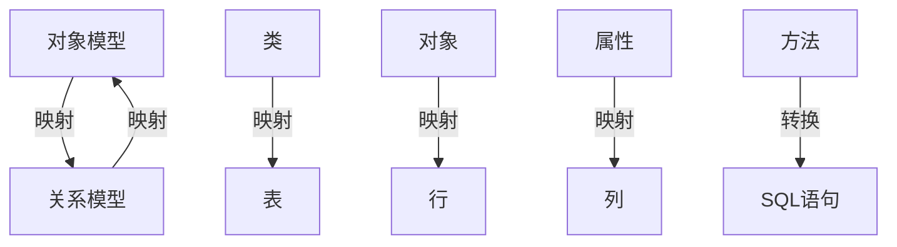

## 是啥？

ORM 是 "Object-Relational Mapping"（对象关系映射）的缩写。在数据库上下文中，ORM 是一种编程技术，用于将面向对象编程语言中的对象与关系型数据库中的表进行映射。

主要特点和优势：

1. 将数据库表映射到编程语言中的类。
2. 将表中的行映射到类的实例（对象）。
3. 将表中的列映射到对象的属性。
4. 提供了一种以面向对象方式操作数据库的方法。
5. 减少了直接编写 SQL 查询的需要，提高了开发效率。
6. 增强了代码的可维护性和可读性。
7. 提供了数据库无关性，使得切换不同的数据库系统变得更容易。

常见的 ORM 框架包括：

- Python: SQLAlchemy, Django ORM
- Java: Hibernate, JPA
- Ruby: Active Record (Rails)
- PHP: Doctrine, Eloquent (Laravel)
- .NET: Entity Framework

使用 ORM 可以让开发者更专注于业务逻辑，而不是底层的数据库操作细节。但是，在某些复杂查询或高性能要求的场景下，可能还是需要直接使用 SQL 来获得更好的控制和性能。

## 原理是什么？

