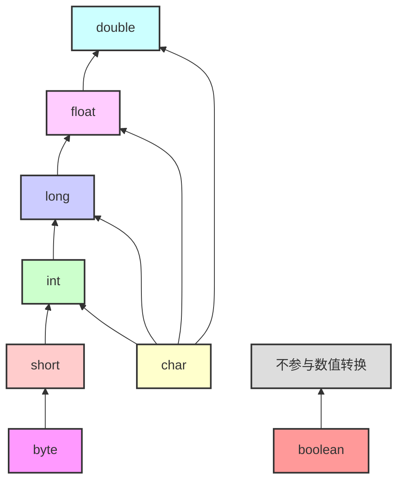

## 内存

| 1       | 2     | 4     | 8      |
| ------- | ----- | ----- | ------ |
| byte    | short | int   | long   |
| boolean | char  | float | double |

##『继承』体系

== 和 + 这类操作时会自动为操作符两边做类型转换到能够等量齐观的级别

## 精度

// double 的二进制表示  
0.05 = 1.1001100110011001100110011001100110011001100110011010 × 2^-5

// 转换回十进制就会得到：

0.05000000000000000277555756156289135105907917022705078125

## 相加

1. char、byte、short相加时会自动转换为int类型
2. +=会自动强转（自动装箱功能），但是+必须要手动强转b=(byte)(a+b)。

## 比较

x == f1[0]，x是long类型，与float类型对比属于低精度，所以x要向高精度的float类型转型再比较，故相等；
