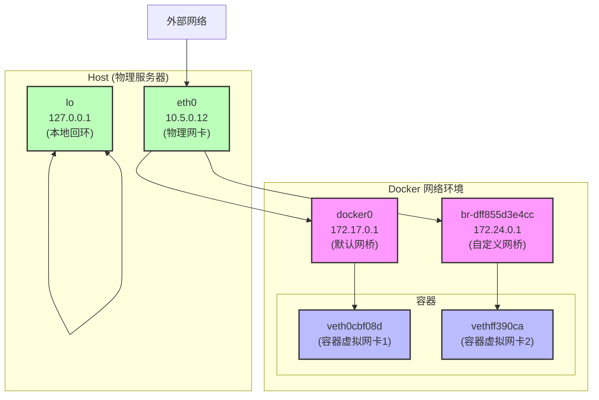

## 公网 IP

`curl ifconfig.me`

### 网络接口顺序

1. **物理网卡**：`eth0`
2. **本地回环接口**：`lo`
3. **Docker默认网桥**：`docker0`
4. **Docker自定义网桥**：`br-xxx`
5. **Docker容器虚拟网卡**：`veth-xxx`



## 网络统计信息

```Java
eth0:
RX packets 2377130  bytes 3372009777 (3.3 GB)  # 已接收的数据
TX packets 322799  bytes 32328691 (32.3 MB)    # 已发送的数据
```

这表明您的服务器已经接收了约 3.3GB 的数据，发送了约 32.3MB 的数据。

- RX = Receive (接收)
- TX = Transmit (发送)
