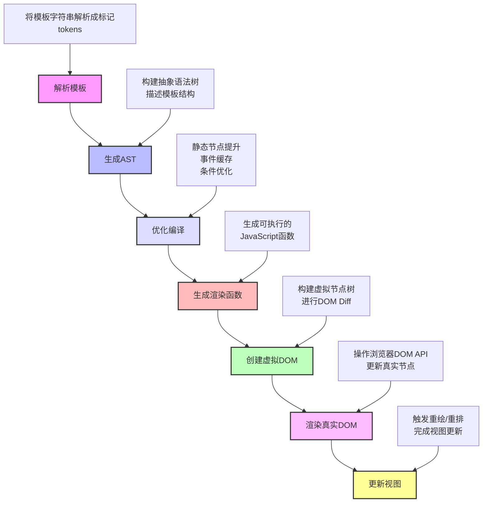

模板渲染是一个前端的基础概念，每个框架都有自己的实现方式：



## 通用的渲染概念

```Java
// 1. 模板解析
Template -> AST(抽象语法树)

// 2. 编译优化
AST -> 优化 -> 渲染函数

// 3. 虚拟DOM
VNode {
  type: String | Component
  props: Object
  children: Array | String
}

// 4. DOM操作
diff算法 -> 最小化DOM更新
```

## [Vue3@](Vue3@.md)的模版渲染

```vue
<!-- 声明式渲染 -->
<template>
  <div class="user">
    Hello, {{ user.name }}!
  </div>
</template>

<!-- 编译后的渲染函数 -->
function render() {
  return h('div', { class: 'user' }, [
    'Hello, ' + user.name + '!'
  ])
}
```
