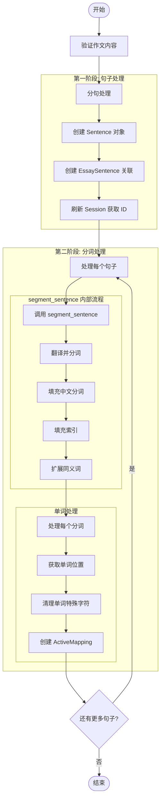

[掌声]谢谢。

今天，能与你们一同参加这所世界顶尖大学的毕业典礼，我感到无比荣幸。

说实话，我从未从大学毕业，这是我离大学毕业最近的一次。

[笑声]

今天，我想讲述我人生中的三个故事。就这样。没什么大不了的。仅三个故事。

第一个故事是关于如何把生命中的点点滴滴串连起来。我在里德学院只读了六个月就退学了。但之后我又以兼职的形式待了大约18个月，才真正辞职。

那么，我为何选择退学呢？这一切在我出生之前就已开始。我的生母是一位年轻的未婚研究生，她决定把我送去领养。她强烈认为我应该被大学毕业生收养。因此，我出生后的一切都已安排妥当，将由一位律师和他的妻子收养。

只不过当我蹦出来时，他们在最后一刻决定，他们真的想要一个女孩。我的父母当时在等待名单上，半夜接到电话问："我们意外得了个男宝宝。你想要他吗？"他们说："当然。"

---

我的生母后来发现，我的养母根本没有上过大学，我的养父甚至连高中都没毕业。她拒绝签署最终的收养文件。几个月后，她才勉强同意，因为我的父母保证我会去上大学。

这是我人生的起点。17年后，我确实上了大学，但我天真地选择了一所几乎和斯坦福一样昂贵的大学。我工薪阶层的父母的所有积蓄都花在了我的大学学费上。

六个月后，我看不出它有什么价值。我完全不知道自己的人生想要做什么，也不清楚大学如何能帮我找到答案。而我就在这里，花光了父母毕生积蓄的所有钱。于是我决定退学，并且相信这一切都会顺利解决。

当时确实挺吓人的，但回想起来，这是我做过的最好的决定之一。我一退学，我可以不再上那些必修却无趣的课程，转而旁听那些看起来更有意思的课。

并非一切都那么浪漫。我没有宿舍，只能睡在朋友房间的地板上。我为了买食物，把可乐瓶退回去换五分钱的押金。每个星期天晚上，我都会步行七英里穿过市区，去哈瑞·克里希纳神庙享用一周唯一的一顿美餐。

我很喜欢它。我跟随好奇心和直觉所涉足的许多事物，后来都成了无价之宝。让我给你举个例子。当时的里德学院提供了可能是全国最好的书法教育。校园内，每一张海报、每个抽屉上的标签都用手写书法精美地标注着。

因为我退了学，不用去上常规课程，我决定参加书法班学习这门技艺。我学习了衬线字体和无衬线字体的知识，关于调整不同字母组合之间的间距，关于优秀排版的要素。它美丽，富有历史感，艺术上微妙之处，科学难以捕捉。我觉得这非常有趣。

[需要我继续提供后面的内容吗？]

这一切在我生活中毫无实际应用的可能。但十年后，在设计第一台Macintosh电脑时，一切都回到了我的记忆中。我们将这一切设计都融入了Mac之中。这是第一台拥有精美字体的电脑。如果我没有在大学里旁听过那门课程，Mac电脑就不会拥有多种字体或比例间距字体。既然Windows只是模仿了Mac，很可能没有个人电脑会配备它们。

[掌声]

如果我从未辍学，我本不该去上那门书法课。个人电脑可能就不会有如今这般出色的排版效果。当然，在大学时，我无法预见未来如何将点滴串联起来。但十年后回首，一切都变得非常、非常清晰。

再次强调，你无法预知未来，将点滴串联起来。你只能在回顾时将它们联系起来。所以你必须相信，这些点滴会在你未来的某一天串连起来。你必须相信某些东西。你的直觉、命运、人生、业力，随便你怎么称呼。因为相信这些点滴会在未来串连起来，会给你信心去追随你的内心，即使它引领你离开寻常的道路。这将带来天壤之别。

我的第二个故事是关于爱与失去。我很幸运。我很早就找到了自己热爱的事业。我和沃兹在我父母的车库里创办了苹果公司，那时我20岁。我们辛勤工作，十年间，苹果从车库里的两个人发展成了一家拥有四千多名员工、价值二十亿美元的公司。我们刚刚推出了我们的杰作——麦金塔电脑，一年前，我刚满30岁。

然后我被解雇了。你怎么会被自己创立的公司解雇呢？好的，随着苹果公司的发展，我们聘请了一位我认为非常有才华的人来与我共同管理公司。在最初的一年左右，事情进展得很顺利。然而，我们对未来的愿景开始产生分歧，最终我们闹翻了。当我们这么做时，我们的董事会站在了他那边。于是，30岁的我离开了公司。而且非常公开地出局了。

我成年后生活的重心就此消失，这让我感到无比痛苦。几个月来，我真的不知道该怎么办。我觉得自己辜负了上一代企业家的期望。我在交接棒时掉了接力棒。我见到了戴维·帕卡德和鲍勃·诺伊斯，并试图为自己把事情搞得如此糟糕而道歉。我曾公开地遭遇失败，甚至一度考虑逃离硅谷。

但我逐渐意识到了一些事情。我依然热爱我所做的事。苹果公司的变故丝毫没有改变这一点。我被拒绝了，但我依然爱着。于是我决定重新开始。当时我并未意识到，但事实证明，被苹果公司解雇是我人生中可能发生的最好的事情。成功的沉重被重新成为初学者的轻松所取代。对一切都更加不确定。这让我得以进入一生中最富创造力的阶段。

接下来的五年里，我创办了一家名为NeXT的公司。另一家公司名为皮克斯，我遇见了后来成为我妻子的那位非凡女性。皮克斯随后制作了世界上第一部电脑动画长片《玩具总动员》，如今已成为全球最成功的动画工作室。在出人意料的转折中，苹果收购了NeXT，我也因此重返苹果。我们在NeXT开发的技术，正是苹果如今复兴的核心所在。洛琳和我共同拥有一个美好的家庭。

我确信，如果我没有被苹果公司解雇，这一切都不会发生。这药味道糟糕，但我想病人需要它。有时候，生活会给你当头一棒。不要失去信心。我深信，让我持续前进的唯一动力就是我对自己所做的事情的热爱。你必须找到你所爱的东西。工作如此，爱人亦然。

你的工作将占据你生活的一大部分。真正获得满足的唯一途径，就是去做你认为是伟大的工作。成就一番伟业的唯一途径就是热爱自己的事业。如果你还未找到，继续寻找，不要安于现状。如同所有心灵的追求，当你找到它时，你自会知晓。如同任何伟大的关系一样，随着时间的推移，它只会变得越来越好。所以继续寻找吧。不要将就。

[掌声]

我的第三个故事与死亡有关。十七岁时，我读到一则格言，大意是："如果你把每一天都当作生命中的最后一天去生活，总有一天你肯定会是对的。"

[笑声]

这给我留下了深刻印象，自那以后的33年里，我每天早上都会照镜子，问自己："如果今天是我生命的最后一天，我今天要做的事，是我真正想做的吗？"每当连续多日答案都是"不"时，我知道我需要做出一些改变。

记住我即将死去，是我一生中遇到的最重要箴言，它帮我做出了生命中的重大抉择。因为几乎所有事情，所有外界的期待，所有的骄傲，所有对尴尬或失败的恐惧，在死亡面前，这些事物都变得无足轻重，只留下真正重要的东西。记住你终将死去，是我所知避免陷入患得患失困境的最佳方法。你已经一丝不挂了。没有理由不追随你的内心。

大约一年前，我被诊断出患有癌症。我在7:30做了扫描。早晨的扫描结果明确显示我的胰腺上有一个肿瘤。我甚至不知道胰腺是什么。医生告诉我，这几乎肯定是一种无法治愈的癌症，我预计只能再活三到六个月。我的医生建议我回家，把自己的事情安排妥当，这是医生们用来表示"准备迎接死亡"的暗语。

这意味着要在短短几个月内，尝试告诉孩子们你原以为未来十年才会慢慢告诉他们的一切。这意味着确保一切安排妥当，以便尽可能减轻家人的负担。这意味着你要告别了。我整天都想着那个诊断结果。

那天晚上晚些时候，我做了个活检，他们把内窥镜伸进了我的喉咙，把胃扔进肠子里，把针插进胰腺里，并从肿瘤中取出了一些细胞。我被麻醉了，但当时在场的妻子，他们告诉我，在显微镜下观察细胞时，医生们开始哭泣，因为结果发现这是一种非常罕见的胰腺癌，可以通过手术治愈。我做了手术，谢天谢地，现在没事了。

[掌声]

这是我离死亡最近的一次。我希望这是未来几十年内我离它最近的一次。经历过这一切，如今，死亡对我而言已不再只是抽象的概念，而是有了更切实的体会，因此我可以更加肯定地告诉你这一点。

没有人想死。即便是想去天堂的人，也不愿以死亡为代价到达那里。然而，死亡是我们共同的目的地。无人能逃脱它的掌控。理应如此，因为死亡很可能是生命最伟大的发明。它是生命的变革推动者。辞旧迎新。此刻，新生的就是你。但总有一天，在不久的将来，你终将老去，被时光淘汰。

抱歉说得这么夸张，但事实确实如此。你的时间有限，所以不要浪费生命过别人的生活。不要被教条所束缚。这就是生活在他人思考结果中的状态。别让他人的意见淹没了你内心的声音。最重要的是，要有勇气追随自己的内心和直觉。他们早已洞悉你内心真正渴望成为的模样。其他一切都是次要的。

当我年轻时，曾有一本令人惊叹的出版物，名为《全球概览》。这是我这一代人的圣经之一。它是由一个名叫斯图尔特·布兰德的人创造的。离这里不远的门洛帕克。他以诗意的笔触赋予了它生命。这是在60年代末，在个人电脑和桌面出版出现之前。这一切都是用打字机、剪刀和宝丽来相机完成的。这就像是平装版的谷歌，在谷歌问世之前的35年。它充满理想主义，充斥着精巧的工具和伟大的理念。

斯图尔特和他的团队出版了数期《全球概览》。然后，当它完成了自己的历程，他们出版了最后一期。那是20世纪70年代中期，我和你年纪相仿。在他们最后一期的封底上，印着一张清晨乡间小路的照片，那种你如果够大胆，可能会搭便车遇到的。其下写着："求知若饥，虚心若愚。"这是他们告别时的寄语："求知若渴，保持愚蠢。"

我一直以来都希望自己能够如此。现在，当你们毕业重新起航，我衷心祝愿你们如此。求知若饥，虚心若愚。

非常感谢大家。

[掌声]



```json
{
    "sentence": {
        "sentence": "于是我决定退学，并且相信这一切都会顺利解决。"
    },
    "mappingList": [
        {
            "focus_word": "决定",
            "translation": "",
            "part_of_speech": "",
            "definition": "",
            "example": "",
            "is_need_translation": true,
            "ai_review": {
                "ai_review_is_correct": null,
                "ai_review_expression": "decide,determine"
            },
            "checkingAI": false,
            "usage_history": []
        },
        {
            "focus_word": "退学",
            "translation": "",
            "part_of_speech": "",
            "definition": "",
            "example": "",
            "is_need_translation": true,
            "ai_review": {
                "ai_review_is_correct": null,
                "ai_review_expression": "drop out"
            },
            "checkingAI": false,
            "usage_history": []
        },
        {
            "focus_word": "相信",
            "translation": "",
            "part_of_speech": "",
            "definition": "",
            "example": "",
            "is_need_translation": true,
            "ai_review": {
                "ai_review_is_correct": null,
                "ai_review_expression": "believe,trust"
            },
            "checkingAI": false,
            "usage_history": []
        },
        {
            "focus_word": "一切",
            "translation": "",
            "part_of_speech": "",
            "definition": "",
            "example": "",
            "is_need_translation": true,
            "ai_review": {
                "ai_review_is_correct": null,
                "ai_review_expression": "everything"
            },
            "checkingAI": false,
            "usage_history": []
        },
        {
            "focus_word": "解决",
            "translation": "",
            "part_of_speech": "",
            "definition": "",
            "example": "",
            "is_need_translation": true,
            "ai_review": {
                "ai_review_is_correct": null,
                "ai_review_expression": "resolved,solved"
            },
            "checkingAI": false,
            "usage_history": []
        },
        {
            "focus_word": "顺利",
            "translation": "",
            "part_of_speech": "",
            "definition": "",
            "example": "",
            "is_need_translation": true,
            "ai_review": {
                "ai_review_is_correct": null,
                "ai_review_expression": "smoothly"
            },
            "checkingAI": false,
            "usage_history": []
        }
    ]
}
```
