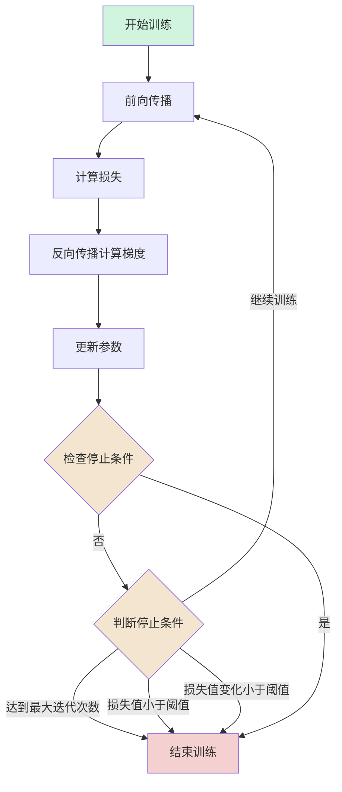

---
draw:
title: 多层感知机 MLP
date created: 2025-02-14
date modified: 2025-02-14
---

## 案例


## 1. 输入层到隐藏层的计算

$z^{(1)} = W^{(1)}x + b^{(1)}$  
$a^{(1)} = \sigma(z^{(1)})$

```Java
第一步: 计算加权和 z¹ = W¹x + b¹

[0.2  -0.5  0.1]     [2]     [0.3]     [0.2(2) + (-0.5)(3) + 0.1(-1) + 0.3] 
[-0.3  0.4  0.2]  ×  [3]  +  [-0.1]  = [-0.3(2) + 0.4(3) + 0.2(-1) - 0.1]
                     [-1]

详细计算:
z₁ = 0.2(2) + (-0.5)(3) + 0.1(-1) + 0.3
   = 0.4 - 1.5 - 0.1 + 0.3 
   = -0.9

z₂ = -0.3(2) + 0.4(3) + 0.2(-1) - 0.1
   = -0.6 + 1.2 - 0.2 - 0.1
   = 0.3

第二步: 应用Sigmoid激活函数 a¹ = σ(z¹)
a₁ = σ(-0.9) = 1/(1 + e⁰·⁹) ≈ 0.29
a₂ = σ(0.3) = 1/(1 + e⁻⁰·³) ≈ 0.57
```

## 2. 隐藏层到输出层的计算

$z^{(2)} = W^{(2)}a^{(1)} + b^{(2)}$  
$a^{(2)} = \sigma(z^{(2)})$

```Java
第一步: 计算加权和 z² = W²a¹ + b²

[0.5  0.2] × [0.29]  + [0.1] = [0.5(0.29) + 0.2(0.57) + 0.1]
             [0.57]

详细计算:
z² = 0.5(0.29) + 0.2(0.57) + 0.1
   = 0.145 + 0.114 + 0.1
   = 0.359

第二步: 应用Sigmoid激活函数 a² = σ(z²)
输出 = σ(0.359) = 1/(1 + e⁻⁰·³⁵⁹) ≈ 0.589
```

## 3. 损失函数

对于使用均方误差(MSE)作为损失函数  
$C_0 = (a^{(L)} - y)^2$

- $a^{(L)}$ 是神经网络的输出值（预测值），在我们前面的例子中是 0.589
- $y$ 是我们希望网络输出的正确答案，也就是训练数据中的目标值（比如如果这是一个二分类问题，y 可能是 0 或 1）

## 4. 链式法则 & 反向传播


$\frac{\partial C_0}{\partial w^{(L)}} = \frac{\partial z^{(L)}}{\partial w^{(L)}} \frac{\partial a^{(L)}}{\partial z^{(L)}} \frac{\partial C_0}{\partial a^{(L)}}$

其中:

1. $\frac{\partial C_0}{\partial a^{(L)}} = 2(a^{(L)} - y)$
2. $\frac{\partial a^{(L)}}{\partial z^{(L)}} = \sigma'(z^{(L)})$
3. $\frac{\partial z^{(L)}}{\partial w^{(L)}} = a^{(L-1)}$

### 输出层参数梯度计算

对于权重 $W^{(2)}=[0.5,0.2]$ 的梯度:

1. $\frac{\partial C_0}{\partial a^{(2)}} = 2(a^{(2)} - y) = 2(0.589 - 1) = -0.822$
2. $\frac{\partial a^{(2)}}{\partial z^{(2)}} = \sigma'(z^{(2)}) = a^{(2)}(1-a^{(2)}) = 0.589(1-0.589) = 0.242$
3. $\frac{\partial z^{(2)}}{\partial W^{(2)}} = a^{(1)} =[0.289, 0.574]$，因为$z^{(2)} = W^{(2)}a^{(1)} + b^{(2)}$

$W^{(2)} =[0.5, 0.2]$  
所以对于 $W_1^{(2)}$: 也就是 0.5  
$\frac{\partial C_0}{\partial W_1^{(2)}} = (-0.822) \times 0.242 \times 0.289 \approx -0.0287$

对于 $W_2^{(2)}$: 也就是 0.2  
$\frac{\partial C_0}{\partial W_2^{(2)}} = (-0.822) \times 0.242 \times 0.574 \approx -0.0572$

这样的表示更清晰地展示了每个导数项的来源和计算过程。每个导数项都有其明确的物理含义:

- $\frac{\partial C_0}{\partial a^{(L)}}$ 表示损失相对于输出的敏感度
- $\frac{\partial a^{(L)}}{\partial z^{(L)}}$ 表示激活函数的导数
- $\frac{\partial z^{(L)}}{\partial w^{(L)}}$ 表示上一层的激活值

这种链式表示方法使得我们能更好地理解梯度是如何从输出层一步步反向传播的。

来推导对偏置 $b^{(2)}$ 的偏导数。

我们仍然使用链式法则：
$\frac{\partial C_0}{\partial b^{(2)}} = \frac{\partial z^{(2)}}{\partial b^{(2)}} \frac{\partial a^{(2)}}{\partial z^{(2)}} \frac{\partial C_0}{\partial a^{(2)}}$

其中：

1. $\frac{\partial C_0}{\partial a^{(2)}} = 2(a^{(2)} - y) = -0.822$ (与之前相同)
2. $\frac{\partial a^{(2)}}{\partial z^{(2)}} = \sigma'(z^{(2)}) = 0.242$ (与之前相同)
3. $\frac{\partial z^{(2)}}{\partial b^{(2)}} = 1$ (因为 $z^{(2)} = W^{(2)}a^{(1)} + b^{(2)}$，对 $b^{(2)}$ 求导就是 1)

所以：
$\frac{\partial C_0}{\partial b^{(2)}} = (-0.822) \times 0.242 \times 1 \approx -0.199$

## 5. 参数更新

假设学习率 η = 0.1，参数更新公式为：

```Java
W = W - η * ∂C/∂W
b = b - η * ∂C/∂b
```

对于输出层的参数更新：

```Java
W₁² = 0.5 - 0.1 * (-0.0287) = 0.50287
W₂² = 0.2 - 0.1 * (-0.0572) = 0.20572
b² = 0.1 - 0.1 * (-0.199) = 0.1199
```

是的,参数更新后需要进行前向传播计算新的输出值,然后计算新的损失值,这就是一次完整的训练迭代。让我们用更新后的参数计算一次:

## 6. 使用更新后的参数进行前向传播

隐藏层计算(这部分参数未更新,结果不变)

```Java
z₁ = -0.9, a₁ = 0.289
z₂ = 0.3,  a₂ = 0.574
```

输出层计算(使用更新后的参数)

```Java
z² = W₁²a₁ + W₂²a₂ + b²
   = 0.50287(0.289) + 0.20572(0.574) + 0.1199
   = 0.145329 + 0.118083 + 0.1199
   = 0.383312

a² = σ(0.383312) ≈ 0.595
```

计算新的损失值

```Java
对于目标值 y = 1:
C_new = (a² - y)² 
      = (0.595 - 1)² 
      = 0.164025
```

对比原来的损失值:

```Java
C_old = (0.589 - 1)² = 0.168921
```

可以看到损失值从 0.168921 降到了 0.164025,说明这次参数更新是有效的。这就是一次完整的训练迭代。

训练过程会不断重复这个循环:

1. 前向传播
2. 计算损失
3. 反向传播计算梯度
4. 更新参数
5. 重复以上步骤

直到满足停止条件,比如:

- 达到预设的迭代次数
- 损失值小于某个阈值
- 损失值的变化小于某个阈值(收敛)

每次迭代损失值都会略有下降,这样经过多次迭代后,网络的输出会越来越接近目标值。


