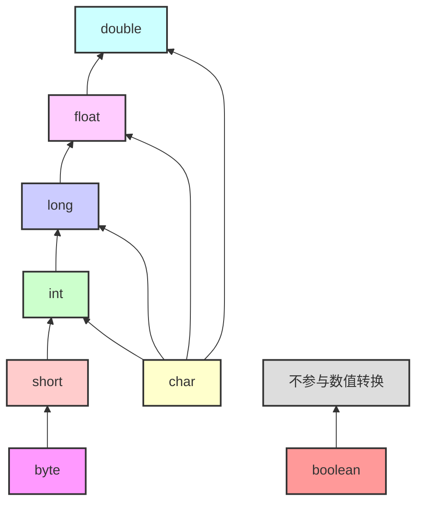

---
draw:
title: 类型转换
date created: 2024-09-19
date modified: 2025-02-06
---

## 强制类型转换

 Java 中所有的强转，都依赖于等于或者put赋值时，右边实际指向的类型 与 强转类型之间的继承关系，如果强转的类型间没有父子关系（null 是一切人的兄弟），就会出 ClassCastException

```java
Object i= null;  
System.out.println((Integer) i);

Object i= "string";  
System.out.println((Integer) i);
```

上面的不会抛空指针，只输出一个 null  
下面的会抛 `java.lang.ClassCastException`

 ### 那么基础类型的父子关系是啥？


