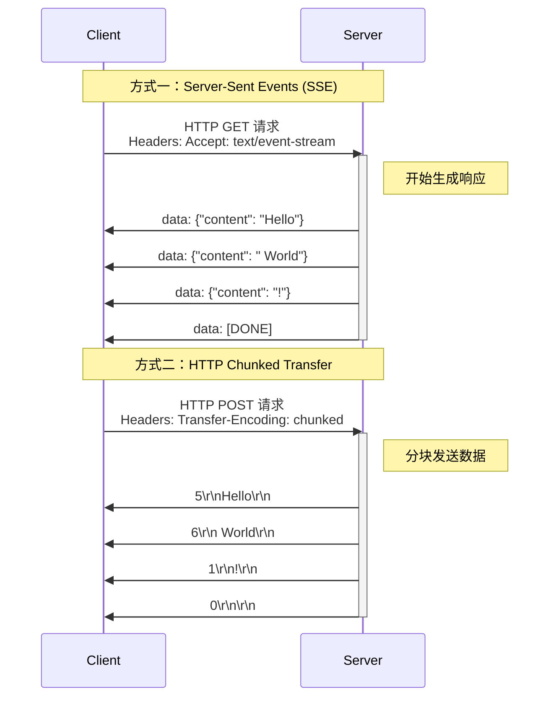

---
draw:
tags: []
title: Streaming
date created: 2024-11-25
date modified: 2024-12-27
---

OpenAI 的流式输出（Streaming）主要有两种实现方式：Server-Sent Events (SSE) 和 HTTP Chunked Transfer Encoding。让我用图表来说明这两种方式。

两种实现方式的详细解释：

1. Server-Sent Events (SSE)
   - 基于 HTTP 协议
   - 客户端发送请求时带上 `Accept: text/event-stream` 头
   - 服务器会保持连接打开
   - 使用特定的文本格式发送数据（data: 开头的行）
   - 适合单向数据推送
   - 自动重连机制
   - OpenAI API 默认使用这种方式

2. HTTP Chunked Transfer Encoding
   - 同样基于 HTTP 协议
   - 服务器通过分块发送数据
   - 每个块前面有该块的大小（十六进制）
   - 以大小为0的块表示传输结束
   - 没有自动重连机制

与 WebSocket 相比的主要区别：

- 这两种方式都是基于 HTTP 的单向流式传输
- 不需要像 WebSocket 那样建立特殊的连接
- 更轻量级，适合单向的数据流推送
- 服务器实现更简单，不需要维护长连接状态

实际应用中的选择考虑：

1. 如果只需要服务器到客户端的数据流，SSE 是很好的选择
2. 如果需要双向实时通信，则应该选择 WebSocket
3. 如果是简单的数据流传输，Chunked Transfer 也是可行的方案
