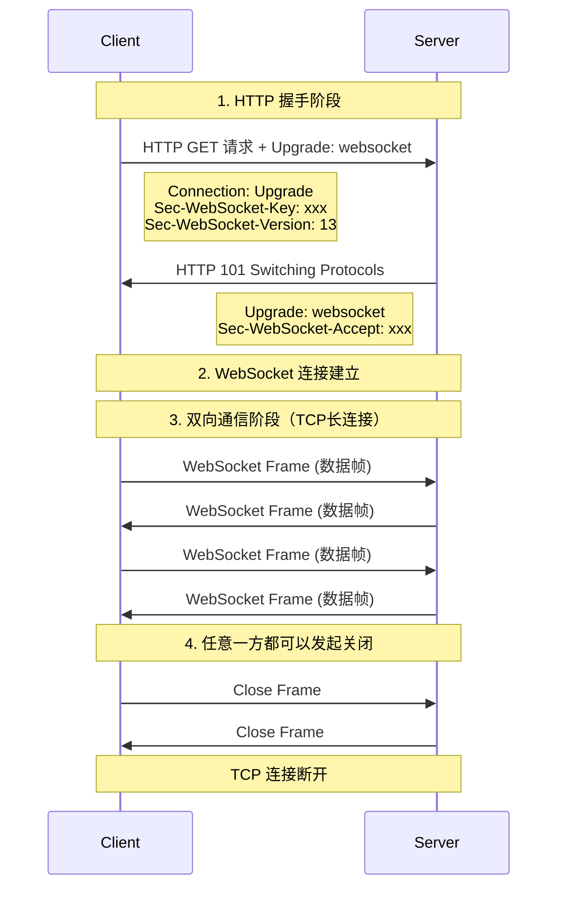

---
draw:
title: WebSocket
tags: []
date created: 2024-06-05
date modified: 2025-01-01
---

我们知道 TCP 连接的两端，同一时间里，双方都可以主动向对方发送数据。这就是所谓的[[全双工]]。

而现在使用最广泛的 HTTP/1.1，也是基于TCP协议的，同一时间里，客户端和服务器只能有一方主动发数据，这就是所谓的半双工。也就是说，好好的全双工 TCP，被 HTTP/1.1 用成了半双工。为什么？

这是由于 HTTP 协议设计之初，考虑的是看看网页文本的场景，能做到客户端发起请求再由服务器响应，就够了，根本就没考虑网页游戏这种，客户端和服务器之间都要互相主动发大量数据的场景。

所以，为了更好的支持这样的场景，我们需要另外一个基于TCP的新协议。于是新的应用层协议Websocket就被设计出来了。大家别被这个名字给带偏了。虽然名字带了个socket，但其实 socket 和 WebSocket 之间，就跟雷峰和雷峰塔一样，二者接近毫无关系。

WebSocket 是基于 [TCP](TCP.md) 的轻量级网络通信协议，和 [HTTP](HTTP.md) 同级的。

[HTTP 1.1](HTTP%201.1.md)握手+[TCP](TCP.md)长连接实现**双向通信

- 与普通 HTTP 不同，WebSocket 是持久连接
- 支持**服务器主动推送消息给客户端**，后端主动给前端推消息

WebSocket 和 HTTP 都是应用层协议，它们确实在网络协议的同一层（应用层）。让我们来看一下具体的协议层级:

1. 应用层 (Application Layer)
   - HTTP
   - WebSocket
   - FTP, SMTP 等其他应用层协议

2. 传输层 (Transport Layer)
   - TCP (是的，TCP 就是它们的下一层)
   - UDP

HTTP 和 WebSocket 的关系比较特殊:

- WebSocket 协议在建立连接时，会先通过 HTTP 进行握手
- 握手成功后，会升级为 WebSocket 协议，使用 TCP 长连接进行**双向通信**

主要区别:

- HTTP 是请求-响应模式，每次通信都需要客户端发起
- WebSocket 建立连接后，服务器可以主动向客户端推送数据，实现了真正的双向通信
