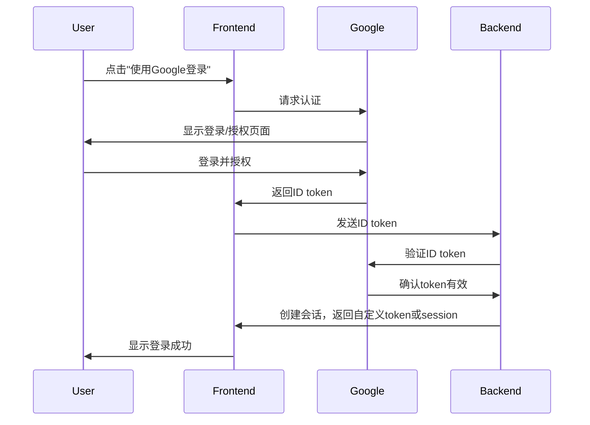

认证是证明你真的是如你所说的那个人

| 认证方法 (Authentication Method)  | 例子                     |                                                   | 优点 (Pros)       | 缺点 (Cons)        |
| ----------------------------- | ---------------------- | ------------------------------------------------- | --------------- | ---------------- |
| 基于密码 (Password-based)         | 以前的 qq 登录              |                                                   | 简单，广泛理解         | 易受攻击，密码疲劳        |
| 无密码 (Passwordless)            | 手机验证码登录                |                                                   | 消除密码相关的漏洞       | 依赖替代渠道（如邮件）的安全性  |
| 多因素 (Multi-Factor MFA)        | cisco 的 vpn 登录         |                                                   | 比仅密码更安全         | 可能对用户来说更复杂       |
| 生物特征 (Biometric)              | iphone 的 FaceID        |                                                   | 便捷，难以伪造         | 隐私问题，可能出现假阳性/假阴性 |
| [社交认证](社交认证.md) (Social)             | Google、微信登录            |                                                   | 对用户方便，减少注册阻力    | 依赖第三方服务，隐私问题     |
| [单点登录](2%20第二大脑/1%20知识/CS/软件工程/登录/单点登录.md) (Single Sign-On SSO) | qunar 里面               |                                                   | 改善用户体验，集中化的认证管理 | 单点故障风险           |
| 基于令牌 (Token-based)            | 使用令牌（如JWT）而不是每次请求都发送凭证 | 不同的 appcode 之间是不是靠这个？google 的本质就是谷歌给返回了一个 token | 无状态，可扩展         | 令牌管理可能复杂         |
| 基于证书 (Certificate-based)      | 使用数字证书来识别用户或设备         |                                                   | 非常安全，适合机器间通信    | 设置和管理复杂          |
| 联合认证 (Federated)              | 允许用户跨不同系统或组织进行认证       |                                                   | 实现跨域单点登录        | 需要不同组织或系统之间的信任   |

十年经验的开发, 连 Session/Cookie/Token/JWT 都讲不明白

backend authentication

1. API dimension whitelist
2. User dimension UPMS

  

这个地方不同的 mock 方式，代表不同的登录鉴权方式

