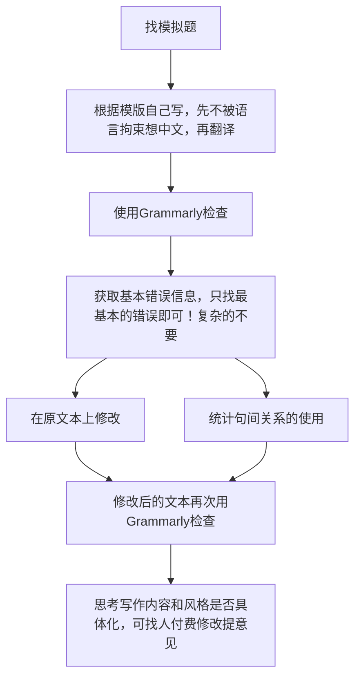
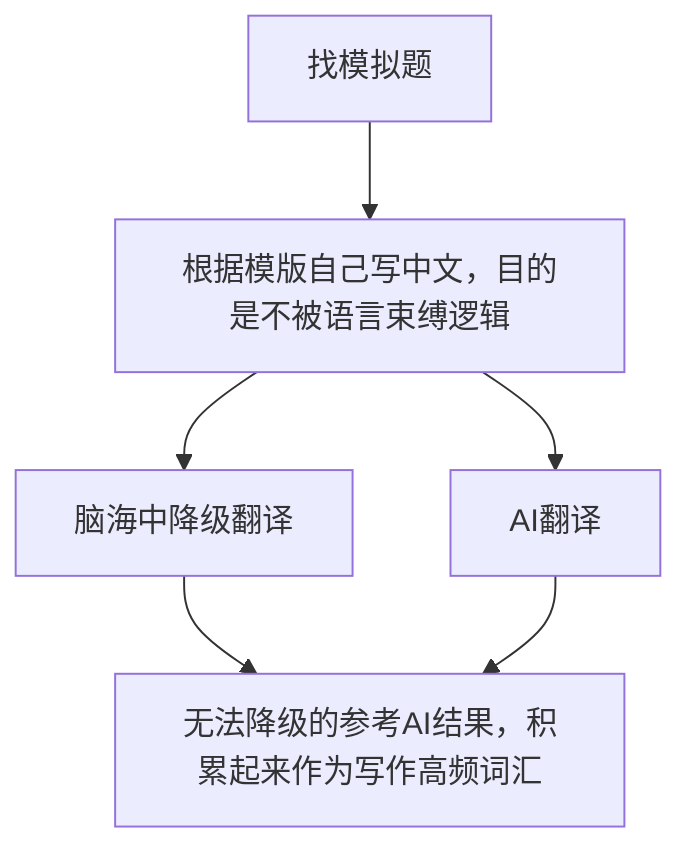

---
draw:
tags: []
title: 托福写作$
date created: 2024-08-18
date modified: 2024-12-27
---

> [!最佳实践]

1. 27 分的关键不在于语法的完美，有了基本的表达能力后（可以有少量低级错误），符合西方论证风格的文字即可达到 27 分。
	1. 把考官当小学生，不要说太抽象的话，主语和宾语之间的关系不要太远
	2. 观点之后的佐证，就是把观点实例化，具体来说就是缩小主语和宾语的指代范围，比如 学生->东南亚的学生 学生->爱学习的学生
2. 对应的字数说对应的话
3. 从自己的思想出发，挖掘自己世界观里的写作[高频词汇](高频词汇)


<!-- more -->

- [一、两个关键点](#%E4%B8%80%E3%80%81%E4%B8%A4%E4%B8%AA%E5%85%B3%E9%94%AE%E7%82%B9)
	- [1.1 论证千万不要隔靴搔痒](#1.1%20%E8%AE%BA%E8%AF%81%E5%8D%83%E4%B8%87%E4%B8%8D%E8%A6%81%E9%9A%94%E9%9D%B4%E6%90%94%E7%97%92)
	- [1.2 逻辑工具 / 逻辑词](#1.2%20%E9%80%BB%E8%BE%91%E5%B7%A5%E5%85%B7%20/%20%E9%80%BB%E8%BE%91%E8%AF%8D)
	- [1.3 主题词积累](#1.3%20%E4%B8%BB%E9%A2%98%E8%AF%8D%E7%A7%AF%E7%B4%AF)
- [二、实践](#%E4%BA%8C%E3%80%81%E5%AE%9E%E8%B7%B5)
	- [2.1 综合写作](#2.1%20%E7%BB%BC%E5%90%88%E5%86%99%E4%BD%9C)
		- [听懂就赢了](#%E5%90%AC%E6%87%82%E5%B0%B1%E8%B5%A2%E4%BA%86)
		- [模版](#%E6%A8%A1%E7%89%88)
	- [2.2 学术写作（180-200）](#2.2%20%E5%AD%A6%E6%9C%AF%E5%86%99%E4%BD%9C%EF%BC%88180-200%EF%BC%89)
		- [模版](#%E6%A8%A1%E7%89%88)
		- [参考资料](#%E5%8F%82%E8%80%83%E8%B5%84%E6%96%99)
		- [练习一](#%E7%BB%83%E4%B9%A0%E4%B8%80)
		- [练习二](#%E7%BB%83%E4%B9%A0%E4%BA%8C)

## 一、两个关键点

### 1.1 论证千万不要隔靴搔痒

论证千万不要隔靴搔痒，要有深度的剖析和论证，这是我考前三次的教训！比如关于政府是否应该给穷学生自助，如果你说"我认为应该投资，因为投资了学生就能有良好的教育条件，就能更好地学到practical skills，就能更好地找到decentjobs，如果不投资学生就不能有良好教育条件"，这是完全没有论证深度的！要这样去思考：穷学生很难有机会接受教育，如果政府给钱，他们就能收到好的教育，为什么呢？比如可以雇佣有质量的教授提升教育质量，建设具有先进设备的实验室可以让学生把理论知识应用到实践中，等等。就是要往下面写一步。

自己的逻辑思维能力没什么问题，目前的困境可能是由于直接写英语导致的。  
可以尝试心里用中文表达，然后翻译成英语，以中文意思为准，英语表达可以降级。

### 1.2 逻辑工具 / 逻辑词

> [!最佳实践]  
> 落实成顺手的模版，就和之前考研英语的写作一样

逻辑词！！on the contrary， in contrast， as a result， in the meantime，apart from that，admittedly，consequently，certainly，obviously，accordingly，simultaneously，to begin with，what's more等等，要好好总结并应用！
一个托福作文评分的外国老师就说过，中国学生写的作文逻辑连接很差，所以在读他们的作文的时候外国教授总是想问"Why"，因为没有连接，作文就会非常跳跃。

| 句间关系  | Transitional Words       | 模拟一                         |             |
| ----- | ------------------------ | --------------------------- | ----------- |
| 让步-转折 | Nonetheless, However     | however，admittedly          | but         |
|       | rather than              |                             |             |
|       |                          |                             |             |
| 平列    | On the other hand, then  |                             |             |
| 顺序    | Firstly, Secondly        | secondly                    |             |
| 增进引申  | In addition, Furthermore | besides                     |             |
| 过渡    | Now, At this point       |                             |             |
|       |                          |                             |             |
| 举例    | Such as, For instance    | 将"Like"改为更正式的"For instance" | For example |
| 比喻    | Like, As                 | like                        |             |
|       |                          |                             |             |
| 总结    | Accordingly, Overall     | finally                     |             |

### 1.3 写作高频词

| Category |             |                |      |
| -------- | ----------- | -------------- | ---- |
| 教育       |             |                |      |
| 环境       |             |                |      |
| 公司&工作    |             |                |      |
| 社会&文化＆商业 |             |                |      |
| 科技&信息    | centralized | centralization |      |
| 生活方式&健康  | appliances  |                | 家用电器 |

|     |                                   |     |
| --- | --------------------------------- | --- |
|     | Maggie's perspective              |     |
|     | arise from                        |     |
|     | rather than                       |     |
|     | economies of scale                |     |
|     | cook individually over open fires |     |
|     |                                   |     |
|     |                                   |     |
|     |                                   |     |
|     |                                   |     |

Would you like me to explain or modify this table in any way?  
主题词


## 二、实践





### 2.1 综合写作

#### 听懂就赢了

尽量把细节听全、写全

#### 模版

```Java
The passage mainly discusses that… However, the lecturer casts doubt on the writer's view from three different aspects.

First, it is said in the reading passage that …. Nonetheless, the professor in the listening material argues that …. This is the first place where the speaker disagrees with the reading passage.

Second, the writer points out that …. In contrast, the speaker in the listening material refutes that …. This is the second place that directly contradicts what the reading passage indicates.

Finally, the reading passage states that …. On the contrary, the professor in the listening material contends that …. This is the last point that entirely opposes the writer's view.
```

### 2.2 学术写作（180-200词）

#### 模版

尽量用举例子的论证方式，具体的不能再具体！！！

```Java
假设第一个人是A，Ta的立场是[1]；第二个人是B，Ta的立场是[2]；我们同意A

1. I highly recommend / I strongly believe [1].

2. Admittedly（不得不承认，让步）, as B mentioned, [不写让步是不行的，要给老师看到你的逻辑严谨程度，因为every coin has two sides嘛，如果不写让步会让人觉得你很偏激很极端的样子！] However, [1] is more beneficial for ....

3. 说你的第一个支持[1]的论点，写两句。For example,

4. 说你的第二个支持[1]的论点，写两句。要是具体的例子！！！具体的不能再具体！！！尽量用举例子的论证方式，而不是比喻

5. Finally, as A pointed out, [这里用自己的话复述一下[1]，但不要照抄，换几个词]。
```

#### 环境、科技

我强烈同意Maggie 的观点，经济发展是解决社会经济问题的唯一方式，随着经济发展会有更新的技术解决环境问题。
不得不承认，如ALex 所说，清洁能源和投资新技术很重要，但它们不应该是我们==关注的主要方向==  
首先，新事物往往==源自==实际需求，==而==缺少环保考虑。比如汽车是为了满足人们出行的需求。但是一个成熟的产业发展起来后，相应的环保就会跟上，比如现在==涌现==的新能源汽车。
其次，经济的发展往往会带来==规模化==的效应，这使得环保变得更容易和低成本。比如经济不发达的时候人们自己==烧火做饭==，有了现代的厨房和功能设备之后，所有的功能变得==集中且统一==。我们可以从功能端统一做环保==治理==。

####


#### 参考资料

方法论：[托福写作满分？自学一个月就可以！_哔哩哔哩_bilibili](https://www.bilibili.com/video/BV1R64y1n7LT/?vd_source=dea414ee2d39e74f662ceec0edffdf24)

模考题：https://toefl.kmf.com/write/academic

#### 练习一

https://toefl.kmf.com/writing/exercise/b25f8j/172449212257056438/b25f8j

I strongly believe the government should tax unhealthy food.

Admittedly, as Tanya mentioned, these taxes aren't that fair for people who are not so rich, because they will shrink the extent of cheaper food. However, taxing unhealthy food is more beneficial for all people in the long term.

First of all, price is not entirely equivalent to health. Even considering the tax, there is so much healthy food at a modest cost. For example, chicken breast is a good choice, which is so cheap and full of protein. Besides, lettuce is a kind of cheap fruit full of vitamins. Fried chicken is high calorie food. With the taxes, people will pay more attention to chicken breast meal and lettuce, etc, but not traditionally unhealthy food, which is good for their health and reduces the rate of some diseases of an unbalanced diet.

Secondly, sometimes people are weak in awareness of nutrition and health. For instance, one of my friends, Mike, cannot distinguish carbohydrates and protein, good grease and bad grease. The government can use the taxes from unhealthy food in the advertisement for nutrition and a balanced diet. If Mike can see some propaganda like eating too much fat meat can increase the risk of heart disease, or people need good grease 20g every day. I believe that he can make more informed choices when buying food, which has less relation to money but more to awareness!

Finally, as Sam pointed out, the idea of taxing unhealthy food does make sense. Limiting the consumption of unhealthy food and adopting a good mindset for health can lift the entire happiness of society.

#### 练习二

I strongly believe that targeted advertising precisely is an accepted way to reach consumers with products and services that are suitable for them.

Admittedly, as Jessica mentioned,

我认为精准广告是一种很好的方式，为消费者提供更适合他们的服务和产品。首先，我们每个人都希望

I believe that it is better for the government to regulate the social-media industry.

To begin with, today's social media industry is steeped in private-owned platforms and accounts in which they fight for audience views regardless of morals and negative influences. It would be almost impossible for those individual sectors to come to an equilibrium where they can compete healthily if they were to control their content and views themselves. However, government can achieve this from different ways, such as setting fair and standardized policies for all companies propagandizing cautions through authoritative medias, or even enlightening the youngsters by rectifying educational system. In this way, government intervention is more influential and effective than individual's effort.

Moreover, government can gain fines by implementing punishments, which could then be invested in healthy media companies or programs. This will in

#### 练习三

Professor: Today, we're discussing the ethics of targeted advertising. Some people argue that online advertising which uses personal information to target specific people is an invasion of privacy. Others argue that it's simply an acceptable way to reach consumers with products and services they're interested in. What's your take? Do you think targeted advertising is ethical, or is it an invasion of privacy?

我认为精准广告是一种很好的方式，能为消费者提供更适合他们的服务和产品。首先，我们每个人在选择商品或者服务的时候本身就会基于自己的背景和认知找我们更喜欢的。比如中国的南方人更习惯于吃米饭而不是面条，那么他们在选择饭店的时候，会更倾向于找那些提供更多米饭选择的饭店。对一些电子在线的生活平台来说，如果能知道用户的背景信息，那无疑会更容易给他们推荐他们更可能喜欢的餐馆，提高用户的满意度。另外，关于隐私侵犯的问题，目前很多用推荐算法的平台，在注册的时候都会提供选项列表给用户，用于让他们确认愿意分享的信息。比如，用户可以同意分享自己的定位信息，而不分享自己的年龄和性别信息。当平台和用户达成一致的时候，平台才会用这些信息给用户做精准广告推荐。所以，基于客户意愿的目标广告我认为是一种道德且高效的方式。

I think target advertising is a good way to provide consumer services and products that more suitable for them. First, all of us would choose products based on our background and interests. For instance, the southern people in China are used to eat rice rather than noodle. When they choose restaurant, they would prefer those can provide more kinds of rice meals. For some electric platform, if they can know customers' hometown, more suitable restaurant can be recommended, enhancing the satisfaction of users. Besides, in terms of the invasion of privacy, many applications would let the users confirm the extent of information they want to share with platform. For example, some users may like to share their location information, but don't want to share their age and ethnicity. And the application use only the information they guarantee to targeted advertising. So, the precise recommendation and advertising based on the users' known is an ethical and efficient way.

```Java
我认为精准广告是一种很好的方式，能为消费者提供更适合他们的服务和产品。首先，我们每个人在选择商品或者服务的时候本身就会基于自己的背景和认知找我们更喜欢的。比如中国的南方人更习惯于吃米饭而不是面条，那么他们在选择饭店的时候，会更倾向于找那些提供更多米饭选择的饭店。对一些电子在线的生活平台来说，如果能知道用户的背景信息，那无疑会更容易给他们推荐他们更可能喜欢的餐馆，提高用户的满意度。另外，关于隐私侵犯的问题，目前很多用推荐算法的平台，在注册的时候都会提供选项列表给用户，用于让他们确认愿意分享的信息。比如，用户可以同意分享自己的定位信息，而不分享自己的年龄和性别信息。当平台和用户达成一致的时候，平台才会用这些信息给用户做精准广告推荐。所以，基于客户意愿的目标广告我认为是一种道德且高效的方式。  

帮我把这篇作文做一个分词，生成 markdown 表格，填充第一列


I think target advertising is a good way to provide consumer services and products that more suitable for them. First, all of us would choose products based on our background and interests. For instance, the southern people in China are used to eat rice rather than noodle. When they choose resturant, they would prefer those can provide more kinds of rice meals. For some electric platform, if they can know customers' hometown, more suitable restarurant can be recommended, enhancing the satifaction of users. Besides, in terms of the invasion of privacy, many applications would let the users confirm the extent of information they want to share with platform. For example, some users may like to share their location information, but don't want to share their age and ethnicity. And the application use only the information they guarantee to targeted advertising. So, the precise recommendation and advertising based on the users' known is an ethical and efficient way. 

帮我把我的英文翻译分词，并填充到第二列中与第一列匹配的部分，这两列不做任何修改，保留我的原文，第三列写出你认为的修改意见，如果匹配的很完美可以空着，如果用词不合适，或者有 typo，可以在第三列提出你的意见
```

好的，我会按照您的要求完成这个任务。我会将您的英文翻译分词，并填充到第二列中与第一列匹配的部分，保留原文不做修改，然后在第三列提供我的修改意见。以下是结果：

| 中文 | 英文 | 修改意见 |
|------|------|----------|
| 精准广告 | target advertising | targeted advertising |
| 消费者 | consumer | |
| 适合 | suitable | more suitable |
| 服务 | services | |
| 产品 | products | |
| 选择 | choose | |
| 商品 | products | |
| 服务 | | (已出现) |
| 背景 | background | |
| 认知 | interests | |
| 中国 | China | |
| 南方人 | southern people | |
| 米饭 | rice | |
| 面条 | noodle | noodles |
| 饭店 | resturant | restaurant |
| 电子在线 | electric platform | electronic platform |
| 生活平台 | | (未直接翻译) |
| 用户 | users | |
| 背景信息 | hometown | background information |
| 推荐 | recommended | |
| 餐馆 | restarurant | restaurant |
| 满意度 | satifaction | satisfaction |
| 隐私侵犯 | invasion of privacy | |
| 推荐算法 | | (未直接翻译) |
| 平台 | platform | |
| 注册 | | (未直接翻译) |
| 选项列表 | | (未直接翻译) |
| 确认 | confirm | |
| 分享 | share | |
| 信息 | information | |
| 定位信息 | location information | |
| 年龄 | age | |
| 性别信息 | | (未直接翻译，使用了ethnicity) |
| 精准广告推荐 | targeted advertising | |
| 客户意愿 | users' known | users' consent |
| 目标广告 | | (已出现为target advertising) |
| 道德 | ethical | |
| 高效 | efficient | |

#### 练习四

### 托福独立口语T1

学生回忆：
青少年应不应该被限制使用电子设备？

### 托福综合口语T2

学生回忆：
建议学校让学生早一点结束基础数学的学习，因为学生已经有能力了，可以早点通过考试，还可以早点学习其他的课程

### 托福综合口语T3

学生回忆：
术语解释：Illusion of explanatory depth。人们总是自以为懂得很多事情的背后的原理机制，但其实是错觉。举了一个自行车chain的例子

### 托福综合口语T4

学生回忆：
巨蛙寻找产卵地点的方法，通过building nesting site或者sheltered areas里面产卵，保证安全；还有一种动物产卵在cold water，更容易孵化

```Java

### 托福独立口语T1
  
青少年应不应该被限制使用电子设备？

### 托福综合口语T2
  
建议学校让学生早一点结束基础数学的学习，因为学生已经有能力了，可以早点通过考试，还可以早点学习其他的课程

### 托福综合口语T3
 
术语解释：Illusion of explanatory depth。人们总是自以为懂得很多事情的背后的原理机制，但其实是错觉。举了一个自行车chain的例子

### 托福综合口语T4
 
巨蛙寻找产卵地点的方法，通过building nesting site或者sheltered areas里面产卵，保证安全；还有一种动物产卵在cold water，更容易孵化
```
