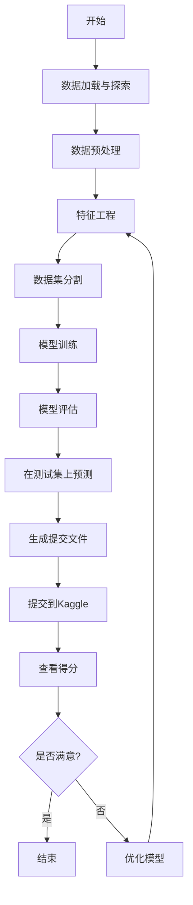

---
draw:
tags: []
title: Kaggle
date created: 2024-10-13
date modified: 2024-12-27
---

## 基本定位

Kaggle给机器学习新手和顶尖选手带来的好处是最大的，反倒对中间选手没什么太大的帮助。

新手小白只需要参加一次与自己工作领域相同的比赛，就可以马上摘掉小白的标签。因为在参赛过程中，你会完整地了解并掌握基于机器学习、深度学习的整个任务的工作流程。包括：

1. 什么是EDA，以及如何进行充分的EDA
2. 针对不同类型的数据，如何进行预处理
3. 如何选择模型，如何训练模型，训练过程中有哪些提升结果的tricks
4. 如何高效调参
5. 如何划分验证集，如何进行模型融合
6. 如何进行数据后处理，以进一步提升最终结果

我当年就是从一枚小白，在参加了一次完整的Kaggle比赛后瞬间成长。最开始大神公开的代码，每一行都需要百度什么意思，然后就一行一行的写上注释。到最后可以针对不同的比赛任务有自己的想法，并熟练地进行训练调参等一系列操作，最终得到了第一枚银牌。

过了小白的阶段，我自认为Kaggle对个人能力的提升所带来的帮助就不是很大了。因为该会的你都已经会了，剩下的就是炼丹，模型融合。本质上就是调参技巧和硬件设备大比拼了。因为数据预处理和后处理基本上大家都差不多，你也不会想出其他多牛逼的提点tricks了，真能想到的话就可以发论文了。至于说kaggle在找工作时候可以作为能力证明，这个其实不是很明显，因为kaggle组队带打越来越多，kaggle含金量越来越低了。

对于大神来说，如果可以保证自己至少拿银牌并且有大概率拿金牌。那么一方面，参加kaggle不失为一份兼职，可以组队带打并收取一定的费用，如果能力超强还可以拿到比赛的奖金。另一方面，如果真能在几次比赛中得个前三，那确实可以在应聘国内外大厂的时候拿出来炫耀一下，还是很加分的。
