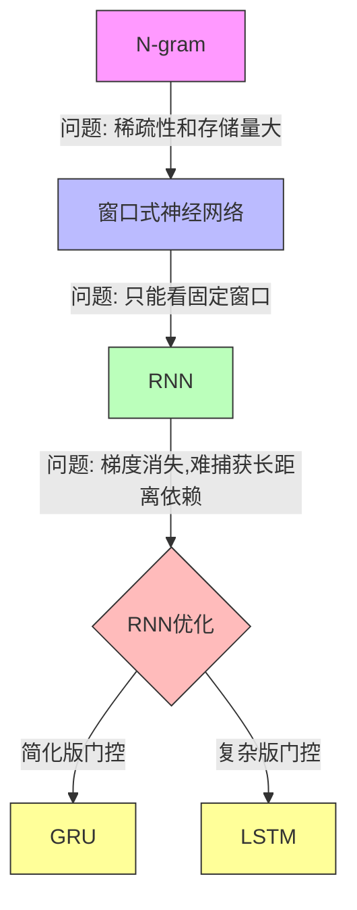

- [地道 = 联合分布概率高](#%E5%9C%B0%E9%81%93%20=%20%E8%81%94%E5%90%88%E5%88%86%E5%B8%83%E6%A6%82%E7%8E%87%E9%AB%98)
- [N-gram](#N-gram)
- [窗口式神经语言模型](#%E7%AA%97%E5%8F%A3%E5%BC%8F%E7%A5%9E%E7%BB%8F%E8%AF%AD%E8%A8%80%E6%A8%A1%E5%9E%8B)
- [RNN](#RNN)
- [RNN的优化](#RNN%E7%9A%84%E4%BC%98%E5%8C%96)
	- [GRU 门控循环单元](#GRU%20%E9%97%A8%E6%8E%A7%E5%BE%AA%E7%8E%AF%E5%8D%95%E5%85%83)
	- [长短期记忆网络 (LSTM)](#%E9%95%BF%E7%9F%AD%E6%9C%9F%E8%AE%B0%E5%BF%86%E7%BD%91%E7%BB%9C%20(LSTM))
- [关注后续更高级的主题](#%E5%85%B3%E6%B3%A8%E5%90%8E%E7%BB%AD%E6%9B%B4%E9%AB%98%E7%BA%A7%E7%9A%84%E4%B8%BB%E9%A2%98)

## 思路

**最终目标**
- 判断语言是否地道(自然)
- 衡量标准是联合概率分布 P(w1,w2,...,wm)  
**实现手段**



## 地道 = 联合分布概率高

> _目的是不是识别一些很怪的话，比如一个老外说中文，我们觉得不地道，所谓的不地道指的就是联合分布概率很低？

1. 概率评估自然程度
- 当一个词序列的联合概率 P(w1,...,wm) 较高时,说明这种表达方式在训练语料中经常出现,也就是较为"地道"
- 相反,如果概率很低,往往意味着这种表达方式不太常见或不自然

1. 具体案例
- "今天天气很好" - 可能会得到较高概率
- "今天天气很优秀" - 虽然在语法上正确,但会得到较低概率,因为中文里通常不会用"优秀"来形容天气

1. 应用场景
- 机器翻译:帮助系统选择更自然的目标语言表达
- 语言学习:可以帮助学习者识别不地道的表达
- 文本生成:确保生成的文本符合目标语言的表达习惯

1. N-gram的作用  
通过限制只看前面n个词的上下文,使得模型既能捕捉到局部的语言使用规律,又能保持计算的可行性。这种方法特别适合识别:
- 词序搭配是否自然
- 语言表达是否符合母语者习惯

## N-gram

"gram" 来自于希腊语 "gramma"，意思是"写下的东西"或"字母"。而 "n" 表示我们要看的单元数量。

具体来说：

- unigram (n=1): 单个词
    - 例如:["我", "喜欢", "苹果"]
- bigram (n=2): 两个词的组合
    - 例如:["我喜欢", "喜欢苹果"]
- trigram (n=3): 三个词的组合
    - 例如:["我喜欢苹果"]

1. **稀疏性问题**  
假设我们在训练一个三元(trigram)语言模型:
- 训练语料中有 "我很喜欢吃面条"
- 但从未出现过 "我很喜欢吃披萨"
- 按照纯统计方法, P(披萨|我很喜欢吃) = 0
- 但实际上"我很喜欢吃披萨"是完全合理的句子
- 这就是稀疏性问题 - 很多合理的组合因为没在训练数据中出现过就被判定为不可能

1. **存储量问题**  
假设我们的词表大小是 10000:
- 对于二元模型(bigram): 需要存储 10000 × 10000 = 1亿个可能组合的统计
- 对于三元模型(trigram): 需要存储 10000 × 10000 × 10000 = 1万亿个可能组合
- 如果增加词表或n的大小,存储量会呈指数级增长

1. **解决方案**
- 对于稀疏性:
  - 平滑(Smoothing): 给未见过的组合分配小概率而不是0
  - 回退(Backoff): 当三元组没见过时,退而使用二元组的概率
- 对于存储量:
  - 只存储实际出现过的n-gram组合
  - 使用数据压缩技术
  - 采用神经网络语言模型等新方法

这些局限也是为什么后来发展出神经网络语言模型的重要原因之一 - 它们可以更好地处理稀疏性问题,同时具有更好的泛化能力。

## 窗口式神经语言模型

让我以这个"吃披萨"的例子来解释窗口式神经语言模型的改良：

1. **传统 n-gram 方法**

```Java
"我很喜欢吃面条" (训练数据中有)
"我很喜欢吃披萨" (训练数据中没有)
```

- n-gram 直接看词的符号，所以这两个序列是完全不同的
- "披萨"没出现过，概率直接为 0

1. **神经语言模型的改进**
- **词嵌入的作用**：
  - "面条"和"披萨"都会被映射到相似的向量空间
  - 比如：都是食物，都可以吃，都是名词
  - 向量可能类似：
    - 面条 →[0.8, 0.6, 0.7,...]
    - 披萨 →[0.7, 0.5, 0.8,...]
- **处理过程**：

```Java
输入："我很喜欢吃" + 待预测词
↓
将每个词转换为词向量
↓
拼接词向量
↓
通过神经网络处理
↓
预测下一个词的概率分布
```

1. **为什么能解决问题**
- **稀疏性问题**：
  - 即使没见过"吃披萨"，但模型知道"披萨"和"面条"相似
  - 通过词向量的相似性，可以推断出"吃披萨"也是合理的
- **存储问题**：
  - 不需要存储所有可能的 n-gram 组合
  - 只需要存储：
    1. 每个词的词向量（维度比词表小得多）
    2. 神经网络的参数
  - 比如：
    - 词表 10000，词向量维度 300
    - 总存储量 ≈ 10000 × 300 = 300万个参数
    - 远小于 n-gram 的 1万亿个统计量

这就像是从"死记硬背所有组合"变成了"理解词的含义并进行推理"，既节省空间又有更好的泛化能力。

## RNN

好的,让我们继续用"我很喜欢吃面条/披萨"的例子来解释RNN的工作原理：

1. **基本工作流程**

```Java
输入序列: "我 很 喜欢 吃 面条"
时刻t:    1  2  3   4   5

h1 = σ(W(hx)"我" + W(hh)h0)
h2 = σ(W(hx)"很" + W(hh)h1)
h3 = σ(W(hx)"喜欢" + W(hh)h2)
h4 = σ(W(hx)"吃" + W(hh)h3)
h5 = σ(W(hx)"面条" + W(hh)h4)
```

1. **对比传统方法和RNN**
- 传统n-gram：
  - 只能看固定窗口："喜欢吃面条"
  - 不知道更早的"我"字信息
- RNN优势：
  - 可以通过隐藏状态传递早期信息
  - h4包含了"我很喜欢"的信息
  - 预测"面条"时能利用完整上下文

1. **长距离依赖问题**  
假设句子变长："我 上个月 在意大利 很 喜欢 吃 披萨"

- 理想情况：
  - h7应该能记住"意大利"和"披萨"的关联
- 实际问题：
  - 信息传递越远，梯度越容易消失
  - "意大利"的信息可能在传到"披萨"时已经很微弱

1. **双向RNN的优势**

```Java
正向: 我 → 很 → 喜欢 → 吃 → 面条
反向: 我 ← 很 ← 喜欢 ← 吃 ← 面条
```

- 预测"吃"时能同时知道：
  - 前文："我很喜欢"
  - 后文："面条"
- 有助于更好地理解上下文含义

这就像人类阅读一样，我们理解一个词不仅需要前文，有时也需要看后文才能更好地理解当前的词。

## RNN的优化

### GRU 门控循环单元

> _感觉是把一个简单的一根筋的上下文增加和衰退加上了更多的逻辑和编排_

是的,你这个理解很形象! 让我用一个更生活化的比喻来说明:

1. **普通RNN** 就像一个"耿直人"：
- 机械地传递信息
- 越往后信息越模糊
- 不懂得取舍,所有信息都平等对待

1. **GRU** 则像一个"聪明的秘书"：
- **重置门(rt)**: 相当于筛选重要信息
  - "这条信息重要吗？需要记住吗？"
  - "意大利"→重要,要记住
  - "上个月"→不重要,可以淡忘
- **更新门(zt)**: 像是在做信息取舍
  - "要保留多少旧信息？"
  - "要加入多少新信息？"
  - 就像在调配新旧信息的比例
- **新记忆候选(h̃t)**: 像是做信息整理
  - 把筛选后的旧信息
  - 和新接收的信息
  - 整理成一个新的备忘录

这确实是从简单的"一根筋"记忆模式,升级到了更智能的"管理式"记忆模式。这种设计更接近人类的认知方式 - 我们也是会有选择地记住重要信息,而不是简单地让所有记忆自然衰退。

1. **重置门(rt)的作用**

```Java
当处理"吃"这个词时：
- 如果 rt ≈ 1：保留"意大利"的信息，因为和"披萨"相关
- 如果 rt ≈ 0：忽略"上个月"的信息，因为对预测不重要
```

1. **更新门(zt)的作用**

```Java
当处理"披萨"时：
- 如果 zt ≈ 1：保持"意大利"的上下文，因为这是重要的地理信息
- 如果 zt ≈ 0：重点关注新信息"吃"，因为这直接关系到下一个词
```

1. **新记忆候选(h̃t)的形成**

```Java
比如处理"披萨"时：
输入: xt = "披萨"的词向量
旧信息: ht-1 包含"意大利...吃"的信息
rt决定保留多少"意大利"的信息
→ 形成新的候选记忆：意大利食物相关的信息
```

1. **最终隐状态(ht)的整合**

```Java
例如最终的"披萨"预测：
- 通过 zt 权衡:
  - 保留"意大利"的背景信息（旧信息）
  - 结合"吃"这个动作信息（新信息）
→ 得到一个综合的表示，有利于预测这类场景
```

对比普通RNN：

- RNN可能会"忘记""意大利"这个重要信息
- GRU通过门控机制可以：
  1. 主动保留"意大利"这个重要上下文
  2. 忽略"上个月"等不太相关的信息
  3. 灵活整合"吃"和"意大利"的信息来预测"披萨"

这就像人的思维过程：我们会有选择性地记住重要信息（通过门控），而不是像普通RNN那样机械地传递所有信息。

### 长短期记忆网络 (LSTM)

好的，还是用"我 上个月 在意大利 很 喜欢 吃 披萨"这个例子来解释LSTM：

LSTM比GRU更复杂，它像是有一个更精细的"记忆管理系统"：

1. **记忆单元(ct)的特点**

```Java
类比成一个"长期记忆本"：
- 可以长期保存"在意大利"这个重要信息
- 不像普通RNN那样容易随时间衰退
- 不像GRU那样把记忆和隐藏状态混在一起
```

1. **三个门的配合**

```Java
输入门(it)：
- "是否要记录新信息？"
- 比如看到"披萨"时，决定记录这个新食物信息

遗忘门(ft)：
- "要保留多少旧信息？"
- 看到"吃"时，决定保留"意大利"的信息
- 但可能逐渐淡忘"上个月"这个时间信息

输出门(ot)：
- "此刻要透露多少记忆？"
- 预测下一个词时，决定展示多少地理和食物相关的信息
```

1. **记忆更新过程**

```Java
处理"披萨"这个词时：

1. 生成候选记忆(c̃t)：
   - 新信息："这是一种食物"

2. 输入门决定：
   - 要记住这是意大利美食

3. 遗忘门决定：
   - 保留"在意大利"的地理信息
   - 逐渐淡忘"上个月"的时间信息

4. 输出门决定：
   - 输出与意大利美食相关的信息
   - 可能暂时隐藏时间信息
```

与GRU相比，LSTM像是一个"更专业的记忆管理器"：

- GRU是"二合一"的记忆管理
- LSTM则是将记忆(ct)和输出(ht)分开，通过三个门进行更精细的控制

这种设计让LSTM特别适合需要长期记忆的任务，比如写一篇关于"意大利美食游记"的长文章，需要长期保持地理和美食相关的上下文信息。

## 关注后续更高级的主题

- 如 Seq2Seq 的 **Attention** 机制、[[Transformer]]、以及近年流行的大规模预训练模型 ([[BERT]]、GPT 等)。它们都是在"怎样更好地处理序列信息"的思路上不断演进。
