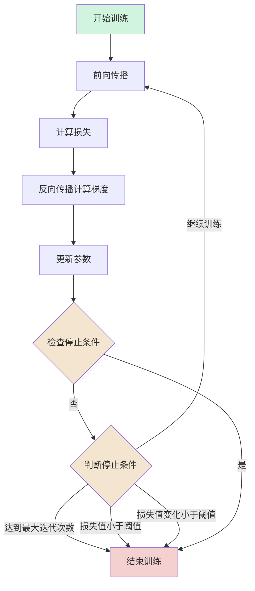

---
draw:
title: 神经网络
date created: 2024-07-16
date modified: 2025-02-14
---
- [1. 神经网络的本质：函数逼近](#1.%20%E7%A5%9E%E7%BB%8F%E7%BD%91%E7%BB%9C%E7%9A%84%E6%9C%AC%E8%B4%A8%EF%BC%9A%E5%87%BD%E6%95%B0%E9%80%BC%E8%BF%91)
	- [1.1 线性变换 + 非线性激活](#1.1%20%E7%BA%BF%E6%80%A7%E5%8F%98%E6%8D%A2%20+%20%E9%9D%9E%E7%BA%BF%E6%80%A7%E6%BF%80%E6%B4%BB)
	- [1.2 多层叠加带来“复合函数”](#1.2%20%E5%A4%9A%E5%B1%82%E5%8F%A0%E5%8A%A0%E5%B8%A6%E6%9D%A5%E2%80%9C%E5%A4%8D%E5%90%88%E5%87%BD%E6%95%B0%E2%80%9D)
- [2. 为什么“线性 + 非线性”能表达万千变化？](#2.%20%E4%B8%BA%E4%BB%80%E4%B9%88%E2%80%9C%E7%BA%BF%E6%80%A7%20+%20%E9%9D%9E%E7%BA%BF%E6%80%A7%E2%80%9D%E8%83%BD%E8%A1%A8%E8%BE%BE%E4%B8%87%E5%8D%83%E5%8F%98%E5%8C%96%EF%BC%9F)
- [3. 有了“万能逼近”，为什么还要设计各种结构？](#3.%20%E6%9C%89%E4%BA%86%E2%80%9C%E4%B8%87%E8%83%BD%E9%80%BC%E8%BF%91%E2%80%9D%EF%BC%8C%E4%B8%BA%E4%BB%80%E4%B9%88%E8%BF%98%E8%A6%81%E8%AE%BE%E8%AE%A1%E5%90%84%E7%A7%8D%E7%BB%93%E6%9E%84%EF%BC%9F)
- [4. 训练数据与损失函数同样关键](#4.%20%E8%AE%AD%E7%BB%83%E6%95%B0%E6%8D%AE%E4%B8%8E%E6%8D%9F%E5%A4%B1%E5%87%BD%E6%95%B0%E5%90%8C%E6%A0%B7%E5%85%B3%E9%94%AE)
- [5. 是“拟合一切”还是“盲目万能”？](#5.%20%E6%98%AF%E2%80%9C%E6%8B%9F%E5%90%88%E4%B8%80%E5%88%87%E2%80%9D%E8%BF%98%E6%98%AF%E2%80%9C%E7%9B%B2%E7%9B%AE%E4%B8%87%E8%83%BD%E2%80%9D%EF%BC%9F)
- [6. 小结](#6.%20%E5%B0%8F%E7%BB%93)
- [case](#case)
	- [符号](#%E7%AC%A6%E5%8F%B7)
	- [案例](#%E6%A1%88%E4%BE%8B)
	- [1. 输入层到隐藏层的计算](#1.%20%E8%BE%93%E5%85%A5%E5%B1%82%E5%88%B0%E9%9A%90%E8%97%8F%E5%B1%82%E7%9A%84%E8%AE%A1%E7%AE%97)
	- [2. 隐藏层到输出层的计算](#2.%20%E9%9A%90%E8%97%8F%E5%B1%82%E5%88%B0%E8%BE%93%E5%87%BA%E5%B1%82%E7%9A%84%E8%AE%A1%E7%AE%97)
	- [3. 损失函数](#3.%20%E6%8D%9F%E5%A4%B1%E5%87%BD%E6%95%B0)
	- [4. 链式法则 & 反向传播](#4.%20%E9%93%BE%E5%BC%8F%E6%B3%95%E5%88%99%20&%20%E5%8F%8D%E5%90%91%E4%BC%A0%E6%92%AD)
		- [输出层参数梯度计算](#%E8%BE%93%E5%87%BA%E5%B1%82%E5%8F%82%E6%95%B0%E6%A2%AF%E5%BA%A6%E8%AE%A1%E7%AE%97)
	- [5. 参数更新](#5.%20%E5%8F%82%E6%95%B0%E6%9B%B4%E6%96%B0)
	- [6. 使用更新后的参数进行前向传播](#6.%20%E4%BD%BF%E7%94%A8%E6%9B%B4%E6%96%B0%E5%90%8E%E7%9A%84%E5%8F%82%E6%95%B0%E8%BF%9B%E8%A1%8C%E5%89%8D%E5%90%91%E4%BC%A0%E6%92%AD)
- [基本的神经网络](#%E5%9F%BA%E6%9C%AC%E7%9A%84%E7%A5%9E%E7%BB%8F%E7%BD%91%E7%BB%9C)
- [其他的神经网络](#%E5%85%B6%E4%BB%96%E7%9A%84%E7%A5%9E%E7%BB%8F%E7%BD%91%E7%BB%9C)

> _Neural networks are biologically inspired classifiers which is why they are often called "artificial neural networks" to distinguish them from the organic kind. However, in reality human neural networks are so much more capable and complex from artificial neural networks that it is usually better to not draw too many parallels between the two.

> _神经网络就是通过线性变换 + 非线性激活，去拟合各种可能的函数规律

很多人都会有这种感觉：**"神经网络就是通过线性变换 + 非线性激活，去拟合各种可能的函数规律"**。从某种角度讲，这确实是对神经网络的一个**概括**，也是神经网络之所以能解决众多问题（图像、文本、语音等）的根本原因——它具有**强大的函数逼近能力 (universal approximation)**。不过，要真正理解为什么"线性+非线性"能拟合万物，还需要从以下几个方面来展开。

---

## 1. 神经网络的本质：函数逼近

### 1.1 线性变换 + 非线性激活

一个简单的全连接神经网络 (feed-forward neural network) 的每一层通常都是：

$h^{(l)}=\sigma(W^{(l)}h^{(l-1)}+b^{(l)})$

其中：

- $W^{(l)}$ 和 $b^{(l)}$ 是**可学习**的权重和偏置向量（线性部分）。
- $\sigma(\cdot)$ 是某种**非线性激活函数**（如 ReLU、tanh、sigmoid 等）。
- $h^{(l-1)}$ 是上层输出（或者对第 1 层来说是输入特征）。

把这些层"堆"到一起就是多层网络，多层网络本质上就是**一层一层地进行"线性变换 + 非线性变换"的级联**。

### 1.2 多层叠加带来"复合函数"

当你把多个线性+非线性操作组合在一起，就形成了一个**非常灵活的复合函数**。理论上，只要网络规模（隐藏单元数/隐藏层数）足够大，神经网络就可以"逼近"从输入到输出之间的任意复杂映射关系，这就是**Universal Approximation Theorem（通用逼近定理）**所阐明的：

> **只要神经网络有至少一层带有足够多的隐藏神经元，并且使用合适的激活函数，它就能以任意精度逼近一个连续函数（在给定的紧致域上）。**

换句话说，**线性+非线性的叠加，能够构造出多种形状的函数曲面**，从而拟合各类复杂的映射。

---

## 2. 为什么"线性 + 非线性"能表达万千变化？

1. **单层线性模型的局限**  
    只用"线性变换"，就是我们熟知的线性回归或感知机，只能刻画"输入输出之间的一个超平面"。比如二分类时只能学到一个"直线/平面"分割边界，表达能力很有限。
    
2. **非线性激活**破局  
    一旦在线性操作之后插入一个**非线性激活函数**，就打破了单纯"线性—线性"叠加依然是"线性"的限制，能够在数据空间中塑造更灵活、更弯曲、更复杂的决策边界或映射关系。
    
3. **多层的级联**  
    多层意味着**复合函数**：
    

    输出=f(⋯f(f(x)))\text{输出} = f(\cdots f(f(\mathbf{x})))

    

    不同层可以捕捉到不同层级的特征。例如在图像中，第一层学到的是简单边缘/纹理，往上层可以组合成局部结构，最终更高层学到抽象语义。**在 NLP、语音、推荐系统等领域也是类似的"分层特征表示"**，这正是深度学习能够自动提取特征的关键。

    

---

## 3. 有了"万能逼近"，为什么还要设计各种结构？

既然"线性+非线性"能拟合"万物"，为什么还要出现卷积网络 (CNN)、循环网络 (RNN)、Transformer 等不同架构？原因在于：

1. **效率与泛化**
    
    - 虽然你可以用一个巨大的全连接网络来逼近任何函数，但在实际问题中，这往往需要海量训练数据和巨大的参数量，且容易过拟合，训练难度也很大。
    - 具有**特定结构**（例如卷积用来处理图像的局部平移不变结构、RNN 处理序列依赖、Transformer 使用自注意力捕捉长程依赖）的网络，更容易捕捉问题的先验特征，训练起来更高效，也更能泛化到新数据。
2. **数据分布与先验**
    
    - 设计网络结构本质上是**把对任务和数据的理解融入到模型中**。
    - 比如图像有局部相关性、时间序列有顺序依赖、语言有上下文依赖等。利用这些先验设计的结构，模型会更"事半功倍"。
3. **可解释性与可控性**
    
    - 不同结构可以更好地解释"模型学到了什么特征"，或者在生产环境中更好地做调整和部署。
    - 仅仅依靠一个"超大"且"没有任何结构"的网络是不现实的：既难以训练，也难以解释。

---

## 4. 训练数据与损失函数同样关键

1. **数据量和数据分布**
    
    - 神经网络要把"线性+非线性"这块"通用函数逼近器"真正**学好**，离不开充足且具有代表性的数据。
    - 如果数据不足或分布与真实场景不匹配，即使"网络能拟合任何函数"，它也可能陷入过拟合，或者在推断阶段效果不佳。
2. **损失函数与优化**
    
    - 在训练过程中，我们通过定义损失函数（如交叉熵、均方误差等），利用梯度下降或变体来一步步更新网络权重，逼近所需的映射。
    - 损失函数的设定和正则化等也会影响模型最终能学到什么函数形状。

---

## 5. 是"拟合一切"还是"盲目万能"？

虽然神经网络理论上可以近似任何函数，但在**实践**中还有若干需要注意的方面：

1. **需要正确的损失和足够的数据**
    
    - 没有正确的目标函数或没有足够多的、高质量的训练数据，模型即使有很强的表达能力也无从发挥或会过度拟合。
2. **需要合理的网络结构和超参数**
    
    - 结构过于简单，无法捕捉复杂关系；结构过于庞大，可能难以训练或过拟合。
    - 激活函数的选择、正则化策略、学习率、batch size 等都会影响收敛效果和最终性能。
3. **模型可解释性和稳定性问题**
    
    - 神经网络逼近的过程往往是一个"黑箱"式的自动学习，对于很多安全、医疗、金融场景，过于"黑箱"可能带来风险。
    - 对抗样本 (adversarial example)、分布外数据等情况，网络也可能出现不可预测的行为。

---

## 6. 小结

- **本质**：是的，从数学角度看，神经网络确实可以被视为在做"线性变换 + 非线性函数"层层叠加，从而具备**通用函数逼近**能力。
- **价值**：正是由于有如此灵活的表达能力，神经网络才能被广泛应用于计算机视觉、自然语言处理、语音识别、推荐系统等众多领域。
- **前提**：要想让这种"通用逼近"发挥作用，需要**足够多且多样化的数据**、**合理的结构设计**和**恰当的训练策略**。
- **局限**：真正的"万物拟合"受限于现实中的数据、训练方法、硬件资源、可解释性需求等；因此，人们通过各种改进方法、加入先验和结构，让神经网络在特定任务上表现更好。

所以，**"线性 + 非线性可以拟合一切"** 这句话在某种意义上**非常正确**：它解释了为什么深度学习方法具有极大的潜力和普适性。但要发挥其威力，还需要结合大量的工程技巧、数据、以及对任务的理解。就像一把"威力无穷的魔法棒"，要真正把魔法变成现实，还需要**数据燃料**和**正确的使用方法**。

---

## case

### 符号

1. **损失函数** (通常用 $J$ 表示)：
   - 是衡量网络预测值与真实值之间差距的函数
   - 例如均方误差损失：$J = \frac{1}{2}(y_{true} - y_{pred})^2$

2. **错误信号** $\delta^{(2)}_1$：
   - 上标 (2) 表示这是第2层的错误信号
   - 下标 1 表示这是该层第1个神经元的错误信号
   - 它表示损失函数相对于该层神经元输入的敏感度
   - 它是损失函数对该层神经元输入的偏导数

在反向传播中，错误信号 $\delta^{(2)}_1$ 告诉我们：

- 第2层的第1个神经元对最终的错误贡献了多少
- 这个神经元的参数应该如何调整才能减小错误

所以 $\delta^{(2)}_1$ 是反向传播算法中的一个中间计算值，用于帮助我们更新网络的权重和偏置，而不是损失函数本身。

### 案例


### 1. 输入层到隐藏层的计算

$z^{(1)} = W^{(1)}x + b^{(1)}$  
$a^{(1)} = \sigma(z^{(1)})$

```Java
第一步: 计算加权和 z¹ = W¹x + b¹

[0.2  -0.5  0.1]     [2]     [0.3]     [0.2(2) + (-0.5)(3) + 0.1(-1) + 0.3] 
[-0.3  0.4  0.2]  ×  [3]  +  [-0.1]  = [-0.3(2) + 0.4(3) + 0.2(-1) - 0.1]
                     [-1]

详细计算:
z₁ = 0.2(2) + (-0.5)(3) + 0.1(-1) + 0.3
   = 0.4 - 1.5 - 0.1 + 0.3 
   = -0.9

z₂ = -0.3(2) + 0.4(3) + 0.2(-1) - 0.1
   = -0.6 + 1.2 - 0.2 - 0.1
   = 0.3

第二步: 应用Sigmoid激活函数 a¹ = σ(z¹)
a₁ = σ(-0.9) = 1/(1 + e⁰·⁹) ≈ 0.29
a₂ = σ(0.3) = 1/(1 + e⁻⁰·³) ≈ 0.57
```

### 2. 隐藏层到输出层的计算

$z^{(2)} = W^{(2)}a^{(1)} + b^{(2)}$  
$a^{(2)} = \sigma(z^{(2)})$

```Java
第一步: 计算加权和 z² = W²a¹ + b²

[0.5  0.2] × [0.29]  + [0.1] = [0.5(0.29) + 0.2(0.57) + 0.1]
             [0.57]

详细计算:
z² = 0.5(0.29) + 0.2(0.57) + 0.1
   = 0.145 + 0.114 + 0.1
   = 0.359

第二步: 应用Sigmoid激活函数 a² = σ(z²)
输出 = σ(0.359) = 1/(1 + e⁻⁰·³⁵⁹) ≈ 0.589
```

### 3. 损失函数

对于使用均方误差(MSE)作为损失函数  
$C_0 = (a^{(L)} - y)^2$

- $a^{(L)}$ 是神经网络的输出值（预测值），在我们前面的例子中是 0.589
- $y$ 是我们希望网络输出的正确答案，也就是训练数据中的目标值（比如如果这是一个二分类问题，y 可能是 0 或 1）

### 4. 链式法则 & 反向传播


$\frac{\partial C_0}{\partial w^{(L)}} = \frac{\partial z^{(L)}}{\partial w^{(L)}} \frac{\partial a^{(L)}}{\partial z^{(L)}} \frac{\partial C_0}{\partial a^{(L)}}$

其中:

1. $\frac{\partial C_0}{\partial a^{(L)}} = 2(a^{(L)} - y)$
2. $\frac{\partial a^{(L)}}{\partial z^{(L)}} = \sigma'(z^{(L)})$
3. $\frac{\partial z^{(L)}}{\partial w^{(L)}} = a^{(L-1)}$

#### 输出层参数梯度计算

对于权重 $W^{(2)}=[0.5,0.2]$ 的梯度:

1. $\frac{\partial C_0}{\partial a^{(2)}} = 2(a^{(2)} - y) = 2(0.589 - 1) = -0.822$
2. $\frac{\partial a^{(2)}}{\partial z^{(2)}} = \sigma'(z^{(2)}) = a^{(2)}(1-a^{(2)}) = 0.589(1-0.589) = 0.242$
3. $\frac{\partial z^{(2)}}{\partial W^{(2)}} = a^{(1)} =[0.289, 0.574]$，因为$z^{(2)} = W^{(2)}a^{(1)} + b^{(2)}$

$W^{(2)} =[0.5, 0.2]$  
所以对于 $W_1^{(2)}$: 也就是 0.5  
$\frac{\partial C_0}{\partial W_1^{(2)}} = (-0.822) \times 0.242 \times 0.289 \approx -0.0287$

对于 $W_2^{(2)}$: 也就是 0.2  
$\frac{\partial C_0}{\partial W_2^{(2)}} = (-0.822) \times 0.242 \times 0.574 \approx -0.0572$

这样的表示更清晰地展示了每个导数项的来源和计算过程。每个导数项都有其明确的物理含义:

- $\frac{\partial C_0}{\partial a^{(L)}}$ 表示损失相对于输出的敏感度
- $\frac{\partial a^{(L)}}{\partial z^{(L)}}$ 表示激活函数的导数
- $\frac{\partial z^{(L)}}{\partial w^{(L)}}$ 表示上一层的激活值

这种链式表示方法使得我们能更好地理解梯度是如何从输出层一步步反向传播的。

来推导对偏置 $b^{(2)}$ 的偏导数。

我们仍然使用链式法则：
$\frac{\partial C_0}{\partial b^{(2)}} = \frac{\partial z^{(2)}}{\partial b^{(2)}} \frac{\partial a^{(2)}}{\partial z^{(2)}} \frac{\partial C_0}{\partial a^{(2)}}$

其中：

1. $\frac{\partial C_0}{\partial a^{(2)}} = 2(a^{(2)} - y) = -0.822$ (与之前相同)
2. $\frac{\partial a^{(2)}}{\partial z^{(2)}} = \sigma'(z^{(2)}) = 0.242$ (与之前相同)
3. $\frac{\partial z^{(2)}}{\partial b^{(2)}} = 1$ (因为 $z^{(2)} = W^{(2)}a^{(1)} + b^{(2)}$，对 $b^{(2)}$ 求导就是 1)

所以：
$\frac{\partial C_0}{\partial b^{(2)}} = (-0.822) \times 0.242 \times 1 \approx -0.199$

### 5. 参数更新

假设学习率 η = 0.1，参数更新公式为：

```Java
W = W - η * ∂C/∂W
b = b - η * ∂C/∂b
```

对于输出层的参数更新：

```Java
W₁² = 0.5 - 0.1 * (-0.0287) = 0.50287
W₂² = 0.2 - 0.1 * (-0.0572) = 0.20572
b² = 0.1 - 0.1 * (-0.199) = 0.1199
```

是的,参数更新后需要进行前向传播计算新的输出值,然后计算新的损失值,这就是一次完整的训练迭代。让我们用更新后的参数计算一次:

### 6. 使用更新后的参数进行前向传播

隐藏层计算(这部分参数未更新,结果不变)

```Java
z₁ = -0.9, a₁ = 0.289
z₂ = 0.3,  a₂ = 0.574
```

输出层计算(使用更新后的参数)

```Java
z² = W₁²a₁ + W₂²a₂ + b²
   = 0.50287(0.289) + 0.20572(0.574) + 0.1199
   = 0.145329 + 0.118083 + 0.1199
   = 0.383312

a² = σ(0.383312) ≈ 0.595
```

计算新的损失值

```Java
对于目标值 y = 1:
C_new = (a² - y)² 
      = (0.595 - 1)² 
      = 0.164025
```

对比原来的损失值:

```Java
C_old = (0.589 - 1)² = 0.168921
```

可以看到损失值从 0.168921 降到了 0.164025,说明这次参数更新是有效的。这就是一次完整的训练迭代。

训练过程会不断重复这个循环:

1. 前向传播
2. 计算损失
3. 反向传播计算梯度
4. 更新参数
5. 重复以上步骤

直到满足停止条件,比如:

- 达到预设的迭代次数
- 损失值小于某个阈值
- 损失值的变化小于某个阈值(收敛)

每次迭代损失值都会略有下降,这样经过多次迭代后,网络的输出会越来越接近目标值。



## 基本的神经网络

通常指的就是[多层感知机](多层感知机.md)

## 其他的神经网络

- 卷积神经网络（[CNN](CNN.md)）
- 循环神经网络（[RNN](RNN.md)）
- 长短期记忆网络（[LSTM](LSTM)）
- 自编码器
