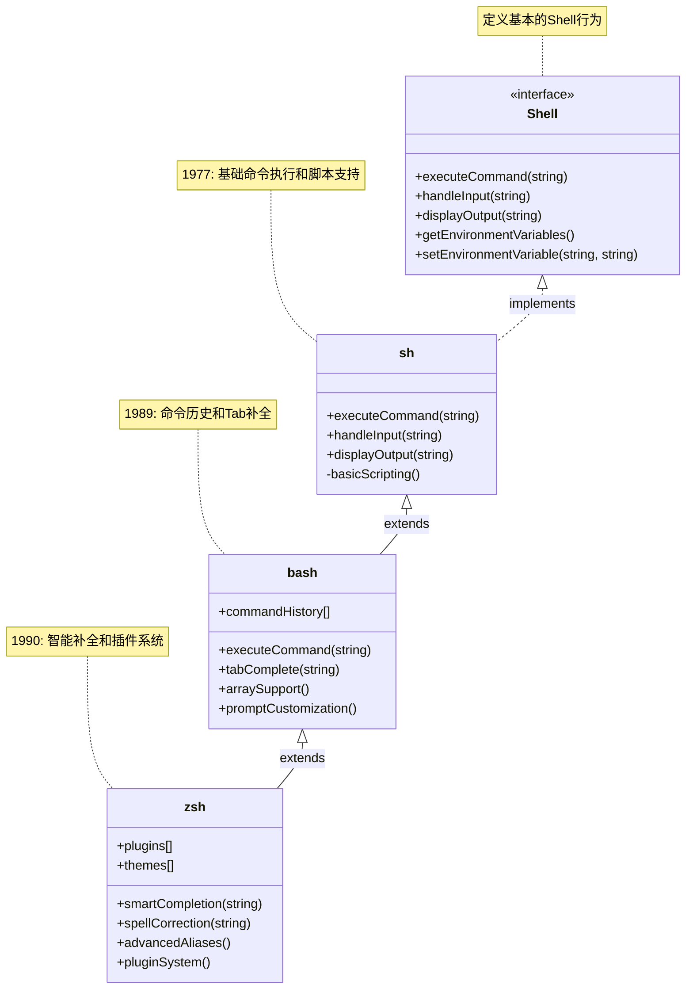

---
draw:
tags: []
title: shell
date created: 2024-07-27
date modified: 2024-11-12
---

**七步之外 Python 快，七步之内 Shell 更快。**

## 接口

Shell是操作系统的外壳，是用户与操作系统内核进行交互的接口。它主要有两个重要功能：
1. 命令解释器：Shell接收用户输入的命令，解释并传递给操作系统内核执行。用户通过Shell可以启动、暂停、停止程序或对计算机进行控制。
2. 脚本语言：Shell还是一种解释执行的脚本语言，可以编写和执行Shell脚本。这些脚本可以包含系统命令、程序控制结构（如循环和函数）等。

Shell 本质上是：
    - 一个接口规范（用户与操作系统交互的标准）
    - 定义了基本的行为（命令执行、IO 处理等）

## 实现类

不同的 Shell 是这个接口的不同实现：
    - sh：最基础的实现
    - bash：基于 sh 的增强实现
    - zsh：基于 bash 概念的更高级实现

| 特性      | sh (Bourne Shell) | bash (Bourne Again Shell) | zsh (Z Shell)   |
| ------- | ----------------- | ------------------------- | --------------- |
| 发布时间    | 1977              | 1989                      | 1990            |
| 基本命令执行  | ✓                 | ✓                         | ✓               |
| 命令历史    | ✗                 | ✓                         | ✓✓ (更智能的历史搜索)   |
| 命令补全    | ✗                 | ✓                         | ✓✓ (更强大的补全系统)   |
| 插件系统    | ✗                 | ✗                         | ✓ (Oh My Zsh)   |
| 主题定制    | ✗                 | 有限                        | ✓ (丰富的主题)       |
| 智能提示    | ✗                 | ✗                         | ✓               |
| 拼写纠错    | ✗                 | ✗                         | ✓               |
| 目录别名    | ✗                 | 基础支持                      | ✓ (更智能的别名)      |
| 数组支持    | ✗                 | ✓                         | ✓               |
| 交互体验    | 基础                | 良好                        | 优秀              |
| 脚本兼容性   | 最广                | 好                         | 一般              |
| 常见使用场景  | 基础脚本 容器环境      | 系统管理 脚本编写              | 日常开发 终端使用    |
| 默认安装环境  | Alpine Linux      | 大多数 Linux                 | macOS Catalina+ |
| 配置复杂度   | 低                 | 中                         | 高               |
| 学习曲线    | 平缓                | 中等                        | 较陡              |
| docker中 | alpine 镜像默认用 sh   | ubuntu/debian 镜像默认用 bash  |                 |

常用插件例子：
- git（显示 git 状态）
- docker（docker 命令补全）
- autojump（快速目录跳转）
- zsh-autosuggestions（自动建议）
- zsh-syntax-highlighting（语法高亮）

## 作用

Shell的主要作用是：
1. 连接用户和操作系统，作为两者之间的桥梁。
2. 保护操作系统内核，降低用户直接操作系统的风险。
3. 提供命令行界面，允许用户通过文本命令控制系统。
## Shell脚本

在Linux系统中，常见的Shell包括bash和sh等。用户可以在Shell终端直接执行命令，也可以编写Shell脚本文件（通常以.sh为扩展名）来执行一系列命令。