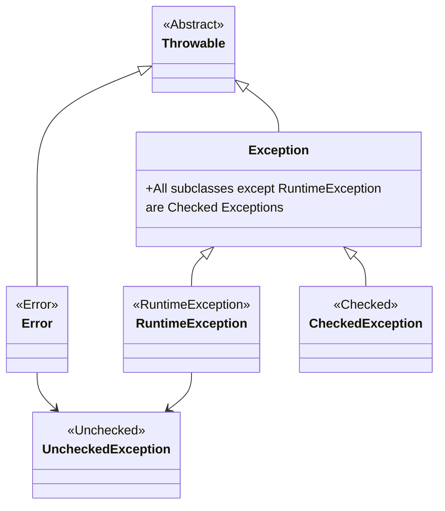

---
draw:
title: Throwable@
date created: 2024-08-20
date modified: 2025-02-06
---

[Throwable@](Throwable@.md)

- [[Error]]（非受检异常）
	- [OOM](OOM.md)
	- [StackOverFlow](StackOverFlow.md)
- [[RuntimeException]]（非受检异常）
- [[CheckedException]]（受检异常）

> [!第一性原理]  
> 受检和不受检，指的是受不受编译器的检查
