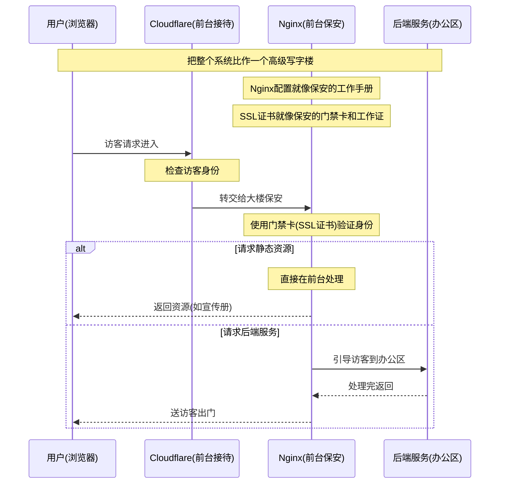
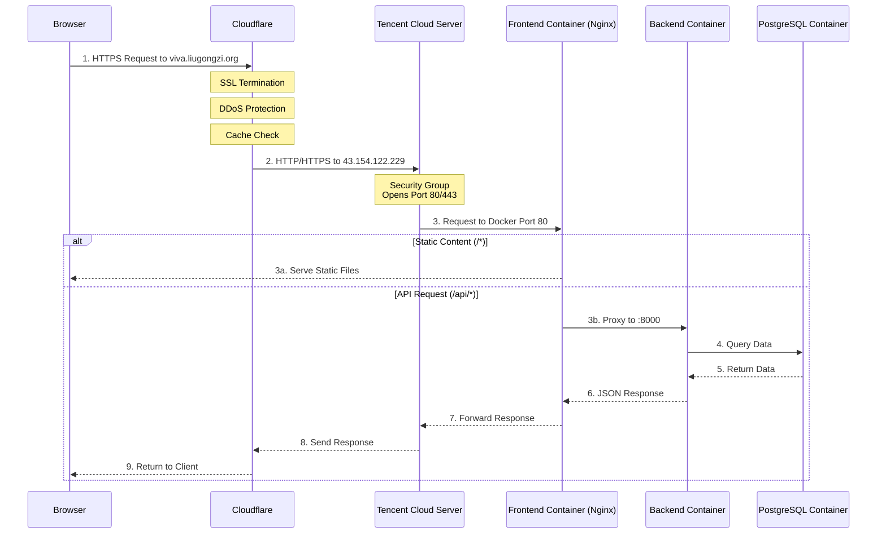

---
draw:
title: Nginx
tags: [Dev, 信息革命]
date created: 2024-03-28
date modified: 2024-11-12
---

让我用一个生活化的比喻来解释：

让我详细解释：

1. **SSL证书的作用**（门禁卡和工作证）：
   - cert.pem 就像保安的工作证，用来证明"我是真正的保安，不是冒充的"
   - key.pem 就像保安的门禁卡，拥有开门和验证的权限
   - 挂载这些文件就像是给保安配发工作证和门禁卡
   - 如果证书文件有问题，就像保安的工作证或门禁卡失效了，无法正常工作

2. **Nginx配置的作用**（工作手册）：
   - 监听端口(80/443)就像保安要看管哪些门
   - SSL配置就像保安检查证件的规程
   - 路由规则就像访客指引手册：
     - 静态文件请求：直接在前台解决
     - API请求：需要引导到办公区(后端服务)

3. **整个流程**：
   - 用户访问网站，就像访客来到大楼
   - Cloudflare先验证，像前台接待初步登记
   - Nginx用SSL证书建立安全连接，像保安用工作证和门禁卡验证身份
   - 然后按配置规则处理请求，像按工作手册指引访客

如果：
- 证书文件错误 → 就像保安的工作证/门禁卡失效
- Nginx配置错误 → 就像工作手册写错了
- 文件没有正确挂载 → 就像保安没带工作证和门禁卡来上班

这就是为什么我们要：
1. 确保证书文件格式正确（工作证/门禁卡有效）
2. 正确配置Nginx（工作手册准确）
3. 正确挂载文件（保安带齐了证件）

这样整个系统才能安全、正确地工作。

