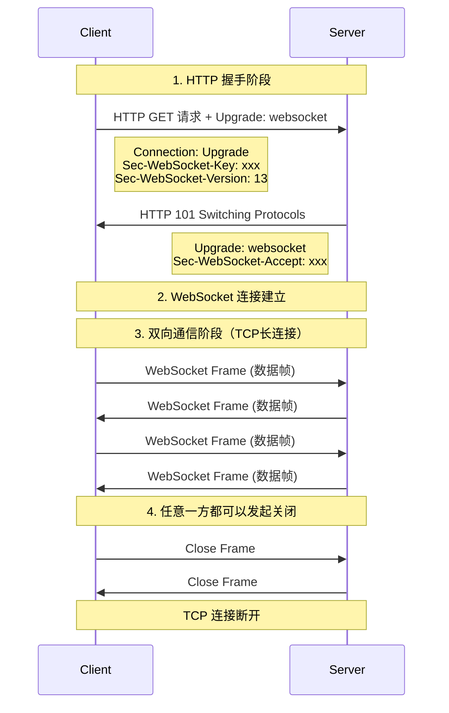

---
draw:
title: WebSocket
tags: []
date created: 2024-06-05
date modified: 2024-12-27
---

excerpt

<!-- more -->

WebSocket 是基于 [TCP](TCP.md) 的轻量级网络通信协议，和 [2 第二大脑/2 知识/CS/互联网/HTTP](2%20第二大脑/2%20知识/CS/互联网/HTTP) 同级的。

[HTTP 1.1](HTTP%201.1.md)握手+[TCP](TCP.md)长连接实现**双向通信

- 与普通 HTTP 不同，WebSocket 是持久连接
- 支持**服务器主动推送消息给客户端**，后端主动给前端推消息

WebSocket 和 HTTP 都是应用层协议，它们确实在网络协议的同一层（应用层）。让我们来看一下具体的协议层级:

1. 应用层 (Application Layer)
   - HTTP
   - WebSocket
   - FTP, SMTP 等其他应用层协议

2. 传输层 (Transport Layer)
   - TCP (是的，TCP 就是它们的下一层)
   - UDP

HTTP 和 WebSocket 的关系比较特殊:

- WebSocket 协议在建立连接时，会先通过 HTTP 进行握手
- 握手成功后，会升级为 WebSocket 协议，使用 TCP 长连接进行**双向通信**

主要区别:

- HTTP 是请求-响应模式，每次通信都需要客户端发起
- WebSocket 建立连接后，服务器可以主动向客户端推送数据，实现了真正的双向通信
