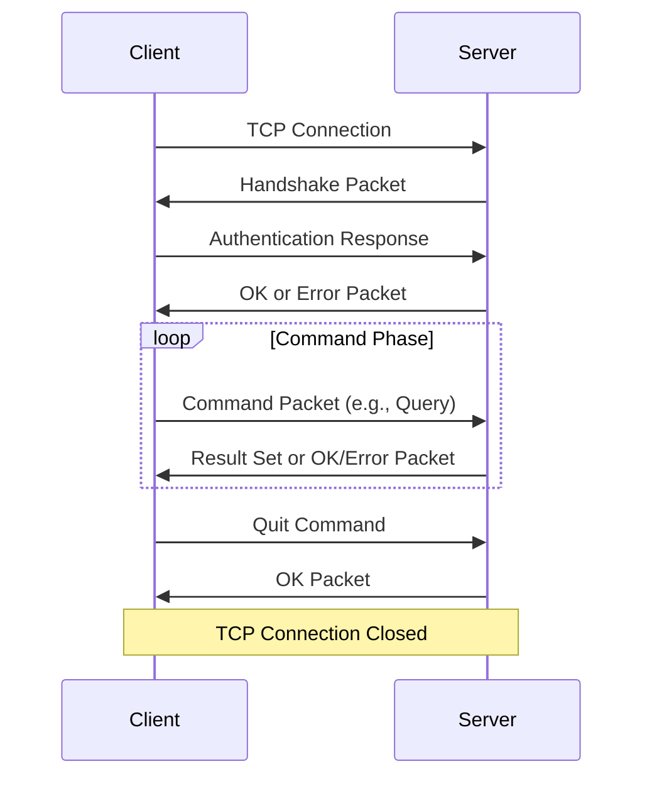

---
draw:
tags: []
title: MySQL
date created: 2024-07-31
date modified: 2024-11-12
---


| 模块   | 讲次   | 标题                           | 时长    |     |
| ---- | ---- | ---------------------------- | ----- | --- |
| 开篇词  | 开篇词  | 这一次，让我们一起来搞懂MySQL            | 06:04 |     |
| 基础篇  | 01   | 基础架构：一条SQL查询语句是如何执行的？| 12:51 |     |
|      | 02   | 日志系统：一条SQL更新语句是如何执行的？| 15:07 |     |
|      | 03   | 事务隔离：为什么你改了我还看不见？| 11:02 |     |
|      | 04   | 深入浅出索引（上）| 15:29 |     |
|      | 05   | 深入浅出索引（下）| 09:52 |     |
|      | 06   | 全局锁和表锁：给表加个字段怎么有这么多阻碍？| 13:02 |     |
|      | 07   | 行锁功过：怎么减少行锁对性能的影响？| 11:32 |     |
|      | 08   | 事务到底是隔离的还是不隔离的？| 19:05 |     |
| 实践篇  | 09   | 普通索引和唯一索引，应该怎么选择？| 15:40 |     |
|      | 10   | MySQL为什么有时候会选错索引？| 17:29 |     |
|      | 11   | 怎么给字符串字段加索引？| 12:48 |     |
|      | 12   | 为什么我的MySQL会"抖"一下？| 15:37 |     |
|      | 13   | 为什么表数据删掉一半，表文件大小不变？| 14:37 |     |
|      | 14   | count(*)这么慢，我该怎么办？| 15:23 |     |
|      | 15   | 答疑文章（一）：日志和索引相关问题            | 20:20 |     |
|      | 16   | "order by"是怎么工作的？| 17:01 |     |
|      | 17   | 如何正确地显示随机消息？| 16:28 |     |
|      | 18   | 为什么这些SQL语句逻辑相同，性能却差异巨大？| 15:36 |     |
|      | 19   | 为什么我只查一行的语句，也执行这么慢？| 12:21 |     |
|      | 20   | 幻读是什么，幻读有什么问题？| 19:27 |     |
|      | 21   | 为什么我只改一行的语句，锁这么多？| 17:38 |     |
|      | 22   | MySQL有哪些"饮鸩止渴"提高性能的方法？| 14:47 |     |
|      | 23   | MySQL是怎么保证数据不丢的？| 17:04 |     |
|      | 24   | MySQL是怎么保证主备一致的？| 19:52 |     |
|      | 25   | MySQL是怎么保证高可用的？| 17:23 |     |
|      | 26   | 备库为什么会延迟好几个小时？| 23:17 |     |
|      | 27   | 主库出问题了，从库怎么办？| 19:55 |     |
|      | 28   | 读写分离有哪些坑？| 21:22 |     |
|      | 29   | 如何判断一个数据库是不是出问题了？| 14:31 |     |
|      | 30   | 答疑文章（二）：用动态的观点看加锁            | 15:43 |     |
|      | 31   | 误删数据后除了跑路，还能怎么办？| 15:31 |     |
|      | 32   | 为什么还有kill不掉的语句？| 13:38 |     |
|      | 33   | 我查这么多数据，会不会把数据库内存打爆？| 14:33 |     |
|      | 34   | 到底可不可以使用join？| 16:42 |     |
|      | 35   | join语句怎么优化？| 16:39 |     |
|      | 36   | 为什么临时表可以重名？| 16:07 |     |
|      | 37   | 什么时候会使用内部临时表？| 13:54 |     |
|      | 38   | 都说InnoDB好，那还要不要使用Memory引擎？| 14:00 |     |
|      | 39   | 自增主键为什么不是连续的？| 17:34 |     |
|      | 40   | insert语句的锁为什么这么多？| 12:18 |     |
|      | 41   | 怎么最快地复制一张表？| 13:30 |     |
|      | 42   | grant之后要跟着flush privileges吗？| 12:54 |     |
|      | 43   | 要不要使用分区表？| 12:51 |     |
|      | 44   | 答疑文章（三）：说一说这些好问题             | 16:21 |     |
|      | 45   | 自增id用完怎么办？| 17:07 |     |
| 特别放送 | 直播回顾 | 林晓斌：我的 MySQL 心路历程            | 18:43 |     |
| 结束语  | 结束语  | 点线网面，一起构建MySQL知识网络           | 08:01 |     |
| 结课测试 | 结课测试 | 这些MySQL知识你都掌握了吗？| 00:28 |     |
|      |      |                              |       |     |
|      |      |                              |       |     |

```Java
[2024-07-31 15:08:40][QTraceId[h_grocery_240730.160200.10.71.162.188.247.2_0]-QSpanId[1]][db-guardian-check-thread-1][com.qunar.db.guardian.RunningSqlHolds][WARN ] db_guardian sql time too long,will cancel ds:pxc_hotel_common_w,sql=select
                trace_id,
                user_id,user_request_code,validation_time,booking_reason,
                from_date,to_date,hotel_seq,room_id,wrapper_id,city_url,submit,
                detail_reason,validation_result_type,wrapper_product,query,order_product,final_result,fields_detail,change_reasons,business_type
                from validation_detail
                 WHERE  validation_time >= ?


                                and validation_time <= ?
                order by validation_time desc limit ?,md5=d54dbee37ee6726eb664e7e16ed7ede3,qtrace=h_grocery_240731.150759.10.71.146.129.225.16122_1,time=40866
```

性能问题：这些日志显示 SQL 查询执行时间过长（超过 20 秒和 35 秒），导致数据库守护进程准备取消这些查询。

## 网络协议

就像浏览器之间用基于[TCP](TCP.md)的[HTTP 1.1](HTTP%201.1.md)通信一样，想和 Mysql 数据库通信，需要通过一种**MySQL 协议**，以下是关于 MySQL 协议的一些重要信息：

1. 基础协议：
   - MySQL 协议是基于 TCP/IP 的。
   - 默认情况下，MySQL 服务器监听 TCP 端口 3306。
2. 协议特性：
   - 它是一个二进制协议，不像 HTTP 那样是文本协议。
   - 支持全双工通信，允许客户端和服务器同时发送数据。
3. 协议结构：
   MySQL 协议的通信包括几个主要部分：
   - 握手阶段（身份验证）
   - 命令阶段（查询执行）
   - 结果集传输
4. 安全性：
   - 支持 SSL/TLS 加密，可以在 TCP 层之上添加加密层。
   - 包含各种身份验证方法，如密码认证、证书认证等。
5. 版本差异：
   - 不同版本的 MySQL 可能在协议细节上有所不同。
   - MySQL 8.0 引入了一些新的协议特性，如 caching_sha2_password 认证。



这个流程图展示了 MySQL 客户端和服务器之间的基本通信过程。

比较 MySQL 协议和 HTTP：

1. 用途：
   - HTTP 主要用于 Web 通信。
   - MySQL 协议专门用于数据库操作。

2. 结构：
   - HTTP 是无状态的，每个请求都是独立的。
   - MySQL 协议是有状态的，维护一个持续的会话。

3. 数据格式：
   - HTTP 主要使用文本格式（虽然可以传输二进制数据）。
   - MySQL 协议使用二进制格式，效率更高。

4. 连接管理：
   - HTTP 通常是短连接（尽管 HTTP/1.1 引入了持久连接）。
   - MySQL 通常保持长连接，以减少连接建立的开销。

5. 复杂性：
   - HTTP 相对简单，易于调试。
   - MySQL 协议更复杂，专门针对数据库操作进行了优化。

在实际应用中，开发者通常不需要直接处理 MySQL 协议的细节。数据库驱动程序（如 Python 的 mysql-connector 或 mysqlclient）会处理这些底层通信细节。

但是，了解这些协议的工作原理对于优化数据库性能、排查连接问题和理解网络安全性都很有帮助。您对 MySQL 协议的某个特定方面感兴趣，或者想了解更多关于如何在应用中高效使用 MySQL 连接的信息吗？
