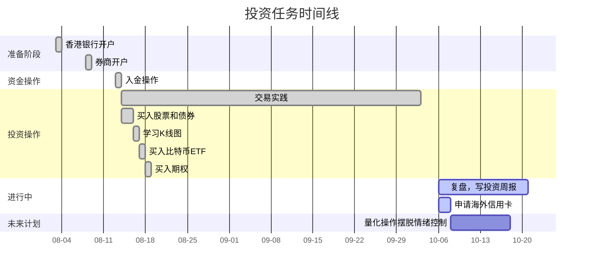

---
draw:
tags: []
title: 投资$
date created: 2023-12-09
date modified: 2024-11-12
---

前期做短线，目的不是为了赚钱，只是为了调动注意力，去补充一些金融和经济学的基础知识。后期做长线是因为节约时间去做事业，进一步吧财富放到真正会持续增长，自然也不需要择时而入的地方，比如左达右饼。
这里可以总结一句我的投资心得：深度的钻研，应该在广度的 low hanging fruit 都已摘完的前提下进行。这一点，对平衡我们的时间投入和投资回报来说非常重要。

<!-- more -->

## 为什么要投资？

男朋友沉迷于股票整个人都变了，怎么办？- 卡恰托雷的回答 - 知乎  
https://www.zhihu.com/question/594190060/answer/3358596386

股票市场并不是零和博弈  
与赌场的你输才能我赢不同，交易市场的神奇之处，在于无门槛地让世界上最聪明的人为你的钱打工，一起分享好的企业成长的红利。
所有资产中股票是升值最快的，因为它背后凝结了最活跃的商业市场中无数聪明人的智慧的努力。相比之下，房子、黄金都只是死物罢了。

## 理性收益率

自 1928 年以来，[标普500](标普500.md) 的平均年化收益率约为 10.26%（包括股息再投资）
自 1986 年设立以来，[纳斯达克指数](纳斯达克指数.md) 的平均年化收益率在 11% 左右  

## 前置准备

1. [零门槛香港开户胎教级攻略 $](零门槛香港开户胎教级攻略%20$.md)  
2. [入金](入金.md) [出金](出金.md)
3. 开 [券商](券商.md) 账户

## 投资标的

| 主类别                   | 子类别                                   |
| --------------------- | ------------------------------------- |
| [债券](债券.md)                | 期限长短：T-Bills < T-Notes < T-Bonds      |
|                       | 收益率：通常情况下，T-Bonds > T-Notes > T-Bills |
| [股票](股票.md)、[基金](基金.md)、[衍生品](衍生品.md) | 港股                                    |
|                       | [@美股](@美股.md)                               |
| 汇                     | RMB                                   |
|                       | USD                                   |
| 商品                    | 金                                     |
|                       | 银                                     |
|                       | 铜                                     |
| [虚拟货币](虚拟货币.md)           | [比特币](比特币) [以太坊](以太坊)                       |
| 房产                    |                                       |

## 投资策略

[只赚认知之内的钱](只赚认知之内的钱.md)、[交易](交易.md)

| 一级分类 | 二级分类     |
| ---- | -------- |
| 投资策略 | [价值投资](价值投资.md) |
|      | [趋势投资](趋势投资.md) |
|      | [轮动策略](轮动策略.md) |
|      | [对冲策略](对冲策略.md) |
|      | [量化$](量化$.md)  |

## 关键动作

## 词汇表

| 术语      | 含义                 |                |
| ------- | ------------------ | -------------- |
| 资产配置    | 将资金分配至不同资产类别       |                |
| 阿尔法     | 超额回报，衡量基金相对于基准的表现  |                |
| 套利      | 利用价格差异获利           |                |
| 熊市      | 市场价格下跌的时期          |                |
| 债券      | 债务凭证，定期支付利息并到期偿还本金 |                |
| 经纪人     | 代表客户买卖金融产品         |                |
| 资本增值    | 资产价格上涨所带来的收益       | 这是股票市场和赌场的区别   |
| 商品      | 基础商品，如石油、黄金等       |                |
| 息票      | 债券的利息支付            |                |
| 红利      | 公司支付给股东的部分利润       |                |
| 多元化     | 投资不同的资产以降低风险       |                |
| [衍生品](衍生品.md) | 价值取决于其他资产的金融合约     | 期权，期货，期货是必须买卖的 |
| 股票      | 代表公司所有权的证券         |                |
| 交易所交易基金 | 在交易所交易的投资基金        |                |

| 术语          | 含义                                      | 补充说明                     |
| ----------- | --------------------------------------- | ------------------------ |
| ALL-in      | 将所有或大部分资金投资于某一特定资产                      | 源自扑克游戏，完全押注在这项投资上        |
| IPO         | 首次公开募股，私营公司首次公开出售股票                     |                          |
| K 线图        | 股票价格波动的图表                               | 起源于日本，能反应当天的开始价结束值和最大最小值 |
| To the moon | 对某个资产价格将大幅上涨的乐观预期                       | 表达对资产未来表现的强烈信心           |
| YOLO        | "You Only Live Once" 的缩写，采取高风险、高回报的投资策略 | 带有无所畏惧、全力以赴的精神           |
| 财务报表        | 展示公司财务状况的报告                             |                          |
| 长期投资        | 持有超过一年的投资                               |                          |
| 持仓成本        | 投资者购买并持有某项投资的平均成本                       |                          |
| 大盘股         | 市值较大的公司股票                               |                          |
| 对冲基金        | 高风险、高回报的投资基金                            |？|
| 多头          | 买入并持有资产，预期价格上涨                          |                          |
| 风险对冲        | 通过投资保护来减少潜在损失                           | 怎么才能做到                   |
| 风险调整回报      | 根据风险衡量的投资回报率                            |                          |
| 负债率         | 公司总负债与总资产的比率                            |                          |
| 复利          | 将投资收益再投资产生的累积效应                         |                          |
| 杠杆          | 使用借款进行投资以增加回报                           |                          |
| 股东权益        | 股东在公司的净资产                               |                          |
| 股票分红        | 公司向股东支付的部分利润                            |                          |
| 固定收益        | 预定利息支付的债务工具                             |                          |
| 黄金          | 投资的贵金属                                  |                          |
| 回撤          | 投资组合从高峰到低谷的跌幅                           |                          |
| 回报率         | 投资的收益与成本的比率                             |                          |
| 基金          | 集合投资，投资于多种资产                            | 一揽子股票                    |
| 价值股         | 被认为相对低估的股票                              |                          |
| 价值投资        | 购买被低估的资产的投资策略                           |                          |
| 净利润         | 扣除所有成本后的利润                              |                          |
| 净现值         | 投资项目未来现金流的现值                            |                          |
| 净资产         | 资产减去负债后的价值                              |                          |
| 景气循环股       | 与经济周期密切相关的股票                            |                          |
| 空头          | 通过卖出不持有的证券获利                            |                          |
| 蓝筹股         | 大型、稳定、信誉良好的公司股票                         |                          |
| 量化宽松        | 中央银行通过购买资产增加货币供给                        |                          |
| 流动性         | 资产快速变现的能力                               |                          |
| 买入期权        | 允许持有人以特定价格买入资产                          |                          |
| 卖出期权        | 允许持有人以特定价格卖出资产                          |                          |
| 名义利率        | 未考虑通胀的利率                                |                          |
| 牛市          | 市场价格持续上涨的时期                             | 现在                       |
| [期权](期权.md)      | 给予买方在未来买卖资产的权利                          |                          |
| 企业债券        | 公司发行的债务证券                               |                          |
| 歧见          | 投资者对市场前景的不同看法                           |                          |
| 权证          | 给予持有人在特定时间以特定价格购买股票的权利                  |                          |
| [市盈率](市盈率.md)     | 股价与每股收益的比率                              |                          |
| 市值          | 公司股票总价值                                 |                          |
| 实际利率        | 考虑通胀后的利率                                |                          |
| 套利          | 利用不同市场间的价格差异获利                          |                          |
| 停牌          | 暂时停止交易                                  | 为啥                       |
| 投机          | 高风险                                     |                          |
| 投资组合        | 投资者持有的多种资产的集合                           |                          |
| 通货膨胀        | 物价整体上涨，货币购买力下降                          | CPI 篮子的总价值上升             |
| 小盘股         | 市值较小的公司股票                               |                          |
| 限价单         | 设定固定价格买入或卖出的订单                          |                          |
| 现金流         | 公司在特定时期内的现金收支                           |                          |
| 熊市          | 市场价格持续下跌的时期                             |                          |
| 嫌贫爱富        | 投资者偏好已经表现良好的资产                          |                          |
| 债券          | 政府或公司发行的债务工具                            |                          |
| 债务比例        | 债务相对于股权的比例                              |                          |
| 政府债券        | 政府发行的债务工具                               |                          |
| 指数基金        | 跟踪市场指数的基金                               |                          |
| 做多          | 买入资产，预期价格上涨                             |                          |
| [做空](做空.md)      | 卖出借入的资产，预期价格下跌                          |                          |

### 资讯

| 级别    | 类别       | 资源名称                                | 描述                 |
| ----- | -------- | ----------------------------------- | ------------------ |
| 入门级   | 建立理财观    |《富爸爸穷爸爸》| 讲清楚什么是资产，建立基本理财观念  |
| 入门级   | 投资指数基金   |《漫步华尔街》| 树立正确的投资心态，介绍指数基金投资 |
| 入门级   | 了解对冲基金历史 |《富可敌国：对冲基金与新精英的崛起》| 讲述全球著名对冲基金的发展史     |
| 入门级   | 机器学习入门   |《机器学习》（西瓜书）| 全面详尽的机器学习入门书籍      |
| 进阶级   | 价值投资     |《巴菲特致股东的信》| 价值投资者的圣经级教材        |
| 进阶级   | 深度学习     |《神经网络与深度学习》（蒲公英书）| 全面详尽的深度学习介绍        |
| 进阶级   | 投资社区     | 雪球                                  | 国内主流投资者交流社区        |
| 进阶级   | 量化交易     | 各大量化交易平台                            | 提供投资数据集和回测模块       |
| 专业级   | 行业分析     | 各券商研究所的研究报告                         | 高质量的行业分析报告         |
| 专业级   | 多因子模型    | Barra USE3 handbook                 | 详细介绍股票市场多因子模型      |
| 专业级   | 因子投资     |《因子投资：方法与实践》| 深入讲解多因子模型和因子投资策略   |
| 专业级   | 量化分析     |《主动投资组合管理》| 量化组合投资的业界"圣经"      |
|       |          |                                     |                    |
| 较专业日报 |          | 勃勃的美股投资日记：https://boist.org         |                    |
| 情绪价值  |          | 抖音口罩哥                               |                    |
| 小门户网站 |          | [6URL](https://www.6url.net/)    |                    |  

[《程序员的个人财富课》](《程序员的个人财富课》.md)  
[长期更：入美股快 5 年了，复盘这些年的失与得 - V2EX](https://www.v2ex.com/t/941650)  
[格雷厄姆](格雷厄姆.md)
