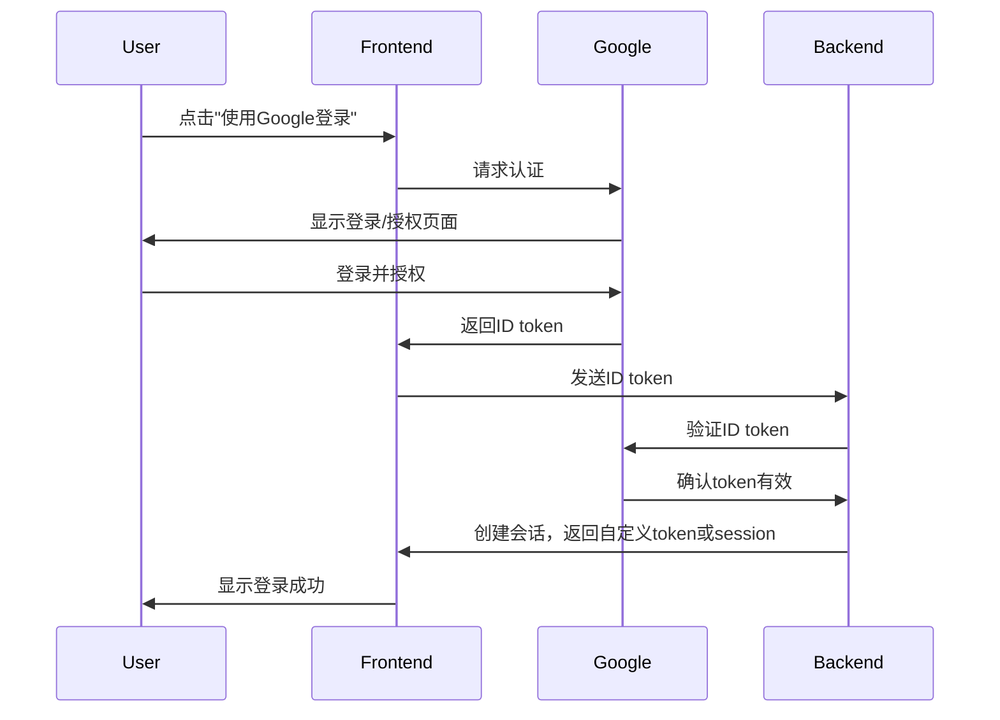
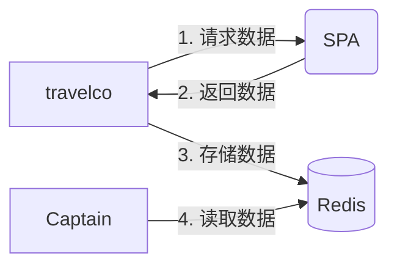

---
draw:
tags: []
title: mermaid
date created: 2024-09-07
date modified: 2024-11-12
---

## 官方文档

https://mermaid.nodejs.cn/intro/

## 图的种类

| 图表类型                                | 描述                     | 主要用途               |
| ----------------------------------- | ---------------------- | ------------------ |
| 流程图 (Flowchart)                     | 使用节点和连接线描述过程或工作流程      | 展示算法、工作流程、决策过程     |
| 类图 (Class Diagram)                  | 展示类、属性、方法及其关系          | 描述面向对象系统的静态结构      |
| 状态图 (State Diagram)                 | 描述对象在其生命周期中的各种状态及转换    | 模拟系统状态变化、描述状态机     |
| 实体关系图 (Entity Relationship Diagram) | 描述实体类型、属性和关系           | 数据库设计、系统数据模型描述     |
| 用户旅程图 (User Journey)                | 可视化用户与产品/服务的交互过程       | 用户体验设计、服务设计        |
| 饼图 (Pie Chart)                      | 圆形图表，展示数据的比例分布         | 数据可视化、比例展示         |
| 需求图 (Requirement Diagram)           | 描述系统需求及其关系             | 软件工程、需求分析          |
| Git图 (Gitgraph)                     | 可视化Git分支和提交历史          | 版本控制工作流程展示         |
| C4架构图 (C4 Diagram)                  | 描述软件架构的不同层次            | 软件架构设计、系统结构展示      |
| 思维导图 (Mindmap)                      | 围绕中心主题组织和呈现相关概念        | 头脑风暴、知识组织          |
| 象限图 (Quadrant Chart)                | 将数据点放置在二维网格中的四个象限内     | 决策分析、优先级排序         |
|                                     |                        |                    |
|                                     |                        |                    |
|                                     |                        |                    |
| 时间线 (Timeline)                      | 不太好，内容一多就很挤，看不清楚       |                    |
| 甘特图 (Gantt)                         | 还不错，可以代替时间线图，做需求的时候可以用 |                    |
| 泳道图/序列图 (Sequence Diagram)          | 非常棒！| 描述系统组件间的通信、API调用顺序 |

## 泳道图



## 节点

1. 构图 LR (Left to Right):BT (Bottom to Top)
2. 节点：
	1. 形状 `(())`圆形, `{}`,`[]`，redis 圆柱体`[()]`
	2. 上色 `style C fill:#bbf,stroke:#333,stroke-width:4px;`
3. 箭头
	1. 中间加字 `E[essay]-->|处理| P[分词]`



这个增强版的 Mermaid 图表展示了以下额外的功能和"花活"：

1. 样式定义：使用 `classDef` 定义了不同的样式类。
2. 子图（Subgraph）：将券处理（CouponHandle）部分封装在一个子图中，使结构更清晰。
3. 方向控制：在子图中使用 ```mermaid
graph LR
    A[travelco] -->|1. 请求数据| B(SPA)
    B -->|2. 返回数据| A
    A -->|3. 存储数据| C[(Redis)]
    D[Captain] -->|4. 读取数据| C


    class A,B,D component;
    class C database;
```0（Top to Bottom）控制流程方向。
4. 。
5. 样式应用：对不同的节点应用了自定义样式。
6. 注释：添加了一个指向 Context 的注释。
7. 图标：在 Context 节点旁添加了一个齿轮图标（使用 Font Awesome）。
8. 点击事件：为 Context 节点添加了一个点击事件（注意：这在某些 Mermaid 渲染器中可能不支持）。
9. 换行：在节点文本中使用 ```mermaid
graph LR
    A[travelco] -->|1. 请求数据| B(SPA)
    B -->|2. 返回数据| A
    A -->|3. 存储数据| C[(Redis)]
    D[Captain] -->|4. 读取数据| C


    class A,B,D component;
    class C database;
```1 来实现换行，使显示更整洁。
10. 连接线样式：使用 ```mermaid
graph LR
    A[travelco] -->|1. 请求数据| B(SPA)
    B -->|2. 返回数据| A
    A -->|3. 存储数据| C[(Redis)]
    D[Captain] -->|4. 读取数据| C


    class A,B,D component;
    class C database;
```2 代替 ```mermaid
graph LR
    A[travelco] -->|1. 请求数据| B(SPA)
    B -->|2. 返回数据| A
    A -->|3. 存储数据| C[(Redis)]
    D[Captain] -->|4. 读取数据| C


    class A,B,D component;
    class C database;
```3 来创建无箭头的连接线（用于图标连接）。

[mermaid](mermaid.md)里这个染色不错

```Java
    classDef gradient fill:#f96,stroke:#333,stroke-width:2px;
```
