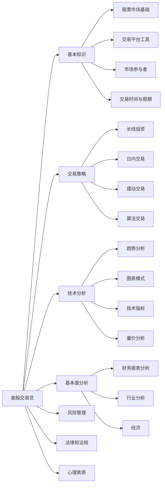

---
draw:
tags: []
title: 交易
date created: 2024-07-14
date modified: 2024-11-12
---

[基本面](基本面.md)、[消息面](消息面.md)  
[大盘](大盘.md)、[技术指标](技术指标.md)  
[仓位](仓位.md)、[交易单](交易单.md)  
[Buy the rumor, sell the news](Buy%20the%20rumor,%20sell%20the%20news.md)

操作的成功与否不重要，重要的是有思路，并能通过复盘优化思路  

## 经验

1. 今天的一个经验是非盘中确实波动比较慢 不适合做t  
实验之后发现fomc day这种日内大事件大iv 日内theta decay接近无  但是一但iv crash还横盘就能赚很多 两点前基本上就浮动几刀 根本吃不到theta 两点后到盘尾暴涨到一百盈利一手 要吃theta decay还是iv低的日子有的吃

| caozuo |                                                                            |
| ------ | -------------------------------------------------------------------------- |
|        | 限价单中的止盈逻辑和止损逻辑                                                             |
|        | excess 流动性不足导致的清仓                                                          |
|        | UVXY 等带损耗的工具不能过夜                                                           |
|        | 瑞幸这种一般的股票大涨之后不能跟，瑞幸看七个点进去，没有继续涨就应该赶紧出掉，这是个低级错误                         |
|        | ------------ 其实没有这些失误，正常已经百十的收益了，所以不要怀疑自己的判断，丰富信息和操作步骤的知识即可 -------------- |
|        |                                                                            |
