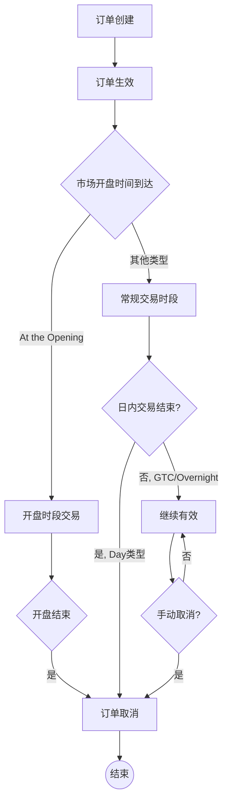

---
draw:
tags: []
title: 交易
date created: 2024-07-14
date modified: 2025-01-21
---


[基本面](基本面.md)、[消息面](消息面.md)  
[大盘](大盘.md)、[技术指标](技术指标.md)  
[仓位](仓位.md)、[交易单](交易单.md)  
[Buy the rumor, sell the news](Buy%20the%20rumor,%20sell%20the%20news.md)

操作的成功与否不重要，重要的是有思路，并能通过复盘优化思路  


可以选择市价单（Market Order）或限价单（Limit Order）。市价单会按当前市场价格立即成交，而限价单则是在达到您设定的价格时成交。

限价单是一种常见的股票交易订单类型。在富途平台上填写限价单时，它的含义是：

1. 设定价格：你需要指定一个具体的买入价格。这个价格通常低于或等于当前市场价格。
2. 执行条件：只有当市场价格达到或低于你设定的价格时，订单才会被执行。
3. 价格保护：限价单可以保护你不会以高于你预期的价格买入股票或 ETF（如纳斯达克指数 ETF）。
4. 不保证成交：如果市场价格没有达到你设定的价格，订单可能不会被执行。
5. 有效期：通常你可以设置订单的有效期，比如当日有效或者直到取消为止。

限价单的优点是可以让你更好地控制买入价格，避免因市场波动而 overpay。但缺点是如果市场价格没有达到你设定的价格，你可能会错过买入机会。

如果你想了解更多关于限价单的细节或其他订单类型，我可以为你进一步解释。

## Order

```Java
## Buy

	                    limit  <--M
------------------------------------  到价买入      

M-->  stop            
------------------------------------  反弹买入

	  limit  <--M    stop	 <--M
------------------------------------  杀跌，StopLimit，到Stop点的时候，触发Limit


## Sell

		  M-->	        limit
------------------------------------  到价卖出，UVXY 那次应该用止损错误用了止盈导致立即成交

	  stop	     <--M
------------------------------------  回落卖出，FFIE 那次，可以设置止损单

	  stop--M	-->   stop--M
------------------------------------  动态止盈，回落卖出，Trail
```

|                 |        |                                                          |                                  |
| --------------- | ------ | -------------------------------------------------------- | -------------------------------- |
| Stop            | 止损     |                                                          |                                  |
| Limit           | 限价     |                                                          |                                  |
| Trail10         | 追踪止损   | 动态 Stop，跟踪距离为 10 元，涨到 100 相当于 Stop 90，涨到 120 相当于 Stop110 | TCOM 那次，可以用这种方式，追一段时间涨幅又避免大幅度的回调 |
| Stop Limit      | 止损限价单  | when stop 被触发，then set limit                             | 拼多多跌 20%的时候，触发 Limit，如果再跌 10%就买  |
|                 |        |                                                          |                                  |
|                 |        |                                                          |                                  |
| Market          | 市价     |                                                          |                                  |
| Market on Close | 收盘市价单  |                                                          | UVXY 绝不隔夜，那么就适合闭市时候的市价单兜底        |
| Limit on Close  | 收盘限价单  |                                                          |                                  |
|                 |        |                                                          |                                  |
| Profit Taker    | 兜底止盈选项 |                                                          |                                  |
| Stop Loss       | 兜底止损选项 |                                                          |                                  |

1. Market（市价单）：以当前市场价格立即执行的订单。
2. Limit（限价单）：以指定价格或更好价格执行的订单。
3. MidPrice（中间价格单）：以买卖价中间价格执行的订单。
4. Stop（止损单）：当价格达到指定水平时触发的市价单。
5. Stop Limit（止损限价单）：当价格达到指定水平时触发的限价单。
6. Trail（追踪止损单）：根据市场价格变动自动调整触发价的止损单。
7. Trail Limit（追踪限价单）：触发后成为限价单的追踪止损单。
8. Market on Close（收盘市价单）：在交易日结束时以收盘价执行的市价单。
9. Limit on Close（收盘限价单）：在交易日结束时以限定价格或更好价格执行的订单。

## 常规时间

1. Day（日内有效）:
    - 这是最常用的选项，适合大多数日间交易者。
    - 订单仅在当天交易时段内有效，如果未成交，会在收市时自动取消。
    - 优点：避免了隔夜持仓的风险，适合短期交易策略。
    - 建议：如果您希望在当天完成交易，并且不想让订单在隔夜市场中暴露，选择此项。
2. Good till Cancel（GTC，有效至取消）:
    - 订单会一直有效，直到被成交或您主动取消。
    - 优点：不需要每天重新下单，适合长期投资者或等待特定价格的投资者。
    - 注意：要记得追踪和管理未成交的 GTC 订单。
3. At the Opening（开盘时段有效）:
    - 订单仅在开盘时段内有效。
    - 适合想要在开盘时立即执行交易的投资者。
    - 优点：可以利用开盘时的流动性和价格发现过程。

## 夜盘时间

1. Overnight（隔夜有效）:
    - 允许订单在正常交易时间之外执行。
    - 适合想要参与盘后交易或预市交易的投资者。
    - 注意：隔夜市场流动性可能较低，价格波动可能较大。



建议：

- 如果您是日内交易者或短期投资者，选择 "Day" 是最安全和常用的选项。
- 如果您有特定的价格目标，并且愿意等待较长时间，可以考虑 "Good till Cancel"。
- 如果您想在开盘时抓住可能的价格机会，选择 "At the Opening"。
- 除非您有特殊的交易需求或策略，通常不建议选择 "Overnight"，因为隔夜市场风险较高。

最终选择应该基于您的交易策略、风险承受能力和对市场的预期。如果不确定，"Day" 选项通常是最安全和灵活的选择。

```Java
|域名(server_name)|服务|上游(upstream) 隐藏后端节点|转发改写(location)|服务类型|菜单|
|---|---|---|---|---|---|
|travelco.greya.corp.qunar.com|simulation-docker|\|k8s__h-travelco__simulation-docker<br><br>- 10.68.36.99:8080:1\||\|**始终**\||OpenResty||
|l-travelco.h.qunar.com|
```


## 经验

1. 今天的一个经验是非盘中确实波动比较慢 不适合做t  
实验之后发现fomc day这种日内大事件大iv 日内theta decay接近无  但是一但iv crash还横盘就能赚很多 两点前基本上就浮动几刀 根本吃不到theta 两点后到盘尾暴涨到一百盈利一手 要吃theta decay还是iv低的日子有的吃

| caozuo |                                                                            |
| ------ | -------------------------------------------------------------------------- |
|        | 限价单中的止盈逻辑和止损逻辑                                                             |
|        | excess 流动性不足导致的清仓                                                          |
|        | UVXY 等带损耗的工具不能过夜                                                           |
|        | 瑞幸这种一般的股票大涨之后不能跟，瑞幸看七个点进去，没有继续涨就应该赶紧出掉，这是个低级错误                         |
|        | ------------ 其实没有这些失误，正常已经百十的收益了，所以不要怀疑自己的判断，丰富信息和操作步骤的知识即可 -------------- |
|        |                                                                            |

## 卖

在美股或港股券商账户（包括长桥证券）里，**卖出股票后获得的资金并不会立刻变成"可提取"或"可兑换"的现金余额**。通常有一个"T+结算周期"（美股常见为 T+2，港股则多为 T+2 或 T+1 视具体股票而定）：

1. **T+2（或 T+1）是什么意思？**
    
    - "T"指的是交易当日（Trade Date），后面的数字表示需要再过多少个工作日资金才会正式结算并"到账"。
    - 例如：如果美股是 T+2，那么你在周一卖出股票，对应资金要到周三收盘或周四（视券商处理流程）才会正式在你的证券账户内成为"可用资金"。

**日结单（Daily Statement）**通常只是对当天或最近一个交易日内的账户交易、持仓、费用等信息的汇总和确认，等于是告诉你"今天有什么交易或变动，预计结算多少资金"。但并不代表这些资金已经在你的账户中成为**可提现/可兑换**的"可用余额"。

收到日结单：只代表当天交易已确认、记录产生了相应账务明细。
资金真正入账：需要等清算周期（T+1或T+2等）走完，并且券商完成内部资金划转后，你在账户上才能看到相应的可用余额。
