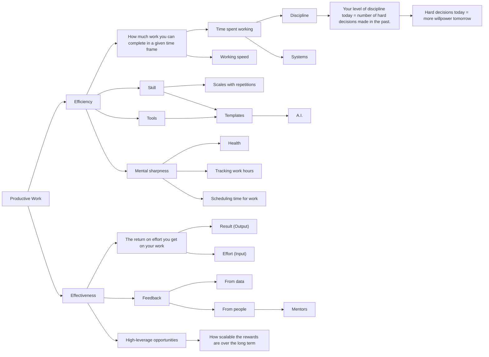

```mermaid
graph LR
    PW[Productive Work] --> E[Efficiency]
    PW --> EF[Effectiveness]
    
    E --> W["How much work you can complete in a given time frame"]
    W --> TS["Time spent working"]
    W --> WS["Working speed"]
    TS --> D[Discipline]
    TS --> S[Systems]
    D --> DD["Your level of discipline today = number of hard decisions made in the past."]
    DD --> HDT["Hard decisions today = more willpower tomorrow"]
    
    E --> SK[Skill]
    SK --> SR["Scales with repetitions"]
    E --> T[Tools]
    E --> MS["Mental sharpness"]
    MS --> H[Health]
    MS --> TWH["Tracking work hours"]
    MS --> SW["Scheduling time for work"]
    
    SK --> TM[Templates]
    T --> TM
    TM --> AI[A.I.]
    
    EF --> RE["The return on effort you get on your work"]
    RE --> RO["Result (Output)"]
    RE --> EI["Effort (Input)"]
    EF --> FB[Feedback]
    FB --> FD["From data"]
    FB --> FP["From people"]
    FP --> M[Mentors]
    EF --> HL["High-leverage opportunities"]
    HL --> HS["How scalable the rewards are over the long term"]
```
