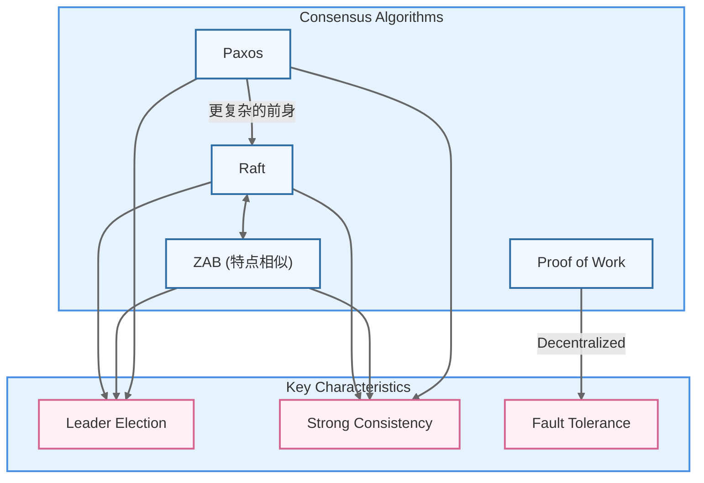
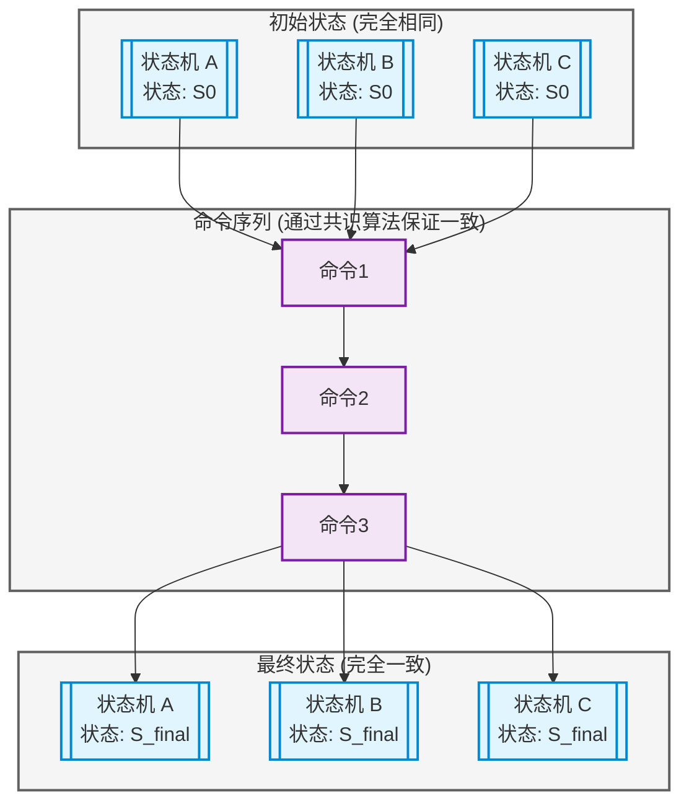
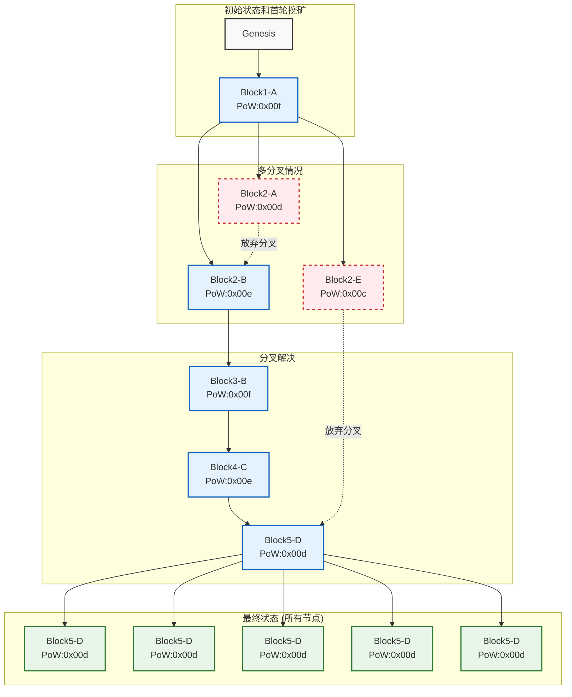

---
draw:
tags: []
title: 比特币、共识算法、RAFT源码剖析
date created: 2024-12-08
date modified: 2024-12-27
---

## 比特币突破 10 万美金

背景事件：比特币价格近期创新高，突破 10 万美金

比特币是一个没有中心机构管理的数字货币系统，全球无数节点共同维护一个账本，但他们是如何在缺乏权威机构的情况下保证每一笔交易记录一致且可信的？这一切的基础是"分布式共识（Distributed Consensus）"。

上限：无政府、去中心化  
下限：目前的金融体系中的一部分资金有去中心化的诉求，BTC 作为金融系统中的润滑剂而存在

需求：去中心化  
解法：分布式共识

## 什么是分布式共识？

定义：分布式共识是指在没有中央权威的情况下，使多个独立节点对某个状态或数据达成相同的看法。

- 在比特币中的体现：所有节点同步维护一个区块链账本，确认哪条链是"最长链"，从而确认交易的有效性。
- 拜占庭将军问题：共识难题的理论根源

[拜占庭将军问题](拜占庭将军问题)：共识难题的理论根源  
目的：以拜占庭将军问题为理论基石，说明分布式共识的核心挑战。

- 拜占庭将军问题简介：多支军队围攻一座城池，指挥官之间通过不可靠的通讯达成一致行动的难题。一些将军可能是叛徒，对信息进行篡改。
- 与网络环境类比：在分布式系统中，一些节点可能故障、延迟或恶意，如何在这种情况下仍然达成一致？

其他例子：

1. 桃花源记中的不知有汉 无论魏晋
2. 有一名日本军官，二战结束后仍在菲律宾孤岛负隅顽抗30年

不管是比特币解决传统金融的痛点，还是拜占庭将军问题，其核心需求都是解决共识的问题，基于此出现了很多共识算法。

1. 共识 -> 协作
2. 女巫

## 共识算法

|特性|PoW（工作量证明）|PoS（权益证明）|PBFT（实用拜占庭容错）|Paxos|Raft|
|---|---|---|---|---|---|
|场景|公有区块链（如比特币）|公有/联盟链（如以太坊）|联盟链/许可网络|传统分布式系统|传统分布式系统（分布式存储、KV服务）|
|信任模型|无中心、匿名节点|无中心(但依赖持币权益)|有限规模、已知节点身份|内部受控集群，有身份控制|内部受控集群，有身份控制|
|容错能力|抗拜占庭节点（需≥50%算力诚实）|抗拜占庭节点（需≥50%权益诚实）|可容忍f个恶意节点 (3f+1节点)|通常假设节点故障非恶意（可扩展支持拜占庭）|通常假设节点故障非恶意（崩溃容错）|
|确认速度|慢（需等待多个区块确认）|相对较快（实现差异大）|快速（固定轮次达成共识）|相对较快（有时较复杂）|较快（通过选举和日志复制机制）|
|能耗与成本|高（大量算力挖矿）|低（无需大量算力）|低（消息交换为主）|低（消息交换与日志复制）|低（消息交换与日志复制）|
|吞吐量与延迟|低吞吐量，高延迟|相对较高吞吐、较低延迟|较高吞吐量、低延迟|中等吞吐，依实现而定|较高吞吐量、低延迟，适合小规模集群|
|节点规模扩展性|可非常大（性能受限）|可较大（仍有性能限制）|通常小到中规模（几十到数百）|通常小规模（几台到十几台）|通常小规模（几台到十几台）|
|最终一致性类型|概率最终一致性（可分叉）|通常可更快或明确的最终性|确定最终一致性（达成即不可逆）|确定最终一致性（决议达成后不可逆）|确定最终一致性（日志提交后不可逆）|

众所周知，[Paxos](Paxos) 是一个非常划时代的共识算法。在 Raft 出现之前的 10 年里，Paxos 几乎统治着共识算法这一领域：因为绝大多数共识算法的实现都是基于 Paxos 或者受其影响，同时 Paxos 也成为了教学领域里讲解共识问题时的示例。但是不幸的是，尽管有很多工作都在尝试降低 Paxos 的复杂性，但是它依然十分难以理解。并且，Paxos 自身的算法结构需要进行大幅的修改才能够应用到实际的系统中。这些都导致了工业界和学术界都对 Paxos 算法感到十分头疼。比如 Google Chubby 的论文就提到，因为 Paxos 的描述和现实差距太大，所以最终人们总会实现一套未经证实的类 Paxos 协议。

基于以上背景，Diego Ongaro 在就读博士期间，深入研究 Paxos 协议后提出了 [Raft](Raft.md) 协议，旨在提供更为易于理解的共识算法。Raft 的宗旨在于可实践性和可理解性，并且相比 Paxos 几乎没有牺牲多少性能。

1. 比特币的共识机制：工作量证明（PoW）
目的：用比特币的实例，描述一种共识算法具体是如何实现的。
- PoW 原理：矿工通过消耗计算资源（电力、算力）来进行哈希碰撞寻找合适解，谁先找到就获得记账权。
- 最终一致性（概率性）：最长链代表共识结果，最终确认为不可逆，虽然存在分叉的可能，但随时间推移这种概率会降低。
- 优点与缺点：去信任化、去中心化，但能耗巨大，吞吐量和确认时间较慢。

下面是加入 Raft 后的一张简要对比表格，将 PoW、PoS、PBFT、Paxos、Raft 几种常见共识算法特性进行比较：

## 非拜占庭容错-RAFT

下面是一个类比场景，将 MIT 6.824 中的几个实验的实现思路，用「只能用微信点对点私聊、不能群聊」的方式来形象解释。请注意，这只是类比，不是精确的技术描述，但有助于理解分布式系统中所面临的问题和解决方案。

### 基本设定

想象一群同事（节点），平时想协同完成任务，但微信群功能故障，无法建群、无法群聊。每个人只能单独私信给其他人发送消息。整个系统要完成各种分布式任务，而 MIT 6.824 的几个 lab 就是解决这些在"只能单聊"的世界里如何合作达成一致、存储共享数据、分工处理任务。

### Lab 1: MapReduce（分工处理信息）

[Lab 1 MapReduce](Lab%201%20MapReduce.md)

**场景类比**：
假设老板（Coordinator）想请大家（Workers）统计一大堆文件中的词频。正常情况下可以在群里发任务，让大家分头做、最后在群里汇总结果。但是现在没有群聊，只能私聊。

**实现思路（类比）**：

1. 老板先把大文件分成小块，然后私信给小张、小李，让他们各自数自己的那部分词频（Map 相当于局部统计）。
2. 小张和小李统计完后，再私信老板他们统计好的中间结果。
3. 老板再根据他们的反馈，私信给小王，让小王把所有结果合并（Reduce）成最终的统计结果。
4. 最终老板收集到结果后再单独私信各人公布最终成绩。

没有群聊，协调者（老板）就得当中介，一个个分配、收集信息，最终保证数据处理完成。这体现了 MapReduce 的中心协调思想。

### Lab 2: Raft（一致性复制）

[Lab2 raft](Lab2%20raft.md)

**场景类比**：
有一群同事需要对一个决策达成一致（例如对公司章程文本的每次修订）。正常可以拉个群，全员投票通过就行，但现在只能点对点私聊。

**实现思路（类比）**：

1. 大家约定好：先选出一个组长（Leader）。但没有群聊，选组长怎么办？大家只能相互私聊投票。当某个人超时没等到组长指令时，就私信给别人说："要不我来当组长？" 收到多数同意后，他就成为组长。
2. 作为组长的人，每次有新决策（日志条目）需要大家同意，他就逐个私信给其他人（Follower），收集他们的确认回复。
3. 只要有过半的人同意，组长就把这条决策定下来，然后再私信告诉大家"决定已经生效"。
4. 若组长挂了（不回复私信），其他人再次通过私信互相推选新组长，继续达成一致。

这样的"点对点约定"和"多数确认"就是 Raft 的精髓：有一个 Leader，不断通过单聊确认大家的状态，确保日志同步和一致。

[共识算法](共识算法.md) 允许一组节点像一个整体一样一起工作，即使其中一些节点出现故障也能够继续工作下去，其正确性主要源于复制状态机的性质：

> 任何初始状态一样的状态机，如果执行的命令序列一样，则最终达到的状态也一样。如果将此特性应用在多参与者进行协商共识上，可以理解为系统中存在多个具有完全相同的状态机（参与者），这些状态机能最终保持一致的关键就是起始状态完全一致和执行命令序列完全一致。

### Lab 3: Fault-tolerant Key/Value Service（基于 Raft 的容错 KV 存储）

**场景类比**：
现在大家需要维护一份共享的钥匙-柜子对照表（KV存储），让团队随时查某把钥匙对应哪个柜子。为了避免单点故障，大家决定每个人都保存一份一模一样的表。

**实现思路（类比）**：

1. 大家继续用 Raft 的方法：选出一个组长来负责更新KV表。
2. 有人找组长私信说："我新买了个柜子，记得更新表格。"
3. 组长在收到新信息后，一个个私信给其他人让他们更新自己的表，并等待大多数人回复"已更新成功"后，组长再私信广播确认最终版本。
4. 如果表太大，一条条更新太慢，组长可能会让大家定期拍快照（snapshot）。私聊发一下当前完整表格，确保崩溃恢复后能快速同步。

这体现了实验中在 Raft 基础上实现分布式一致性存储的思路：用 Leader 协调每次更新，用多数确认保证数据强一致，单聊方式只是让协调成本提高，但基本原理不变。

### Lab 4: Shard Master & Sharded KV（分片与全局管理）

**场景类比**：
团队越来越大，柜子数量飙升，一个人管理所有柜子的映射表太累。大家想把键值对分片（shard），每个人只管一部分钥匙（类似把通讯录分成多本，每个人维护一部分）。
但是仍然只能单聊！
为了动态调整分片分配，需要一个「分片大师」（Shard Master），它统一规划谁负责哪部分。

**实现思路（类比）**：

1. Shard Master 在 Raft 基础上形成一个小团队（依然只能私聊选出组长，存储分片配置）。
2. 客户端（同事）如果想查某个钥匙，就先私信 Shard Master："这把钥匙的映射在哪个同事手里？"
3. Shard Master 根据当前分片规则，私信回复告诉你去找小张。
4. 你再私信小张拿到对应的值。
5. 如果 Shard Master 要调整分片（因为小张任务太多了），它就更新配置，再一对一私信告知各相关人分片变化情况，让他们数据迁移时相互点对点传输分片数据。

整个流程就像一个没有群聊的公司运转，通过无数次的一对一私信来实现动态重分片和数据查询。虽然麻烦，但逻辑上还是能达成一致和共享状态。

---

**总结类比**：

- **Lab1(MapReduce)**：像老板通过私聊给不同人分配统计任务，汇总结果。
- **Lab2(Raft)**：像用私聊投票选出组长，组长通过私聊给大家同步决定，确保所有人笔记本上写下相同决策。
- **Lab3(容错KV)**：在 Raft 基础上，组长通过私聊同步数据更新，让大家手头的KV表始终保持一致。
- **Lab4(分片管理)**：引入分片管理者，利用私聊来告诉你该去找谁查询数据；分片变化时，各节点也只能点对点地私聊传数据。

这些过程的核心是：在无法群聊（无法广播）的环境中，通过点对点沟通和多数派确认，一层层搭建出容错、高一致性、高可用的分布式系统。

## 拜占庭容错-POW

首先，在公网的 P2P 系统中，我们必须设计出支持拜占庭容错的共识算法。相比 Raft 等非拜占庭容错的共识算法，区块链算法本质上利用了真实物理硬件的工作量证明 POF(Proof of Work) 而非可以随意捏造的 IP，域名等信息来标识节点从而解决女巫问题，其可以保证：只要网络中的大多数节点是无恶意的，恶意的节点就无法干被大家都承认的坏事。

## 需求

货币、账本？

- 有一群完全不信任彼此的人（节点），他们都想维护一份共同的记账本（交易记录表）。
- 正常情况下，如果有一个群聊群，大家可以在群里轻松发布各自的交易记录和确认新的"账本版本"，谁赚了钱谁消费了大家一目了然。但现在没有群聊，只能一对一私聊，信息传播变慢且无保障。
- 这些人互不相信对方的身份，每个人都有可能是坏人，会试图伪造交易或发布虚假账本版本。

### 解法 PoW

## 数据结构：账单 branch

区块链是一个每十分钟多一个节点的链表，类似 [Git](Git.md) 中的 branch

每个 revision 是 zip 之后的账单信息，执行 zip 打包的人会被奖励比特币，奖励个数随四年半衰期减半一次，所以 Sum 求极限之后总奖励额度为 2100 万，比特币一共有 2100 万枚，和黄金一样具有稀缺性。

## 如何确定谁 commit？

工作量证明（Proof of Work）机制，通过穷举哈西函数的入参去 match 设置好的出参的 0 的个数来完成工作，打包权给谁是看 GPU 的计算工作量的，通过调整 0 的个数，进一步能保证十分钟打包一次的节奏。

## 双重支付问题，一钱双花问题

a 同时发出给 b 和 c 的账单，会导致分布式网络上不同的节点认知不同，直到打包的时候打包人的认知才会 commit 成所有人的认知。

## 分叉问题，多 branch 问题

链表可能会因为同时打包提交而变成多叉，所有人接收的时候以最长节点数的 branch 为准，因为 commit 是十分钟匀速的，所以其实也就是看哪个 branch 的最后一次提交时间更新鲜。

    

## 小结

1. **无法信任的环境**：
    大家必须在没有共同"老板"或"领导"的情况下更新账本。
    在微信单聊世界里，没有一个公认的权威，不存在"组长"角色帮助达成一致。所以，只能靠某种"难以造假"的方式来让大家普遍认可同一版本的账本。
    
2. **难题求解（挖矿）**：
    想象每过一段时间（比如10分钟），可以生成一页新的账本页面（区块）来记录最近发生的交易。
    但谁来制作这页账本呢？
    在没有群聊的情况下，每个人都在自己家偷偷尝试解一道非常困难的数学难题（相当于 PoW 中的哈希碰撞），这个难题需要大量尝试才能解出来（比如不断给账本尾部附加随机数，直到满足某个严格条件）。
    解题没有捷径，只能多次尝试（消耗计算资源，就像矿工消耗算力），这样解决难题的人被认为确实投入了真实资源和成本。
    
3. **竞争出块（形成区块）**：
    一旦某个节点（矿工）花费巨大努力解出了难题，他就有了"记账的权利"。他会赶紧把他做出的新账本页面（包含一些交易记录和解题结果的证明）通过私聊的方式，尽可能地发送给他认识的其他节点，让更多的人知道"我解出题了，这是最新账本页面"。
    
4. **消息的传播与认可**：
    没有群聊的情况下，这个新账本页面的消息需要节点与节点之间一对一地私聊传播。就像谣言在朋友间口口相传一样，消息会慢慢扩散给更多的人。
    大家收到这份新账本页面后，会检查难题解答是否正确（校验PoW），如果确认无误，就把这个页面附在自己已有的账本后面，认可这是最新的合法状态。
    
5. **最长链原则（最长的账本版本获胜）**：
    由于没有群聊，有可能不同的节点在类似时间各自解决了难题，形成两个版本的账本页面。这时大家就观望：哪个版本会传得更广、接下来有其他节点基于哪个版本继续解下一个难题？
    通常，最终会有一条账本链发展得更长（得到更多后续区块的叠加），因为大多数诚实节点只愿意在最多人认可的、难度最高（累计算力最大）的链上继续工作。
    当一条链变得更长时，其他分叉自然被人们抛弃。
    
6. **保证安全性**：
    恶意节点想要更改过去的账本内容，需要重新解很多之前的难题，这在现实中成本极高。即使他能够一点点私信欺骗一些人，但由于难题求解代价高、时间长，他很难让经过全网传播的正规链被所有人放弃。
    最终，PoW 机制保证了在这个"全是私聊、无统一管理"的世界里，每个人只相信难度最高、工作量最大的账本链。这样即便只能一对一传消息，系统仍能在全球范围内达成一个难以篡改的公共账本。
    
- 在"只能私聊"的比喻中，比特币的 PoW 像是一个"公开比赛"：
    - 每个人暗地里努力"解题"（挖矿），无法走捷径。
    - 谁先解出题，就获得提议新账本版本的权利。
    - 其他人用私聊将该版本传播开来，并根据认证难题解答的正确性和链的长度来达成最终共识。

虽然没有群聊，但共识最终通过全网每个节点对工作量证明的认可以及最长链的选择规则慢慢达成，从而在无中心信任的环境中共享一个可靠的账本。

## GO 的语法特色

总结中

## 工具和思考

1. https://csdiy.wiki（问题）+ github（标准答案）+ git（抄作业）
2. cursor、claude、o1 pro（好老师）

思考：

1. 宾利里的老鼠、所有领域的**基本想法**、复用概念  

2. **显学**性质的技术已经无门槛可言，花费时间即可获得，学习曲线平滑。
3. 实战和真实场景的意义在于给理论概念排一个真实的优先级，这是只学习理论时无法切实感受到的。
