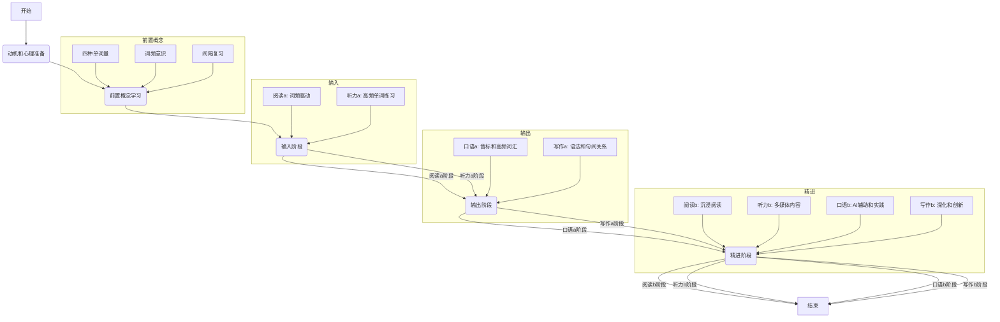

- [前言](#%E5%89%8D%E8%A8%80)
- [一、动机、渴望](#%E4%B8%80%E3%80%81%E5%8A%A8%E6%9C%BA%E3%80%81%E6%B8%B4%E6%9C%9B)
	- [1.1 后高考时代为什么还要学习英语](#1.1%20%E5%90%8E%E9%AB%98%E8%80%83%E6%97%B6%E4%BB%A3%E4%B8%BA%E4%BB%80%E4%B9%88%E8%BF%98%E8%A6%81%E5%AD%A6%E4%B9%A0%E8%8B%B1%E8%AF%AD)
	- [1.2 心理准备](#1.2%20%E5%BF%83%E7%90%86%E5%87%86%E5%A4%87)
- [二、几个前置概念](#%E4%BA%8C%E3%80%81%E5%87%A0%E4%B8%AA%E5%89%8D%E7%BD%AE%E6%A6%82%E5%BF%B5)
	- [2.1 四种单词量](#2.1%20%E5%9B%9B%E7%A7%8D%E5%8D%95%E8%AF%8D%E9%87%8F)
	- [2.1 词频意识](#2.1%20%E8%AF%8D%E9%A2%91%E6%84%8F%E8%AF%86)
	- [2.2 间隔复习](#2.2%20%E9%97%B4%E9%9A%94%E5%A4%8D%E4%B9%A0)
- [三、输入](#%E4%B8%89%E3%80%81%E8%BE%93%E5%85%A5)
	- [3.1 阅读a阶段](#3.1%20%E9%98%85%E8%AF%BBa%E9%98%B6%E6%AE%B5)
	- [3.2 听力a阶段](#3.2%20%E5%90%AC%E5%8A%9Ba%E9%98%B6%E6%AE%B5)
- [四、输出](#%E5%9B%9B%E3%80%81%E8%BE%93%E5%87%BA)
	- [4.1 口语a阶段](#4.1%20%E5%8F%A3%E8%AF%ADa%E9%98%B6%E6%AE%B5)
	- [4.2 写作a阶段](#4.2%20%E5%86%99%E4%BD%9Ca%E9%98%B6%E6%AE%B5)
- [五、精进](#%E4%BA%94%E3%80%81%E7%B2%BE%E8%BF%9B)
	- [阅读b阶段](#%E9%98%85%E8%AF%BBb%E9%98%B6%E6%AE%B5)
	- [听力b阶段](#%E5%90%AC%E5%8A%9Bb%E9%98%B6%E6%AE%B5)
	- [口语b阶段](#%E5%8F%A3%E8%AF%ADb%E9%98%B6%E6%AE%B5)
	- [写作b阶段](#%E5%86%99%E4%BD%9Cb%E9%98%B6%E6%AE%B5)
- [写在最后](#%E5%86%99%E5%9C%A8%E6%9C%80%E5%90%8E)
- [资料与工具](#%E8%B5%84%E6%96%99%E4%B8%8E%E5%B7%A5%E5%85%B7)

## 前言

编程好的技术在国外

国内增长乏力，大公司的出海热潮

The English Odyssey.  
记录一个传统的中国学生，  
起点：在结束中学的英语教育后，  
终点：变成一个能真正运用这门语言的人  
之间的冒险，奥德赛！

我一共花了 xxxx 时间，取得了什么结果，托福多少分，油管无压力，进外企。想把整个过程中总结出的一些最佳实践分享出来。当然也可能会有知识诅咒。

Well-educated 的英语和三十秒露馅的英语，深入的文化理解，深入的一对一的理解

知识诅咒：指的就是**一旦我们自己知道某样东西，我们就会发现很难想象不知道它的时候会是什么样子**。

[口语](口语.md)  
[英语语法@](英语语法@.md)

[英语写作](英语写作.md)

每个映射代表一块砖，四面墙代表四种映射  


四种映射共同组成了英语能力  


## 一、动机、渴望

### 1.1 后高考时代为什么还要学习英语

- 装逼
- 提高上限：更多的信息，比如很多框架的官方文档，可以模糊提高各个领域的上限
- 语言之美：When you are old
- 沉没成本：三年级到大学，前期投入太多，不转化成真正能力的话，==沉没成本太大==
- 存量转化：而且之前输入积累远远大于输出，即使不学习新的输入，将已有的全部转化成主动输出，就已经非常可观了

### 1.2 心理准备

- 没有速成，需要大量时间，但是好的方法和认知可以让你找到门路，不会有劲无处使，会让过程变得科学可靠，可落地，易于操作。

## 二、几个前置概念

### 2.1 四种单词量

 拆解成一个个映射关系

 1. 形 - 意单词量 视力 - 想法
 2. 音 - 意单词量 听音 - 想法
 3. 意 - 声单词量 想法 - 发音
 4. 意 - 形单词量 想法 - 拼写/手写

### 2.1 词频意识

1. 不同的词频意味着不同的性价比
2. 克拉克语言习得的 N+1 原理的本质是词汇由高频到低频的逐步扩展
 

### 2.2 间隔复习

间隔复习是最省时高效的记忆方式！遗忘曲线、supermo 算法

## 三、输入

### 3.1 阅读 a 阶段

#### 逻辑推导

本质连接是什么？终点是什么？

1、听力和手没有关系，做笔记、边听边写，全是假的，没有用，做听力就要解放双手用耳朵

2、听力的本质是：一个==外界的声音==和你==脑中的意思==能产生联系 安瑞额 -> 区域 穿克 ->轨迹

3、听力好的绝对终点是：一大段英语的声音袭来，你能清晰地知道她的每个词表达了啥，需要苦练十年

4、单词的性价比不一样，有的值钱有的不值钱，听懂 " 一 z"，对 99% 的句子都有帮助，能听懂 " 安色弱怕了几 "，对 0.001% 的句子有用

5、听力好的相对终点是：一大段英语声音袭来，其中==高频单词==的声音，和你脑中的意思，已经具备了联系，只需要苦练几月

#### 刻意练习

词频驱动  
很多词频透析类型的软件，可以标注出待阅读文本中的生词  
文本透析

### 3.2 听力 a 阶段

#### 逻辑推导

本质连接是什么？终点是什么？

1、听力和手没有关系，做笔记、边听边写，全是假的，没有用，做听力就要解放双手用耳朵

2、听力的本质是：一个==外界的声音==和你==脑中的意思==能产生联系 安瑞额 -> 区域 穿克 ->轨迹

3、听力好的绝对终点是：一大段英语的声音袭来，你能清晰地知道她的每个词表达了啥，需要苦练十年

4、单词的性价比不一样，有的值钱有的不值钱，听懂 " 一 z"，对 99% 的句子都有帮助，能听懂 " 安色弱怕了几 "，对 0.001% 的句子有用

5、听力好的相对终点是：一大段英语声音袭来，其中==高频单词==的声音，和你脑中的意思，已经具备了联系，只需要苦练几月

#### 刻意练习

1. 低效版：闲看美剧、闲听 bbc，因为不符合刻意练习
2. 背！
3. 怎么背？
	1. 用软件、间隔复习更科学
	2. 闭眼背！因为 3.2.1.1
	3. 两种路径
		1. 高效枯燥版：直接找一本单词书，选高频的 7000 个背完背熟
		2. 高效有趣版：==频率逼近法==，
			1. 选一门考试，找到所有试卷，比如 100 篇，写个脚本跑出 100 篇的总词频，选出 100 篇的高词频
			2. 每天 n 篇，做之前，写个脚本找到这 n 篇中属于高词频的部分，导入墨墨背单词，背完，然后听录音做题
			3. 优点：依托于具体内容不枯燥、先背后听没有痛苦、有答题和分数反馈爽歪歪、顺便捞一门成绩
4. 背多少？
	1. 5000，初步具备听力能力
	2. 无痛听懂油管的常见内容可能需要一万加

https://v2ex.com/t/489712

## 四、输出

对于主动输出来说，无论是口语还是写作，都是一个模式，即 ==准确的用词 -> 准确的词间关系 -> 准确的句子 -> 准确的句间关系 -> 好的篇==。从实施上，关键要素有二，一是起码拥有上千个脑中意到合理单词选择的映射关系，二是需要有完备的语法知识体系。关于 " 准确的用词 "，我主要放在了口语 a 阶段。关于 " 准确的词间关系 -> 准确的句子 -> 准确的句间关系 -> 好的篇 "，我主要放在了写作 a 阶段。  
上面这个阶段结束以后有了基本的词汇的驾驭能力，才可以真正雕琢写作，不然比如简单的 " 真的首饰假的首饰 " authentic fake 都用不好。

### 4.1 口语 a 阶段

#### 几个里程碑

1. 音标体系
2. 高频主动词汇积累
3. 语法体系的应用
4. 人工智能和实地生活 打磨细节

#### 逻辑推导

1. 口语的本质是：一个==脑中的念头==一动，立刻想到==发什么声音== 具体的 - 死波赛飞可 确实 - 一个 zan 克特力
2. 口语好的绝对终点是：脑中的任何念头一起，你都能立刻发出对应的声音，需要苦练十年
3. 单词的性价比不一样，有的值钱有的不值钱，脑中 " 是 " 的念头一起，想到发出 " 一 z"，对 99% 的表达场景都有帮助，脑中 " 人类学 " 的念头一起，想到发出 " 安色弱怕了几 "，对 0.001% 的表达场景有用
4. 口语好的相对终点是：脑中的任何念头一起，其中高频意念，你都能立刻发出对应的声音，只需要苦练几月
5. 如何达到==高频意念==和发什么声音的连接？

#### 刻意练习

1. 音标的符号体系
2. 听力词汇 5000 以上，具体实操可参考听力章节

```Java
	听力是口语的前提，没有说不出来的话，只有听不懂的话
```

1. 舌位知识

```Java
	不求地道，只求自洽，以后慢慢迭代，我现在的认知是 /a/ 你叫他阿猫阿狗都行，但是你每次都得这么叫！
	
	现在不管怎么进化，都是自以为的更标准，没用！
	
	现在练一百遍不得其意，后面慢慢就会懂，因为会发生，你说了一个单词，连外教听不懂，那么就是你这个单词的元音辅音出现问题了  
	
	根据天赋，会越来越趋近标准的
	
	以后不管中国人还是外国人说你发音有问题，那你就进一步问他，哪个单词，哪个音节，哪个元音或者辅音？然后基于以上认知，你就可以改变了！
```

1. 背音标

```Java
	背一遍单词音标（前3000） electronic    approach -> /əˈproʊtʃ/

	重音
```

1. 连读知识 一周

```Java
	任何让你口语更地道炫酷的东西，都没必要话太多时间
	
	连读、吞音等等不需要怎么看，慢慢就懂了，核心就是尽可能凑成   辅元
	
	口语的本质不在于此！
```

1. 找老外说话

```Java
	开始找老外说话，从来不和中国人练口语、英语角全是假的，低效，很难让你持久地输出！

	录音！永远不要在没有录音的情况下说英语

```

1. 复盘录音，梳理其中反应的你的 念头 - 单词 的映射，把不对的地方查字典纠正并导入到墨墨背单词
2. 用看句子挖空想单词的方法 背单词！具体可参考****

### 4.2 写作 a 阶段

#### 逻辑推导

本质连接是什么？终点是什么？

1. 与谈吐一样，写作能力是超越语言的，具体到英语的写作能力，又可以拆为用词准确能力，如口语 a 阶段，逻辑表述能力，类比与或非循环结构的使用，和词句意境能力。
2. 什么是好的写作成果 ==准确的用词 -> 准确的词间关系 -> 准确的句子 -> 准确的句间关系 -> 好的篇==
3. ==准确的用词== 这部分在口语 a 阶段已经初步达到
4. ==准确的词间关系 -> 准确的句子 -> 准确的句间关系 -> 好的篇== 这部分对于口语交流和书面写作来说精确和严谨程度的要求是不同的
5. 重点是词 ->篇的网络结构 完整，每个小点都能做到主动输出

```Java
	对于语法的掌握应该兼具体系化与模糊化，高频、常见即可
```

#### 刻意练习

1. 沉浸在写作社区中，如 Medium，摒弃旧的经济学人，利用好目前 app 的兴趣推流
2. 找托福的五道题，先完成，再完美
3. 利用《新编高级英语语法》搭建 ==准确的词间关系 -> 准确的句子 -> 准确的句间关系 -> 好的篇==网络
4. 在 Medium 中逐个写托福题目，用 Grammarly 修改语法，并纳入 3 的网络体系中，用 ChatGPT 精进用词
5. 找大量的托福雅思高分范文，分析他们的词 ->篇结构，纳入到 3 点网络体系中

比如这是一个中国人的写作，找到错的最厉害的五个点  
通过大量的写进入写作的阶段，通过少量的改，实现高频和准确高性价比的提高  
明天尝试打通 anki 的 api

口录，转文字整理到，每天刷 medium 找到适合自己的英语 feeds，培养英文阅读习惯  
两个月的时间，先争取把 69 个 tpo 写完，再看一个新的境界，收集 180 个错误，表达 200 多个观点  
写完 30 篇的时候发视频

## 五、精进

### 阅读 b 阶段

沉浸在写作社区中，如 Medium，摒弃旧的经济学人，利用好目前 app 的兴趣推流

推特、DIscord 等英语社区中学习 " 当代 " 的英语表达，各种梗

### 听力 b 阶段

油管、博客、美剧

### 口语 b 阶段

口语音视频被 AssemblyAI 处理成分角色文本，ChatGPT 根据语境提出修改意见，我讲修改意见归纳到主动词汇积累和语法网络中。
ChatGPT 的语境处理能力弥补了直接将 STT 的文本丢给 Grammarly 的缺陷

ElevenLabs 生成自己的口语模型，听到自己口语练习的终极形态

出国旅游、出国工作

### 写作 b 阶段

写作的话，是思想打底，文以载道

逐渐体现对于词汇细微之处的驾驭，是上一个阶段的深化。" 雪下得紧了 "

学会反范式，通过破坏语法规则，实现一些高阶表达

## 写在最后

花了多少时间精力，收获后端开发的雏形，尝试很多工具

写作是超越语言的，技能的学习其实也是超越语言的，什么语言的资料并不重要，重要的是什么能让你接近本质，掌握精髓

学习一门技能最高效的方式是，找到这项技能的第一性 (各种映射)，通过持续可理解性输入，做大量刻意练习！

而所有的这一切的第一性原理是：兴趣和热爱！

## 资料与工具

- 间隔复习工具：默默背单词、Anki(API)
- 单词词库：
- 音标知识：B 站英语兔
- 读音示范：B 站英语兔、油管瑞秋英语
- 语法知识：B 站英语兔可提供知识体系、章振邦的《新编高级英语语法》可提供详尽细节
- 音频转文字：网易见外工作台、AssemblyAI
- 油管字幕下载：DownSUB
- 活的 native speaker：很多口语平台，如 Cambly，可以低至 xx/h
- 考试目标物：托福雅思，在小站、考满分等平台均有高质量真题资料
- 精确的语法修改：Grammarly(比 GPT 精确)
- 为语境提供贴切的词汇建议：ChatGPT
